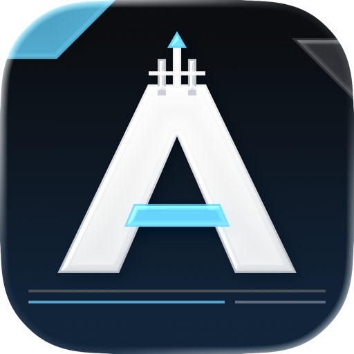

<div align="center">



# Arknights Client

**An unofficial macOS launcher for the Global PC version of Arknights**

Install, update, and run the official Windows client on Apple Silicon Macs.

[](LICENSE)
[](https://github.com/LuMiSxh/Arknights-MacOS-Client/releases)

[Overview](#overview) • [Features](#features) • [Installation](#installation) • [Quick Start](#quick-start) • [Development](#development)

</div>

---

## Overview

Arknights Client is a native SwiftUI launcher for the official Global PC client. It downloads game files from Yostar and runs the Windows game through a bundled Wine and DXMT runtime.

The project is in alpha and supports only Apple Silicon Macs running macOS 26 or newer.

## Features

- Install, resume, update, repair, and remove the Global PC client.
- Launch the game in windowed, borderless, or fullscreen mode at a selected resolution.
- Use HiDPI rendering for the game and its login browser.
- Support the Yostar, Apple, Google, and Facebook login flows through Wine compatibility helpers.
- Check launcher and game versions independently; automatic checks can be disabled.
- Display one-time project announcements from this repository; announcement checks can be disabled.
- Store the Wine prefix and Windows user folders under Application Support.
- Write separate launcher and Wine logs that can be opened from Settings.

## Installation

The app requires:

- Apple Silicon
- macOS 26 or newer
- Rosetta 2

Download `Arknights Client.dmg` from [GitHub Releases](https://github.com/LuMiSxh/Arknights-MacOS-Client/releases/latest), open it, and drag the app to **Applications**.

> [!WARNING]
> Builds are ad-hoc signed and not notarized. On first launch, right-click the app in Finder and select **Open**.

The bundled Wine runtime is an Intel binary and currently runs through Rosetta 2. macOS may show a one-time notice when **Play** is selected for the first time because Apple has announced that Intel-app support will end in a future macOS release.

Game files are stored separately from the app. Removing the launcher does not remove the game; use **Uninstall Game** in Settings.

## Quick Start

1. Open Arknights Client.
2. Select **Install** and wait for the game download to finish.
3. Choose a display mode in Settings if needed.
4. Select **Play**.

The default game location is `~/Library/Application Support/com.lumisxh.arknights-client/Games/Arknights-Global`.

> [!NOTE]
> The first Google, Apple, or Facebook sign-in can take 5–15 seconds to open while the embedded Windows browser starts through Wine. A blank login view during that interval does not usually indicate a failed click.

## Development

Development requires Swift 6.2, the matching Xcode command-line tools, [`just`](https://github.com/casey/just), and [`uv`](https://docs.astral.sh/uv/).

```sh
git clone https://github.com/LuMiSxh/Arknights-MacOS-Client.git
cd Arknights-MacOS-Client
just check
```

| Command                | Purpose                                              |
| ---------------------- | ---------------------------------------------------- |
| `just run`             | Run the native launcher from SwiftPM                 |
| `just preview`         | Run the isolated debug-state simulator               |
| `just preview-popup …` | Preview a local Markdown popup                       |
| `just preview-app`     | Build an isolated launcher-state simulator           |
| `just runtime`         | Download and verify the tested Wine and DXMT runtime |
| `just dev`             | Build the app with the runtime                       |
| `just dev-dmg`         | Build an installable development DMG                 |
| `just ci`              | Run all checks and build the release configuration   |

Run `just --groups` for the complete command list.
Tested runtime versions, download locations, checksums, and source provenance are pinned in [`runtime.json`](runtime.json).
Repository automation lives in `scripts/` as Python scripts. uv reads their inline metadata and installs tool-specific dependencies automatically.

## Documentation

- [Architecture](docs/architecture.md)
- [Design](docs/design.md)
- [Storage](docs/storage.md)
- [Releases and updates](docs/releases-and-updates.md)
- [Announcements](docs/announcements.md)
- [Changelog](CHANGELOG.md)
- [Third-party notices](docs/legal/third-party-notices.md)

## License

Arknights Client is licensed under the [Mozilla Public License 2.0](LICENSE).

Copyright © 2026 LuMiSxh. This project is not affiliated with Hypergryph or Yostar. Arknights and its artwork belong to their respective owners.
