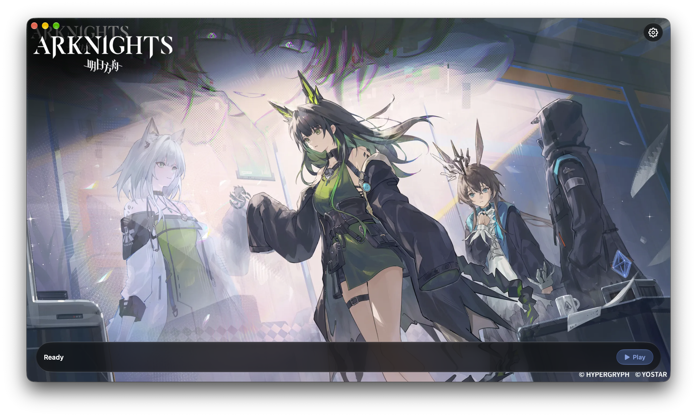

<div align="center">


# Arknights Client

**Run official Arknights PC clients on Apple Silicon Macs through a native SwiftUI launcher.**

[](https://github.com/LuMiSxh/Arknights-MacOS-Client/releases)
[](https://github.com/LuMiSxh/Arknights-MacOS-Client/releases/latest)
[](https://lumisxh.github.io/Arknights-MacOS-Client/installation/#requirements)
[](LICENSE)



[Website & documentation](https://lumisxh.github.io/Arknights-MacOS-Client/) · [Download latest](https://github.com/LuMiSxh/Arknights-MacOS-Client/releases/latest) · [Installation](https://lumisxh.github.io/Arknights-MacOS-Client/installation/) · [Troubleshooting](https://lumisxh.github.io/Arknights-MacOS-Client/help/troubleshooting/)

</div>

## Overview

Arknights Client downloads official PC game files directly from the selected publisher and runs them through a bundled, tested Wine and DXMT environment. The native launcher manages game installation, updates, display options, artwork, icons, compatibility fixes, and diagnostics.

> [!TIP]
> Use the [project website](https://lumisxh.github.io/Arknights-MacOS-Client/) for installation instructions, compatibility information, troubleshooting, and release history.

> [!NOTE]
> Arknights Client is an unofficial community project. It is not affiliated with Hypergryph, Yostar, or Bilibili and does not include game files or downloaded artwork in release builds.

## Features

### Install and play

- Install, resume, update, repair, and remove regional PC clients
- Enable the China or China — Bilibili client through Canary Features
- Keep each region in its own game directory and switch between installed regions
- Run in windowed, borderless, or fullscreen mode at a selected resolution
- Enable HiDPI rendering for the game and its embedded login browser
- Use Yostar, Apple, Google, and Facebook login flows through Wine compatibility helpers

### Native macOS experience

- Follow a resumable setup assistant while the game downloads in the background
- Personalize the launcher with custom artwork, a preset gallery, and dynamic theme colors
- Customize launcher and game icons with normalized macOS Dock sizing
- Start any installed region or open Settings from the app's Dock menu
- Show optional game-version, server-time, and daily-reset indicators
- Play optional YouTube background music with playlist and volume controls
- Use native Settings, update notices, diagnostics, and support actions

### Compatibility and maintenance

- Launch through a pinned Wine and DXMT runtime tested as one compatibility unit
- Apply game-specific browser, window, input, and Command-Q integrations automatically
- Check launcher and game versions independently; automatic checks can be disabled
- Clear DXMT shader, browser, and downloaded gallery caches from Settings
- Keep launcher, Wine, game, and embedded-browser logs available for troubleshooting

## Installation and support

Use the website's [installation guide](https://lumisxh.github.io/Arknights-MacOS-Client/installation/) for requirements, Gatekeeper and Rosetta guidance, region setup, and first launch. The [Help section](https://lumisxh.github.io/Arknights-MacOS-Client/help/) covers troubleshooting, storage, runtime compatibility, and the boundary between launcher support and publisher support.

## Development

Development requires Swift 6.2, the matching Xcode command-line tools, [`just`](https://github.com/casey/just), and [`uv`](https://docs.astral.sh/uv/).

```sh
git clone https://github.com/LuMiSxh/Arknights-MacOS-Client.git
cd Arknights-MacOS-Client
just check
```

| Command               | Purpose                                                     |
| --------------------- | ----------------------------------------------------------- |
| `just check`          | Run source checks and network-denied Python and Swift tests |
| `just integration`    | Run the network-denied onboarding-to-download workflow      |
| `just live-contracts` | Deliberately check the current public Yostar API contracts  |
| `just preview`        | Open the focused isolated UI-state simulator                |
| `just dev web`        | Start the local documentation website                       |
| `just check web`      | Check website types and formatting                          |
| `just format web`     | Format website sources                                      |
| `just runtime`        | Download and verify the tested Wine and DXMT runtime        |
| `just dev app run`    | Build the app with its runtime and open it                  |
| `just ci`             | Run deterministic tests and build the release configuration |

Run `just --groups` for the complete command list. Tested runtime versions, download locations, checksums, and source provenance are pinned in [`runtime.json`](runtime.json). Repository automation lives in `scripts/` and resolves from the root `pyproject.toml` and `uv.lock`; packaging-only Python tools remain in a separate dependency group.

A fresh checkout may resolve pinned uv and SwiftPM development dependencies before tests start. Unit and integration test execution itself is isolated from the public network.

## Documentation

User documentation is published on the project website:

- [Installation](https://lumisxh.github.io/Arknights-MacOS-Client/installation/)
- [Help and troubleshooting](https://lumisxh.github.io/Arknights-MacOS-Client/help/)
- [Runtime compatibility](https://lumisxh.github.io/Arknights-MacOS-Client/help/runtime-compatibility/)
- [Changelog](https://lumisxh.github.io/Arknights-MacOS-Client/changelog/)

Contributor and source-level documentation remains versioned with the repository under [`docs/development/`](docs/development/README.md) and [`docs/legal/`](docs/legal/README.md).

## License

Arknights Client is licensed under the [Mozilla Public License 2.0](LICENSE).

Copyright © 2026 LuMiSxh. Arknights and its artwork belong to their respective owners.
