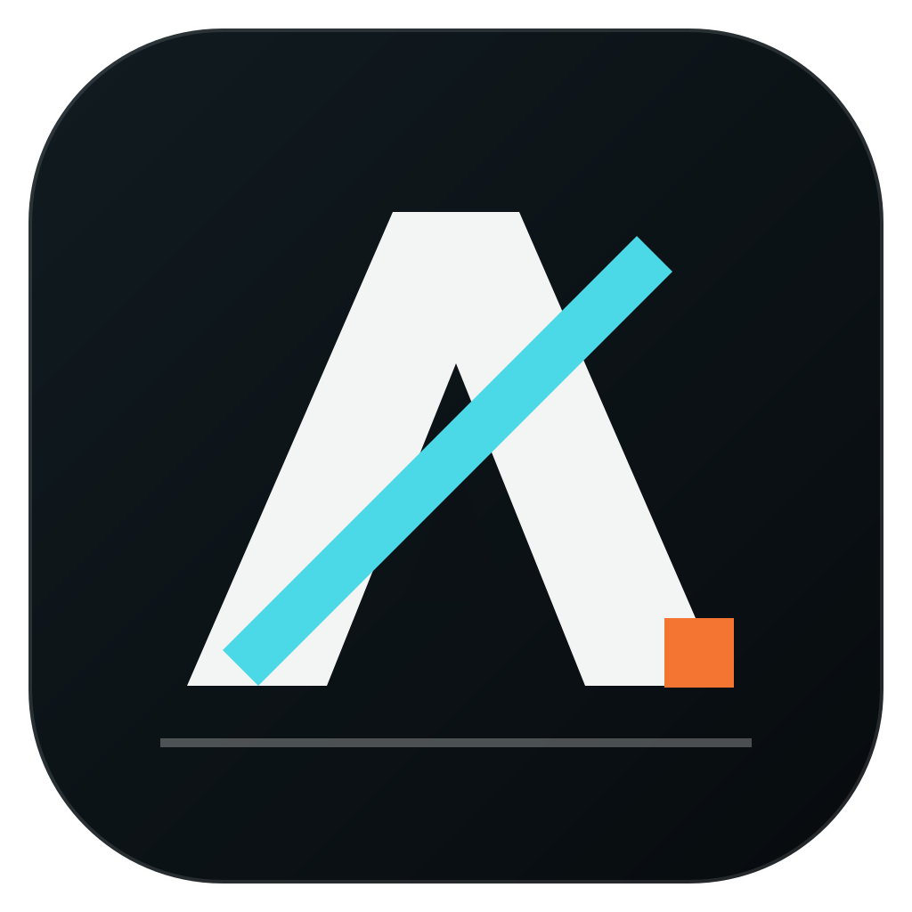

<div align="center">



# Arknights Client

**A native macOS launcher for Arknights**

Install, update, repair, and launch the official Global PC client on Apple Silicon.

[](LICENSE)
[](https://github.com/LuMiSxh/ArknightsClient/releases)

[Overview](#overview) • [Features](#features) • [Installation](#installation) • [Development](#development) • [Documentation](#documentation)

</div>

---

## Overview

Arknights Client is an unofficial macOS launcher for the official Global PC release of Arknights. The DMG includes the native SwiftUI launcher and a Wine + DXMT compatibility runtime; the game itself is downloaded directly from Yostar on first launch.

The interface follows modern macOS conventions while drawing on the industrial visual language of Arknights. The project supports Apple Silicon and macOS 26 or newer.

## Features

- Install, resume, update, repair, and uninstall the Global PC client
- Self-contained Wine + DXMT runtime with no paid compatibility software
- Fullscreen, windowed, borderless, and display resolution options
- Independent automatic update checks for the launcher and game
- Native macOS 26 interface with Liquid Glass and custom artwork
- Manual, reproducible DMG releases with verified runtime archives

## Installation

Download `Arknights Client.dmg` from [GitHub Releases](https://github.com/LuMiSxh/ArknightsClient/releases), open it, and drag **Arknights Client** to **Applications**.

Releases are ad-hoc signed but not notarized because the project has no Apple Developer account. On first launch, right-click the app in Finder and select **Open**, then confirm the macOS prompt.

Rosetta 2 is required by the Windows compatibility runtime. The launcher requests its installation through macOS when necessary.

## Development

Arknights Client uses Swift 6.2 and SwiftUI. Development requires Apple Silicon and macOS 26 with the matching Xcode command-line tools.

```sh
git clone https://github.com/LuMiSxh/ArknightsClient.git
cd ArknightsClient
swift test --arch arm64
swift run ArknightsClient
```

Build an app bundle or a complete DMG with:

```sh
./scripts/build-app.sh
ARKNIGHTS_RUNTIME_DIR="/path/to/Wine-DXMT" ./scripts/build-dmg.sh
```

Swift files use tabs with a width of four. Verify a change before opening a pull request:

```sh
swift format lint --configuration .swift-format --recursive --strict Sources Tests
swift test --arch arm64
swift build --configuration release --arch arm64
```

Keep changes focused, write code and user-facing text in English, add tests for changed behavior, and record user-visible changes under `Unreleased` in `CHANGELOG.md`. Do not commit proprietary Arknights binaries or artwork. Contributions are licensed under MPL-2.0.

## Documentation

- [Architecture](docs/architecture.md)
- [Design](docs/design.md)
- [Storage](docs/storage.md)
- [Releases and updates](docs/releases-and-updates.md)
- [Changelog](CHANGELOG.md)
- [Third-party notices](docs/legal/third-party-notices.md)

## License

Copyright © 2026 LuMiSxh. The launcher is licensed under the [Mozilla Public License 2.0](LICENSE); corresponding release source is described in the [source-code notice](docs/legal/source-code.md).

This project is not affiliated with Hypergryph or Yostar. Arknights and its artwork belong to their respective owners. Wine and DXMT use LGPL licenses.
