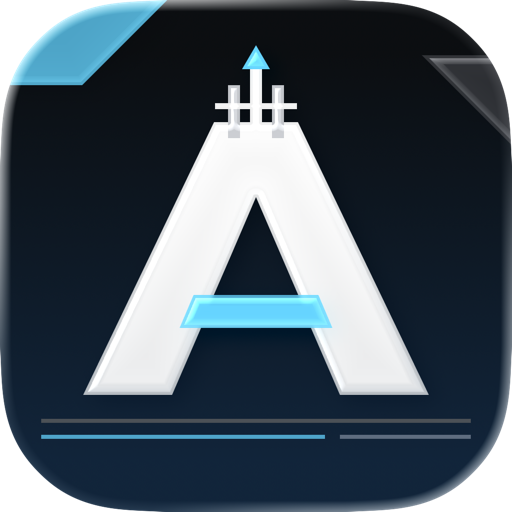
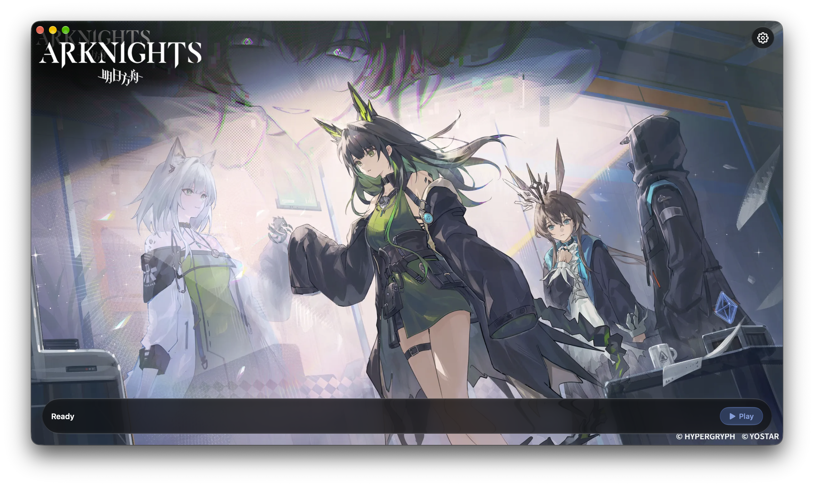

<div align="center">



# Arknights Client

**Play Arknights PC on Apple Silicon Macs.** This free, unofficial launcher sets up the game. It runs the publisher's Windows game through bundled Wine and DXMT.

[](https://github.com/LuMiSxh/Arknights-MacOS-Client/releases)
[](https://lumisxh.github.io/Arknights-MacOS-Client/help/runtime-compatibility/)
[](https://lumisxh.github.io/Arknights-MacOS-Client/installation/#requirements)
[](LICENSE)



**[Download](https://github.com/LuMiSxh/Arknights-MacOS-Client/releases/latest)** · [Website](https://lumisxh.github.io/Arknights-MacOS-Client/) · [Installation](https://lumisxh.github.io/Arknights-MacOS-Client/installation/) · [Troubleshooting](https://lumisxh.github.io/Arknights-MacOS-Client/help/troubleshooting/) · [Changelog](https://lumisxh.github.io/Arknights-MacOS-Client/changelog/)

</div>

## Get started

1. Use an Apple silicon Mac with macOS 15–27, Rosetta 2 (the setup assistant can install it), and free space for the game. See the [requirements](https://lumisxh.github.io/Arknights-MacOS-Client/installation/#requirements) and [runtime compatibility](https://lumisxh.github.io/Arknights-MacOS-Client/help/runtime-compatibility/).
2. Download **Arknights.Client.dmg** from the [latest release](https://github.com/LuMiSxh/Arknights-MacOS-Client/releases/latest). Drag the app to **Applications**.
3. Open the app. Releases are not notarized, so macOS can block it. The [installation guide](https://lumisxh.github.io/Arknights-MacOS-Client/installation/) shows how to allow it.
4. Choose your region. The setup assistant downloads the official game files.

Global, Japan, Korea, China, and China (Bilibili) are supported by default. Taiwan is an experimental Canary region.

> [!NOTE]
> Arknights Client is an unofficial community project. It is not affiliated with Gryphline, Hypergryph, Yostar, or Bilibili. Release builds do not include game files or downloaded artwork.
>
> This project uses AI coding assistants. Read [AI assistance](https://lumisxh.github.io/Arknights-MacOS-Client/ai-assistance/).

## Features

- Install, resume, update, repair, and remove regional PC clients, each in its own game directory.
- Windowed, borderless, or fullscreen play, including native fullscreen beyond 4K, with Retina, MetalFX, or Lightweight rendering.
- Official sign-in for each client.
- Resumable setup assistant. The game downloads in the background.
- Custom artwork, preset gallery, dynamic theme colors, and custom launcher and game icons.
- Dock menu, optional game-version, server-time, and daily-reset indicators, and optional YouTube background music.
- Pinned Wine and DXMT runtime, tested as one unit.
- Automatic browser, window, input, and Command-Q integrations.
- Separate launcher and game update checks, cache clearing, and logs.

## Support

The publisher of your region handles account, payment, and in-game problems. See the [Help section](https://lumisxh.github.io/Arknights-MacOS-Client/help/) and [publisher support routing](https://lumisxh.github.io/Arknights-MacOS-Client/help/#publisher-support-routing).

## Development

You need Swift 6.4, the matching Xcode command-line tools, [`just`](https://github.com/casey/just), and [`uv`](https://docs.astral.sh/uv/).

```sh
git clone https://github.com/LuMiSxh/Arknights-MacOS-Client.git
cd Arknights-MacOS-Client
just check
```

| Command            | Purpose                                                     |
| ------------------ | ----------------------------------------------------------- |
| `just check`       | Run source checks and network-denied Python and Swift tests |
| `just integration` | Run the network-denied onboarding-to-download workflow      |
| `just ci`          | Run deterministic tests and build the release configuration |
| `just dev app run` | Build the app with its runtime and open it                  |
| `just dev web`     | Start the local documentation website                       |

Run `just --list` for all commands. [`runtime.json`](runtime.json) pins the tested runtime. Contributor documentation is in [`docs/development/`](docs/development/README.md) and [`docs/legal/`](docs/legal/README.md).

## License

Arknights Client is licensed under the [Mozilla Public License 2.0](LICENSE).

Copyright © 2026 LuMiSxh. Arknights and its artwork belong to their respective owners.
