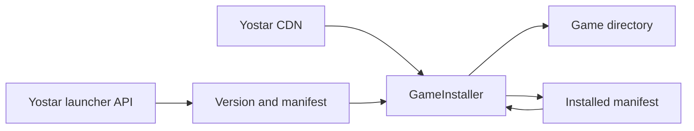
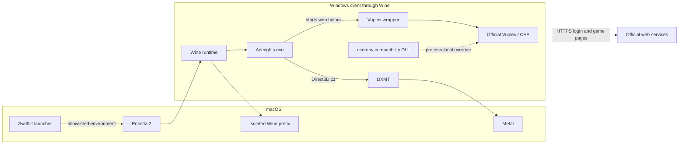
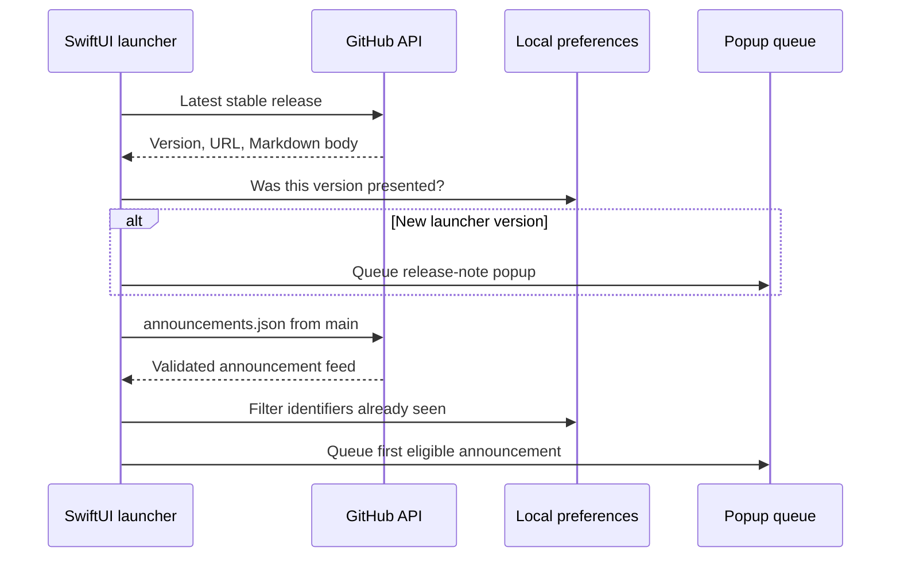

# Architecture

Arknights Client has a native SwiftUI launcher and a bundled Windows compatibility runtime. The launcher owns downloads, updates, settings, and process state. Wine is used only after **Play** is selected.

## Source layout

| Folder | Responsibility |
| --- | --- |
| `Application` | App entry point and macOS lifecycle |
| `UI` | Launcher, Settings, and document views |
| `ViewModels` | UI state and user actions |
| `Models` | API payloads, install state, launch options, and errors |
| `Services` | Yostar API, artwork, installer, and launcher updates |
| `Storage` | Standard macOS paths and preferences |
| `Runtime` | Wine environment, prefix configuration, DXMT, Vuplex, and process lifecycle |
| `Utilities` | CRC64 and diagnostic logging |

`LauncherViewModel` is the main UI orchestrator. Network access, installation, artwork caching, update discovery, announcements, and Wine execution remain separate service or runtime types; the view model coordinates their results into one user-facing `LauncherPhase`. Facts independent of that phase, such as whether game files are installed or a newer version exists, remain separate state.

## Installation

`LauncherAPI` obtains the current Global version, manifest, and CDN URLs. `GameInstaller` validates every manifest path before writing, resumes `.part` files, verifies size and CRC64, and records the installed manifest.

A normal update compares the installed and current manifests so unchanged files can be reused. **Repair** deliberately skips that shortcut: it checks every installed file and downloads missing or damaged files again. Installation is exclusive; refreshes, Settings actions, and repeated clicks cannot start a second installer.

## Launch process

The packaged runtime is x86_64 and runs through Rosetta 2. The launcher gives Wine an isolated prefix and an allowlisted environment, mounts the game directory as `G:`, installs the pinned DXMT libraries, and starts `G:\Arknights.exe`. The main game uses DXMT for Direct3D-to-Metal translation. The exact runtime contract and compatibility components are documented in [Runtime compatibility](runtime-compatibility.md).

Arknights starts its Chromium-based Vuplex helper for account and in-game web pages. Before launch, the launcher moves the official helper beside a small wrapper. The wrapper preserves the game's arguments and starts the untouched helper with the system DNS resolver. A process-local `userenv.dll` supplies the one AppContainer SID function missing from the tested Wine build. Neither compatibility component affects the game renderer or reads browser content.

Vuplex can share its accelerated off-screen surface through D3D11, but Chromium and Vuplex cannot coordinate write access to that surface through the tested DXMT path. The wrapper therefore uses Vuplex's CPU `OnPaint` transfer while leaving Chromium's internal GPU compositor enabled. CEF's asynchronous DNS path calls `SIO_ADDRESS_LIST_SORT`, which Wine does not implement; the wrapper disables that path so CEF uses Wine's normal system resolver. Social login starts a separate Chromium process and may take several seconds on first use.

Install, update, and repair restore the official Vuplex executable before modifying game files. The wrapper is then installed again at the next launch only when the helper still advertises the expected software-paint option. Unknown helpers and unrelated `userenv.dll` files are left untouched.

## Process lifecycle

The launcher remains in **Starting** until Wine exposes a visible game window. It monitors both the direct Wine process and the prefix-wide `wineserver`. Closing the game triggers prefix-scoped cleanup so browser and Yostar helpers do not keep the launcher in **Running**. **Stop** and launcher termination use the same prefix-scoped shutdown.

The `Arknights` runtime alias and `WINEPRELOADERAPPNAME` give the main macOS process a readable name. Packaging applies one reviewed patch to the staged Wine macOS driver so the standard `Command-Q` shortcut is available.

Prefix changes run through an ordered migration plan: Wine initialization, DXMT installation, and registry overrides. The prefix stores completed migration IDs with the runtime archive checksum and `prefixRevision` in `.arknights-runtime-migrations.json`. Each successful step is recorded atomically, so an interrupted launch resumes at the first incomplete step. A checksum or prefix-revision change replays the complete plan; adding a migration ID runs only that new step for an otherwise current prefix. Version 0.1 markers are imported once and removed.

Game-directory shims implement `GameCompatibilityComponent` and are registered with `GameCompatibilityManager`. Active components are reconciled before every launch; all active and retired components are restored before install, update, or repair. Removing a shim means moving its component from the active list to the retired list for a supported upgrade cycle, allowing launcher-owned files to be cleaned up even when replacement assets are no longer bundled.

Vuplex uses this reconciliation path rather than one-time migration state because the official updater can replace its helper at any time. Its wrapper and `userenv.dll` carry stable ownership markers, so upgrades and retirement never rely only on the current bundled bytes. Unknown files remain untouched.

## Launcher communication

Launcher releases and optional project announcements use GitHub as a read-only endpoint; no separate application server is required. Release discovery reads the latest stable GitHub Release. The release body becomes the Markdown changelog popup and its release page remains available from Settings and the status capsule.

Announcements are read from `announcements.json` on `main`. The launcher validates the feed, version and date bounds, body length, and optional HTTPS action before displaying one eligible entry. Seen identifiers are stored locally, so editing an existing entry does not repeatedly interrupt users. Official Yostar HTML notices use the same popup queue after conversion to native attributed text.

## Boundaries

- Only the official Global PC distribution is supported.
- Game files come from first-party HTTPS endpoints and are never included in a release.
- Manifest paths cannot escape the selected game directory.
- Wine receives private home, cache, configuration, runtime, and temporary directories.
- Wine exposes only its private `C:` drive and the selected game directory as `G:`; the default `Z:` mapping to the macOS root is removed.
- The prefix limits accidental file access but is not a macOS security sandbox.
- The launcher never handles credentials or intercepts Vuplex pages.
- Runtime versions and source revisions are pinned in [`runtime.json`](../runtime.json).
