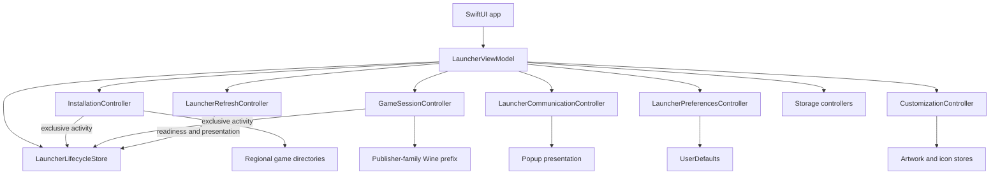
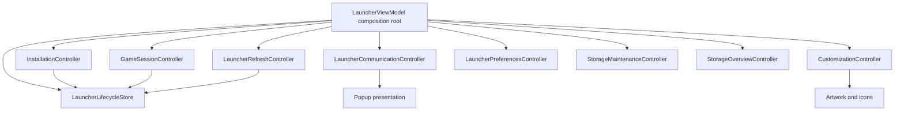

# Architecture

Arknights Client is a native SwiftUI launcher around a bundled Windows compatibility runtime. The
launcher owns downloads, updates, settings, diagnostics, and process state. It does not ship game
files and it does not run Wine until **Play** is selected.

This section describes the boundaries that make those responsibilities safe to change. Start with
the map below, then follow the flow that matches the change you are making:

- [Installation architecture](installation.md) covers API responses, manifest validation,
  resumable downloads, and per-region state.
- [Launch and process lifecycle](launch-and-process-lifecycle.md) covers Rosetta, Wine prefixes,
  compatibility components, process monitoring, and shutdown.
- [Wine prefix architecture](wine-prefix.md) covers prefix topology, environment isolation, drive
  mappings, migrations, persistent state, and maintenance boundaries.
- [Communication and boundaries](communication-and-boundaries.md) covers publisher requests,
  announcements, notices, update checks, and stale-result handling.
- [Data and persistence](data-and-persistence.md) maps `AppPaths`, `UserDefaults`, caches, logs,
  and files that can be removed.

The primary composition and ownership sources are [`LauncherViewModel`](../../../Sources/ArknightsClient/Features/Launcher/State/LauncherViewModel.swift),
[`LauncherState`](../../../Sources/ArknightsClient/Features/Launcher/State/LauncherState.swift),
and [`AppPaths`](../../../Sources/ArknightsClient/Shared/Persistence/AppPaths.swift).

## System map

The launcher is the composition root for feature controllers. Data and side effects flow through
those controllers; views receive the narrow controller or values they need. The root does not
become a shared service locator.

The arrows represent ownership or an explicit callback, not arbitrary bidirectional access. For
example, `InstallationController` can update lifecycle state, but a view should not reach into
`LauncherViewModel` to start a download.

## Source layout

| Folder           | Responsibility                                                                                  |
| ---------------- | ----------------------------------------------------------------------------------------------- |
| `Application`    | App entry point, dependency composition, and macOS lifecycle                                    |
| `Features`       | Feature-owned UI, state, domain models, services, and external work                             |
| `Infrastructure` | Feature-independent network and system I/O primitives                                           |
| `Shared`         | Cross-feature domain/configuration, persistence, diagnostics, support, and shared UI contracts  |
| `Resources`      | SwiftPM resources copied into the application bundle                                            |

`Features` is organized around behavior rather than technical layers:

- `Launcher` owns application composition, shared lifecycle presentation, home, Settings, documents,
  popups, and launcher updates.
- `Game` owns installation, Wine runtime behavior, Intel translation, and game-file compatibility components.
- `Customization` owns artwork, icons, and the preset gallery.
- `Audio` owns background playback, Now Playing integration, settings, and HUD controls.
- `Onboarding` owns its resumable flow, progress persistence, and step views.

Feature-specific components remain with their feature. `Shared/UI/Components` contains only presentation contracts used by multiple features, such as action buttons, modal chrome, and Settings panels.

`Infrastructure` contains feature-independent I/O such as bounded HTTP loading and chunked
transfer support. It does not decide whether a response is a valid game manifest or how a
controller presents an error. That policy remains in the owning feature. Neither `Infrastructure`
nor `Shared` imports feature-owned types; features map transport and storage errors at their
boundary.

User-facing launcher copy lives in Apple String Catalogs with stable, feature-namespaced keys. Generated Foundation symbols make catalog references type-safe, while small feature-local `…Strings` namespaces keep ownership with the UI that uses the copy. English is the source language and deterministic fallback; the launcher follows macOS by default and persists an explicit in-app language override when selected. The catalog workflow is documented in [Localization](../localization.md).

Repository scripts derive shipping product metadata from `Resources/Info.plist`, target and resource layout from SwiftPM's evaluated `Package.swift`, and runtime layout from `runtime.json`. `scripts/lib/project_config.py` cross-validates the first two before builds and checks. Scripts must not maintain separate app-name, executable, platform, architecture, language, or package-resource lists.

Tests follow separate unit, deterministic integration, and live-contract boundaries. Their target ownership, network and filesystem isolation, fixtures, CI cadence, and manual Wine/game matrix are documented in [Testing architecture](../testing.md).

`LauncherViewModel` is the application composition root. It constructs feature controllers, wires the
few transitions that cross feature boundaries, and provides the application shell used by developer
scenarios. It does not implement network, filesystem, installation, Wine, audio,
customization, or update work itself. Feature-local views receive their owning controller or explicit
values and actions instead of the complete root model. New work should follow the same direction:
put policy beside the feature that owns it and add only the smallest callback needed at composition
time.

Long-lived state and asynchronous work have one feature owner:

| Owner                             | Responsibility                                                                                            |
| --------------------------------- | --------------------------------------------------------------------------------------------------------- |
| `LauncherLifecycleStore`          | Mutually exclusive launcher activity, metadata-refresh state, launch readiness, status, and failure UI    |
| `InstallationController`          | Region, install directory, installed state, resumable install/update/repair tasks, progress, and removal  |
| `GameSessionController`           | Runtime discovery, prefix maintenance, launch options capture, Wine processes, Game Mode, and diagnostics |
| `IntelTranslationController`      | Rosetta preflight, installation, recovery state, and launch eligibility                                   |
| `LauncherRefreshController`       | Concurrent publisher configuration and branding refreshes, stale-result rejection, and region transitions |
| `CustomizationController`         | Artwork, Dynamic Theme, launcher and game icons, and preset application                                   |
| `BackgroundMusicController`        | Playlist parsing, playback, Now Playing metadata, fades, and music-link presentation                       |
| `LauncherCommunicationController` | Launcher releases, announcements, Yostar notices, and popup ordering                                      |
| `LauncherPreferencesController`   | Persisted user-facing settings and the region-aware server-reset timer                                    |
| `StorageMaintenanceController`    | Targeted DXMT, browser, and gallery cache cleanup                                                         |
| `StorageOverviewController`       | Asynchronous usage measurement for installations, shared runtime data, caches, and logs                   |

Installation, maintenance, and the Wine-backed game lifecycle share the exclusive
`LauncherActivity` state machine because they may touch the same game files or runtime. Refresh and
presentation remain orthogonal so safe metadata checks and actionable errors can coexist with a
running game. Controllers use explicit narrow feature dependencies and callbacks configured by the
composition root; they never depend on `LauncherViewModel` or implicit singleton state.

The state tree has three deliberately separate concerns:

| State branch              | Answers                                              | Examples                                                      |
| ------------------------- | ---------------------------------------------------- | ------------------------------------------------------------- |
| `activity`                | What exclusive work owns the game/runtime right now? | install, migrate, launch, run, stop                           |
| `refresh` and `readiness` | What metadata and prerequisites are currently known? | Publisher configuration, installed version, Rosetta availability |
| `presentation`            | What should the user see or act on?                  | status text, failure message, update prompt                   |

Do not use a presentation message as a lifecycle lock, and do not clear an active lifecycle state
just because a refresh failed. `LauncherLifecycleStore` is the single gate for mutually exclusive
work; `ExclusiveOperationGate` additionally gives an installation task a token so a stale cancelled
task cannot finish a newer operation.

First-run setup is a separate `Onboarding` feature with its own `@Observable` coordinator and `UserDefaults` progress store. It never downloads files or persists launcher settings itself: each step calls the same region, installer, display, artwork, icon, update, and audio actions used by the main interface. A mandatory launcher-update preflight runs before setup; an available launcher release blocks the remaining steps until the newer app is installed and reopened. Interrupted setup resumes at its saved step, but an absent game always routes back through Region & Install before later steps.

Detailed flows are documented in [Installation architecture](installation.md), [Launch and process lifecycle](launch-and-process-lifecycle.md), and [Communication and boundaries](communication-and-boundaries.md).

## Platform boundary

The native side runs on Apple Silicon and macOS 15 or newer. The packaged Wine runtime is x86-64,
so the launcher verifies that macOS can execute an Intel process through Rosetta 2 before launch.
Wine receives a private prefix, private Unix home, private temporary directories, and only the
selected game directory as `G:`. The prefix reduces accidental access to host files, but it is not
a macOS security sandbox. See [Runtime compatibility](../../help/runtime-compatibility.md) and
[Storage](../../help/storage.md) for the user-facing contract.

> [!WARNING]
> Do not describe the Wine prefix as a security boundary equivalent to App Sandbox. A custom game
> directory is intentionally exposed to the Windows client, and the runtime still executes native
> macOS binaries under the launcher's user account.

## Change guide

Before changing a behavior, identify its owner and its external contract:

| Change                                            | Start here                                         | Also update or verify                                                                                                         |
| ------------------------------------------------- | -------------------------------------------------- | ----------------------------------------------------------------------------------------------------------------------------- |
| Game files, manifests, install paths              | `Features/Game/Installation`                       | [Installation architecture](installation.md), installer tests                                                                 |
| Wine startup, prefix, process or display behavior | `Features/Game/Runtime`                            | [Launch and process lifecycle](launch-and-process-lifecycle.md), [Runtime compatibility](../../help/runtime-compatibility.md) |
| Compatibility wrapper or bridge                   | `Features/Game/Compatibility` and `RuntimeSupport` | restore/update behavior, runtime notices, release validation                                                                  |
| Publisher endpoint or refresh behavior            | `LauncherAPI` and `LauncherRefreshController`      | [Communication and boundaries](communication-and-boundaries.md), live contracts                                               |
| Persisted setting or app-owned path               | `LauncherPreferencesStore` or `AppPaths`           | [Data and persistence](data-and-persistence.md), storage tests                                                                |
| User-facing copy                                  | owning feature's String Catalog                    | [Localization](../localization.md), English and German layout                                                                 |

Run the focused checks while iterating and [Testing architecture](../testing.md) before a full
release validation. A runtime layout, prefix migration, or installer safety change is not complete
until the relevant fixture-backed tests and a manual compatibility scenario have been reviewed.
