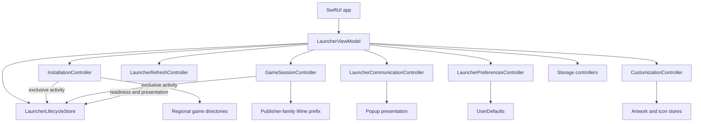
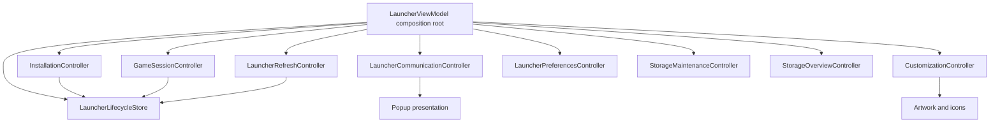

# Architecture

Arknights Client is a native SwiftUI launcher around a bundled Windows compatibility runtime. The
launcher owns downloads, updates, settings, diagnostics, and process state. It does not ship game
files. It does not run Wine until the user selects **Play**. Start with the system map. Then read the
flow that matches your change:

- [Installation architecture](installation.md): manifests, resumable downloads, per-region state.
- [Launch and process lifecycle](launch-and-process-lifecycle.md): Rosetta, compatibility components,
  process monitoring, shutdown.
- [Wine prefix architecture](wine-prefix.md): prefix topology, isolation, migrations, maintenance.
- [Communication and boundaries](communication-and-boundaries.md): publisher requests, announcements,
  notices, update checks, stale results.
- [Data and persistence](data-and-persistence.md): `AppPaths`, `UserDefaults`, caches, logs, removable
  files.

The primary composition and ownership sources are [`LauncherViewModel`](../../../Sources/ArknightsClient/Features/Launcher/State/LauncherViewModel.swift),
[`LauncherState`](../../../Sources/ArknightsClient/Features/Launcher/State/LauncherState.swift),
and [`AppPaths`](../../../Sources/ArknightsClient/Shared/Persistence/AppPaths.swift).

## System map

Data and side effects flow through the feature controllers. Each view receives only the controller or
values it needs. The root is not a service locator.

```mermaid
flowchart TB
	App[SwiftUI app] --> Root[LauncherViewModel]
	Root --> Lifecycle[LauncherLifecycleStore]
	Root --> Install[InstallationController]
	Root --> Game[GameSessionController]
	Root --> Refresh[LauncherRefreshController]
	Root --> Communication[LauncherCommunicationController]
	Root --> Settings[LauncherPreferencesController]
	Root --> Customization[CustomizationController]
	Root --> Storage[Storage controllers]
	Install -->|exclusive activity| Lifecycle
	Game -->|exclusive activity| Lifecycle
	Refresh -->|readiness and presentation| Lifecycle
	Communication --> Popup[Popup presentation]
	Customization --> Assets[Artwork and icon stores]
	Settings --> Defaults[UserDefaults]
	Install --> GameFiles[Regional game directories]
	Game --> Prefix[Publisher-family Wine prefix]
```

An arrow means ownership or an explicit callback, not free two-way access. For example,
`InstallationController` can update lifecycle state. A view must not use `LauncherViewModel` to start a
download.

## Source layout

| Folder           | Responsibility                                                                              |
| ---------------- | ------------------------------------------------------------------------------------------- |
| `Application`    | App entry point, dependency composition, macOS lifecycle                                    |
| `Features`       | Feature-owned UI, state, domain models, services, external work                             |
| `Infrastructure` | Feature-independent network and system I/O primitives                                       |
| `Shared`         | Cross-feature domain, configuration, persistence, diagnostics, support, shared UI contracts |
| `Resources`      | SwiftPM resources copied into the application bundle                                        |

`Features` is organized by behavior, not by technical layer:

- `Launcher`: composition, shared lifecycle presentation, home, Settings, documents, popups, launcher
  updates.
- `Game`: installation, Wine runtime, Intel translation, game-file compatibility components.
- `Customization`: artwork, icons, preset gallery.
- `Audio`: background playback, Now Playing, settings, HUD controls.
- `Onboarding`: resumable flow, progress persistence, step views.

Rules:

- Feature-specific components stay in their feature. `Shared/UI/Components` holds only presentation
  contracts that multiple features use, such as action buttons, modal chrome, and Settings panels.
- `Infrastructure` holds feature-independent I/O, such as bounded HTTP loading and chunked transfer
  support. It does not decide if a response is a valid game manifest or how a controller shows an error.
  The owning feature keeps that policy.
- `Infrastructure` and `Shared` never import feature-owned types. Features map transport and storage
  errors at their boundary.
- Launcher copy is English literals in small feature-local `…Strings` namespaces. The UI that uses the
  copy owns it. There is no runtime language-selection layer.

Repository scripts derive their configuration from these sources:

| Data                       | Source                              |
| -------------------------- | ----------------------------------- |
| Shipping product metadata  | `Resources/Info.plist`              |
| Target and resource layout | SwiftPM's evaluated `Package.swift` |
| Runtime layout             | `runtime.json`                      |

`scripts/lib/project_config.py` cross-validates the first two sources before builds and checks. Scripts
must not keep separate lists of app names, executables, platforms, architectures, or package resources.

Unit, deterministic integration, and live-contract tests are separate. [Testing architecture](../testing.md)
covers target ownership, isolation, fixtures, CI cadence, and the manual Wine/game matrix.

`LauncherViewModel` is the composition root. It constructs the feature controllers, wires the few
transitions that cross feature boundaries, and provides the application shell that the debug simulator
uses. It does no network, filesystem, installation, Wine, audio, customization, or update work.
Feature-local views receive their owning controller, or explicit values and actions, never the complete
root model. Put new policy beside the owning feature. Add only the smallest callback at composition time.

Each long-lived state and each asynchronous task has one feature owner:

| Owner                             | Responsibility                                                                                       |
| --------------------------------- | ---------------------------------------------------------------------------------------------------- |
| `LauncherLifecycleStore`          | Exclusive activity, refresh state, launch readiness, status, failure UI                              |
| `InstallationController`          | Region, install directory, installed state, resumable install/update/repair tasks, progress, removal |
| `GameSessionController`           | Runtime discovery, prefix maintenance, launch options, Wine processes, Game Mode, diagnostics        |
| `IntelTranslationController`      | Rosetta preflight, installation, recovery state, launch eligibility                                  |
| `LauncherRefreshController`       | Concurrent configuration and branding refreshes, stale-result rejection, region transitions          |
| `CustomizationController`         | Artwork, Dynamic Theme, launcher and game icons, presets                                             |
| `BackgroundMusicController`       | Playlist parsing, playback, Now Playing metadata, fades, music-link presentation                     |
| `LauncherCommunicationController` | Launcher releases, announcements, Yostar notices, popup order                                        |
| `LauncherPreferencesController`   | Persisted settings and the region-aware server-reset timer                                           |
| `StorageMaintenanceController`    | Targeted DXMT, browser, and gallery cache cleanup                                                    |
| `StorageOverviewController`       | Async usage measurement for installations, runtime data, caches, logs                                |

Installation, maintenance, and the Wine-backed game lifecycle share the exclusive `LauncherActivity`
state machine, because they can touch the same game files or runtime. Refresh and presentation stay
orthogonal, so safe metadata checks and actionable errors can exist while a game runs.

Controllers use explicit, narrow dependencies and callbacks that the composition root configures. They
never depend on `LauncherViewModel` or implicit singleton state.

The state tree has three separate concerns:

| State branch              | Answers                                     | Examples                                               |
| ------------------------- | ------------------------------------------- | ------------------------------------------------------ |
| `activity`                | Which exclusive work owns the game/runtime? | install, migrate, launch, run, stop                    |
| `refresh` and `readiness` | Which metadata and prerequisites are known? | configuration, installed version, Rosetta availability |
| `presentation`            | What does the user see or act on?           | status text, failure message, update prompt            |

- Do not use a presentation message as a lifecycle lock.
- Do not clear an active lifecycle state because a refresh failed.
- `LauncherLifecycleStore` is the single gate for mutually exclusive work.
- The `installing(id:)` activity carries its operation ID. A stale cancelled installation task
  cannot finish a newer operation.

```mermaid
flowchart TD
	Root[LauncherViewModel composition root] --> Lifecycle[LauncherLifecycleStore]
	Root --> Installation[InstallationController]
	Root --> Session[GameSessionController]
	Root --> Refresh[LauncherRefreshController]
	Root --> Communication[LauncherCommunicationController]
	Root --> Customization[CustomizationController]
	Root --> Preferences[LauncherPreferencesController]
	Root --> Storage[StorageMaintenanceController]
	Root --> StorageOverview[StorageOverviewController]
	Installation --> Lifecycle
	Session --> Lifecycle
	Refresh --> Lifecycle
	Communication --> Popup[Popup presentation]
	Customization --> Artwork[Artwork and icons]
```

First-run setup is the separate `Onboarding` feature. It has its own `@Observable` coordinator and
`UserDefaults` progress store. It never downloads files or persists launcher settings. Each step calls
the same region, installer, display, artwork, icon, update, and audio actions as the main interface.

- A mandatory launcher-update preflight runs before setup. An available release blocks the remaining
  steps until the user installs and reopens the newer app.
- Interrupted setup resumes at its saved step.
- If the game is absent, setup returns to Region & Install before later steps.

## Platform boundary

The native side runs on Apple Silicon and macOS 15 or newer. The packaged Wine runtime is x86-64.
Before launch, the launcher verifies that macOS can run an Intel process through Rosetta 2.

Wine receives a private prefix, a private Unix home, private temporary directories, and only the
selected game directory, as `G:`. The prefix reduces accidental access to host files. It is not a macOS
security sandbox. See [Runtime compatibility](../../help/runtime-compatibility.md) and
[Storage](../../help/storage.md).

> [!WARNING]
> Never describe the Wine prefix as a security boundary equal to App Sandbox. The Windows client can
> access a custom game directory by design. The runtime also runs native macOS binaries under the
> launcher's user account.

## Change guide

Before you change behavior, find its owner and external contract:

| Change                                 | Start here                                         | Also update or verify                                                                                                         |
| -------------------------------------- | -------------------------------------------------- | ----------------------------------------------------------------------------------------------------------------------------- |
| Game files, manifests, paths           | `Features/Game/Installation`                       | [Installation architecture](installation.md), installer tests                                                                 |
| Wine startup, prefix, process, display | `Features/Game/Runtime`                            | [Launch and process lifecycle](launch-and-process-lifecycle.md), [Runtime compatibility](../../help/runtime-compatibility.md) |
| Compatibility wrapper or bridge        | `Features/Game/Compatibility` and `RuntimeSupport` | restore/update behavior, runtime notices, release validation                                                                  |
| Publisher endpoint, refresh            | `LauncherAPI` and `LauncherRefreshController`      | [Communication and boundaries](communication-and-boundaries.md), live contracts                                               |
| Persisted setting, app-owned path      | `LauncherPreferencesStore` or `AppPaths`           | [Data and persistence](data-and-persistence.md), storage tests                                                                |
| User-facing copy                       | owning feature's `…Strings` namespace              | English literals and accessibility review                                                                                     |

Run focused checks while you iterate. Follow [Testing architecture](../testing.md) before a full
release validation. A change to the runtime layout, a prefix migration, or installer safety is complete
only after a reviewer checks the fixture-backed tests and a manual compatibility check passes.
