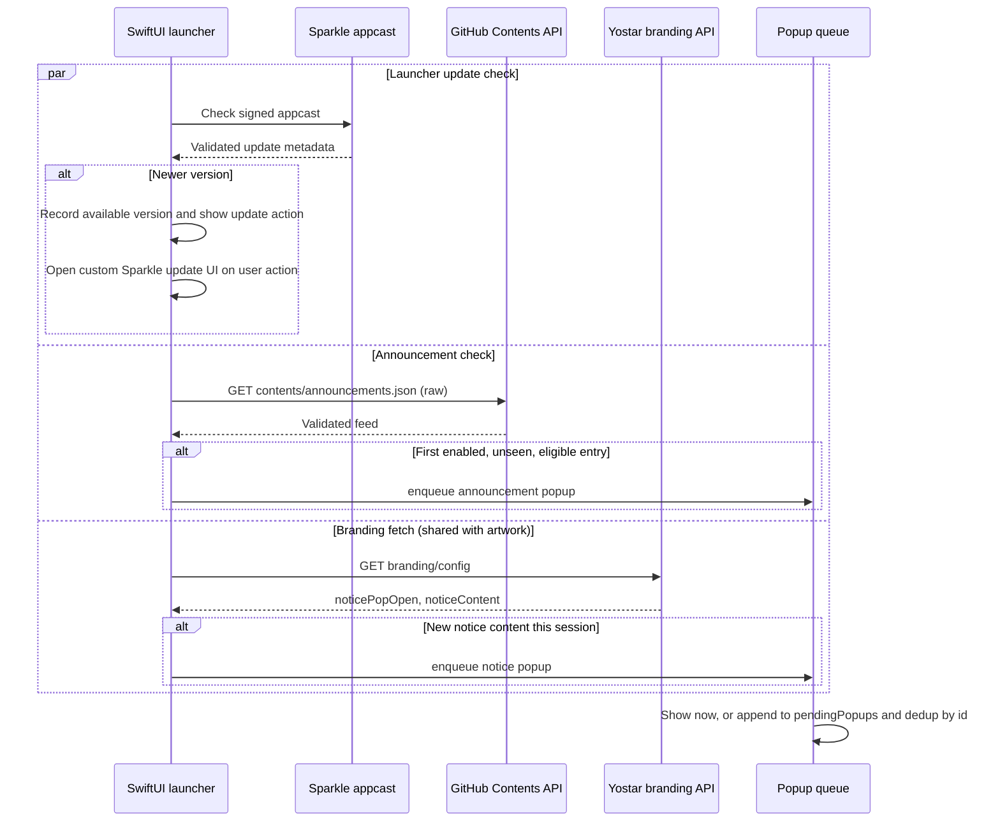
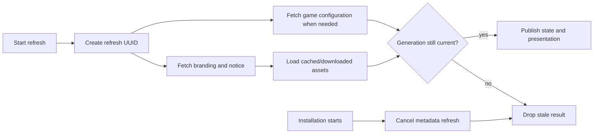

# Communication and boundaries

The launcher has no project-owned application server. Its remote inputs are the official Yostar
launcher APIs, the repository-hosted announcements feed, the official branding response, and
Sparkle's signed appcast. Each source has a separate owner, validation policy, and failure path.
Keep those channels separate when adding a new message or update surface.

## Launcher communication

Three read-only sources feed the launcher; no separate application server exists. Each fires independently at launch, on its own precondition, with no ordering or dependency between them. Announcements and Yostar notices can enqueue a popup; launcher updates use status state and the themed Sparkle UI.

| Channel                  | Owner                         | Payload                                                   | User-visible result                                                |
| ------------------------ | ----------------------------- | --------------------------------------------------------- | ------------------------------------------------------------------ |
| Yostar game/config API   | `LauncherAPI`                 | Region configuration, branding, CDN and manifest location | Readiness, artwork, region notice, or an actionable launcher error |
| Repository announcements | `LauncherAnnouncementService` | Bounded JSON feed from `main`                             | Once-only Markdown popup with an optional HTTPS action             |
| Sparkle appcast          | `LauncherUpdaterController`   | Signed launcher update metadata and archive               | Update status, then Sparkle's themed update UI on request          |

Yostar's `noticeContent` travels inside the branding response and is not a fourth independent
network service. It is formatted as native attributed text before it enters the popup queue.

- **Sparkle appcast** (`SUFeedURL`), checked silently when automatic launcher-update checks are on and before onboarding. Sparkle validates the signed feed and compares its update item against the running version. A newer version becomes launcher status state and enables the update action; an automatic startup discovery and manual actions open the launcher's themed Sparkle UI.
- **GitHub Contents API** (`https://api.github.com/repos/LuMiSxh/Arknights-MacOS-Client/contents/announcements.json?ref=main`), checked by `checkAnnouncements()` when announcements are enabled. The request sends `Accept: application/vnd.github.raw+json` so GitHub returns the raw file instead of a base64-wrapped JSON blob. The feed is capped at 20 entries and 128 KB and must declare schema version 1; the first entry that is enabled, not already seen, within its optional date window and version bounds, under the field-length limits, and using only an HTTPS action becomes the shown announcement.
- **Yostar's own branding response** — not a dedicated notice endpoint. It rides along on the same `api.branding(region:)` call the launcher already makes for hero artwork, as part of `refresh()`'s concurrent branding fetch. If that response's `noticePopOpen` is true and its `noticeContent` differs from the last notice shown, the HTML is converted to native attributed text and queued. This channel has no persistent "seen" state: the in-memory guard resets on every region switch and on every fresh launch, so an active Yostar notice reappears each session, unlike announcements, which persist seen IDs.

Launcher release discovery and installation are owned by `LauncherUpdaterController`, a feature-local wrapper around Sparkle 2.9.6's `SPUUpdater` and the launcher's `LauncherUpdateUserDriver`. Sparkle validates the feed, handles release notes data, download, signature verification, replacement, and relaunch; the feature-local SwiftUI driver supplies the launcher's accessible themed presentation. The wrapper rejects checks while the shared lifecycle is installing, migrating, launching, or running the game and postpones a pending relaunch until that activity returns to idle.

Announcements and Yostar notices funnel into the same queue (`enqueuePopup`): if nothing is showing, the new popup is shown immediately and recorded as seen right away; otherwise it is appended to `pendingPopups` and only recorded as seen once `dismissPopup` actually promotes it into view. Entries are deduplicated by id — a duplicate of the currently-shown or an already-queued id is dropped silently. Announcements keep a set of seen ids, while Yostar notices keep nothing beyond the current session (their id also embeds a fresh UUID each time, so the queue's own id-based dedup never catches a repeat there — only the upstream content comparison does). Dismissing a popup by its action button removes it from the queue before opening the URL, not after.

## Refresh concurrency

`LauncherRefreshController` starts the game configuration and branding requests for the current
region independently. A refresh receives a UUID generation. Cancelling a refresh invalidates that
generation before a later task can publish its result; branding assets are accepted only when both
the refresh ID and active region still match. This prevents a slow response from a previous region
from replacing current artwork, notices, or readiness state.

The controller also avoids replacing user-selected artwork with a late official image. A custom
artwork generation is captured at refresh start and checked again before the downloaded asset is
applied.

> [!IMPORTANT]
> Every asynchronous remote result needs an ownership check before it mutates observable state.
> Cancellation alone is not enough: a request may complete between cancellation and its callback.

## Boundaries

- Yostar's Global, Japan, and Korea clients use the Yostar launcher API. The Canary-gated China and China — Bilibili clients use Hypergryph's separate metadata and payload infrastructure.
- Game files come from first-party HTTPS endpoints and are never included in a release.
- Manifest paths cannot escape the selected game directory; see [Installation architecture](installation.md#manifest-and-path-safety).
- Wine receives private home, cache, configuration, runtime, and temporary directories.
- Wine exposes only its private `C:` drive and the selected game directory as `G:`; the default `Z:` mapping to the macOS root is removed. `L:` points to the app-owned log directory.
- The prefix limits accidental file access but is not a macOS security sandbox.
- The launcher never handles credentials or intercepts Vuplex pages. It renders Yostar notices as native text and project announcements through its bounded Markdown renderer.
- Remote action links are accepted only over HTTPS; announcement body size, item count, field lengths, and version/date windows are validated before queueing.
- Runtime versions and source revisions are pinned in [`runtime.json`](../../../runtime.json).

> [!WARNING]
> A popup or notice is not an authorization boundary. Keep remote content out of process
> execution, filesystem paths, and credentials. If a new feed needs richer behavior than text and an
> HTTPS action, define and review a separate contract instead of expanding the existing parser
> implicitly.

## Failure policy

Remote requests fail closed for the feature they serve:

- A failed branding request leaves cached/custom artwork and the last known launcher state in place;
  it does not make an installed game unavailable.
- A failed game configuration request is actionable when no game is installed, but is logged and
  tolerated when an installed game already has enough state to remain usable.
- An unavailable announcements feed produces no popup and does not block launch.
- A failed Sparkle check records update-check failure; it does not replace the running launcher or
  block normal game use. The onboarding preflight has its own update gate when an update is found.

Do not turn an optional message or metadata source into a lifecycle dependency without updating the
state model and the user-facing recovery contract. For request limits and feed fields, see
[Announcements](../announcements.md). For release/update ordering, see [Releases and updates](../releases-and-updates.md).

## Privacy and support boundary

The launcher sends the region and signed request metadata required by Yostar's API, fetches
repository announcements when enabled, and performs Sparkle update checks according to Settings.
It does not collect project telemetry. The embedded browser remains an official game helper; the
compatibility wrappers adjust process behavior but do not inspect login, payment, or page contents.

Logs are local app-owned files. Diagnostics may include endpoint hosts, versions, process IDs,
termination status, and bounded runtime output. Before sharing a log, remove account identifiers,
local paths, or any content that is not needed for the report. Route account, payment, and service
issues to official Yostar support; route launcher, runtime, and packaging issues to the repository
issue form.
