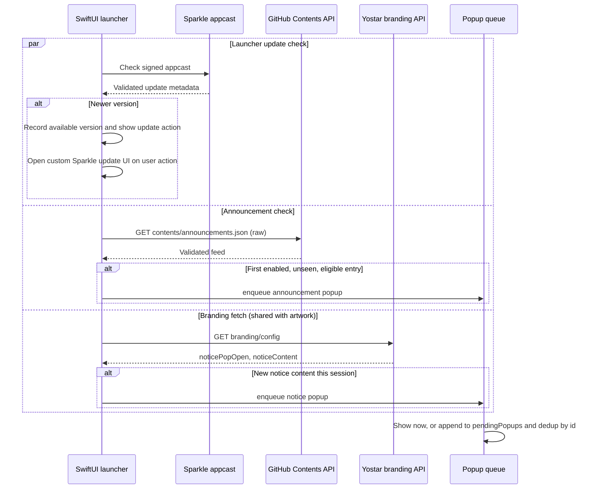
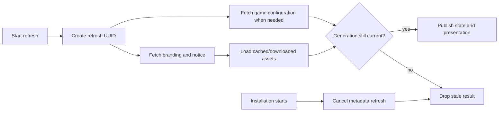

# Communication and boundaries

The launcher has no project-owned application server. Each remote source has its own owner,
validation policy, and failure path. Keep the channels separate when you add a message or update
surface.

## Launcher communication

Six read-only channels feed the launcher. Each runs independently at launch, on its own precondition,
with no order between them. Announcements and Yostar notices can enqueue a popup. Launcher updates use
status state and the themed Sparkle UI.

| Channel                                                                 | Owner                         | Payload                                                   | User-visible result                                                |
| ----------------------------------------------------------------------- | ----------------------------- | --------------------------------------------------------- | ------------------------------------------------------------------ |
| Yostar game/config API (Global, Japan, Korea)                           | `LauncherAPI`                 | Region configuration, branding, CDN and manifest location | Readiness, artwork, region notice, or an actionable launcher error |
| Gryphline (Taiwan) and Hypergryph (China clients) metadata/payload APIs | `LauncherAPI`                 | Region configuration, branding, CDN and manifest location | Readiness, artwork, or an actionable launcher error                |
| Repository announcements                                                | `LauncherAnnouncementService` | Bounded JSON feed from `main`                             | Once-only Markdown popup with an optional HTTPS action             |
| Sparkle appcast                                                         | `LauncherUpdaterController`   | Signed launcher update metadata and archive               | Update status, then Sparkle's themed update UI on request          |
| Repository wallpaper tags                                               | `PresetCatalogService`        | Bounded `WallpaperTags.json` from `main`                  | Gallery search tags layered over the bundled manifest              |

- **Sparkle appcast** (`SUFeedURL`): Checked silently when automatic launcher-update checks are on, and
  before onboarding. A newer version becomes launcher status state and enables the update action. An
  automatic startup discovery or manual action opens the themed Sparkle UI.
- **GitHub Contents API**
  (`https://api.github.com/repos/LuMiSxh/Arknights-MacOS-Client/contents/announcements.json?ref=main`):
  `checkAnnouncements()` checks it when announcements are on.
  - The request sends `Accept: application/vnd.github.raw+json`, so GitHub returns the raw file, not a
    base64-wrapped JSON blob.
  - The feed has at most 20 entries and 128 KB, and must declare schema version 1.
  - The first entry that is enabled, unseen, inside its optional date window and version bounds, under
    the field-length limits, and HTTPS-only in its action becomes the shown announcement.
- **Third-party preset sources**: `PresetRemoteSources` names every community mirror and the Fankit
  gallery API that the preset gallery reads. Size limits are in `AppConstants.Presets`.
  - The operator catalog and avatar images use community mirrors that track `main`. A failed fetch keeps
    the cached catalog or the curated avatars. A failed gallery fetch keeps the cached wallpapers.
  - The wallpaper tags file below is app-owned and follows `main` on purpose. It is not pinned.
  - The China and Taiwan launcher logos have no remote source. The launcher shows its text logo.
- **Wallpaper tags** (`AppConstants.Presets.wallpaperTagsURL`, the raw
  `Sources/ArknightsClient/Resources/WallpaperTags.json` on `main`): Fetched once per launch, when the
  Artwork gallery first loads.
  - The manifest has at most 1 MB and must declare schema version 1. Its entries replace bundled
    entries with the same ID.
  - The file is cached as `wallpaper_tags_v1.json` in the gallery cache. The next launch applies it
    before the network answers.
  - A failed or 404 response keeps the bundled and cached tags. Clearing the gallery cache returns to
    the bundled manifest.
- **Yostar branding response** (not a dedicated notice endpoint): It rides on the `api.branding(region:)`
  call that `refresh()` already makes for hero artwork.
  - If `noticePopOpen` is true and `noticeContent` differs from the last notice shown, the launcher
    converts the HTML to native attributed text and queues it.
  - There is no persistent "seen" state. The in-memory guard resets on every region switch and fresh
    launch, so an active notice reappears each session. Announcements persist seen IDs.

`LauncherUpdaterController` owns launcher release discovery and installation. It wraps Sparkle 2.9.6's
`SPUUpdater` and the launcher's `LauncherUpdateUserDriver`.

- Sparkle validates the signed feed, compares its update item with the running version, and handles
  release notes data, download, signature verification, replacement, and relaunch.
- The feature-local SwiftUI driver supplies the accessible, themed presentation.
- The wrapper rejects checks while the lifecycle is installing, migrating, launching, or running the
  game. It postpones a pending relaunch until idle.
- Lifecycle activity gates these checks. A stale activity lease cannot change that gate. See
  [Activity leases](launch-and-process-lifecycle.md#activity-leases).

Announcements and Yostar notices share one queue (`enqueuePopup`):

- If nothing shows, the popup shows now and is recorded as seen. Otherwise it joins `pendingPopups` and
  is recorded as seen only when `dismissPopup` promotes it.
- The queue silently drops a duplicate ID of the shown or a queued popup.
- Announcements keep a set of seen IDs. Yostar notices keep nothing beyond the session. Their ID embeds
  a fresh UUID, so only the upstream content comparison catches a repeat.
- Dismissing a popup with its action button removes it from the queue before the URL opens.

```mermaid
sequenceDiagram
	participant App as SwiftUI launcher
	participant Releases as Sparkle appcast
	participant Contents as GitHub Contents API
	participant Yostar as Yostar branding API
	participant Queue as Popup queue

	par Launcher update check
		App->>Releases: Check signed appcast
		Releases-->>App: Validated update metadata
		alt Newer version
			App->>App: Record available version and show update action
			App->>App: Open custom Sparkle update UI on user action
		end
	and Announcement check
		App->>Contents: GET contents/announcements.json (raw)
		Contents-->>App: Validated feed
		alt First enabled, unseen, eligible entry
			App->>Queue: enqueue announcement popup
		end
	and Branding fetch (shared with artwork)
		App->>Yostar: GET branding/config
		Yostar-->>App: noticePopOpen, noticeContent
		alt New notice content this session
			App->>Queue: enqueue notice popup
		end
	end
Queue->>Queue: Show now, or append to pendingPopups and dedup by id
```

## Refresh concurrency

`LauncherRefreshController` starts the game configuration and branding requests for the current region
independently. Each refresh receives a UUID generation.

- Cancelling a refresh invalidates its generation before a later task can publish.
- The controller accepts branding assets only when the refresh ID and active region both still match, so
  a slow response from a previous region cannot replace current artwork, notices, or readiness.

```mermaid
flowchart LR
	Start[Start refresh] --> ID[Create refresh UUID]
	ID --> Config[Fetch game configuration when needed]
	ID --> Branding[Fetch branding and notice]
	Branding --> Assets[Load cached/downloaded assets]
	Config --> Check{Generation still current?}
	Assets --> Check
	Check -->|yes| Publish[Publish state and presentation]
	Check -->|no| Drop[Drop stale result]
	Install[Installation starts] --> Cancel[Cancel metadata refresh]
	Cancel --> Drop
```

A late official image never replaces user-selected artwork. The controller captures a custom-artwork
generation at refresh start and checks it again before it applies the downloaded asset.

> [!IMPORTANT]
> Every asynchronous remote result needs an ownership check before it mutates observable state.
> Cancellation alone is not enough: a request can complete between cancellation and its callback.

## Boundaries

- Game files come from first-party HTTPS endpoints. No release includes them.
- Manifest paths cannot escape the selected game directory. See [Installation architecture](installation.md#manifest-and-path-safety).
- Wine sees only its private prefix, `G:` for the selected game directory, and `L:` for logs. The
  prefix is not a macOS security sandbox. See [Wine prefix architecture](wine-prefix.md).
- The launcher never handles credentials or intercepts Vuplex pages. It renders Yostar notices as native
  text and announcements through its bounded Markdown renderer.
- Remote action links must use HTTPS. The launcher validates announcement body size, item count, field
  lengths, and version/date windows before it queues an announcement.
- [`runtime.json`](../../../runtime.json) pins runtime versions and source revisions.

> [!WARNING]
> A popup or notice is not an authorization boundary. Keep remote content out of process execution,
> filesystem paths, and credentials. If a new feed needs more than text and an HTTPS action, define and
> review a separate contract. Do not expand the existing parser implicitly.

## Failure policy

Remote requests fail closed for the feature they serve:

- Branding request fails: cached or custom artwork and the last known state stay. An installed game
  stays available.
- Game configuration request fails: actionable when no game is installed. Logged and tolerated when an
  installed game has enough state.
- Announcements feed is unavailable: no popup. Launch is not blocked.
- Sparkle check fails: the launcher records the failure. The running launcher and normal game use
  continue. The onboarding preflight has its own update gate.

Never make an optional message or metadata source a lifecycle dependency without updating the state
model and recovery contract. See [Announcements](../announcements.md) for request limits and feed
fields, and [Releases and updates](../releases-and-updates.md) for release order.

## Privacy and support boundary

The launcher sends the region and the signed request metadata that the publisher API needs. It fetches
announcements when enabled and checks Sparkle updates per Settings. It collects no project telemetry. The embedded browser stays an official game helper. The compatibility wrappers never
inspect login, payment, or page contents.

Logs are local app-owned files. Diagnostics can include endpoint hosts, versions, process IDs,
termination status, and bounded runtime output. Before you share a log, remove account identifiers,
local paths, and unneeded content.

Route account, payment, and service issues to the selected publisher's official support. Use the
[publisher support routing table](../../help/README.md#publisher-support-routing). Route launcher,
runtime, and packaging issues to the repository issue form.
