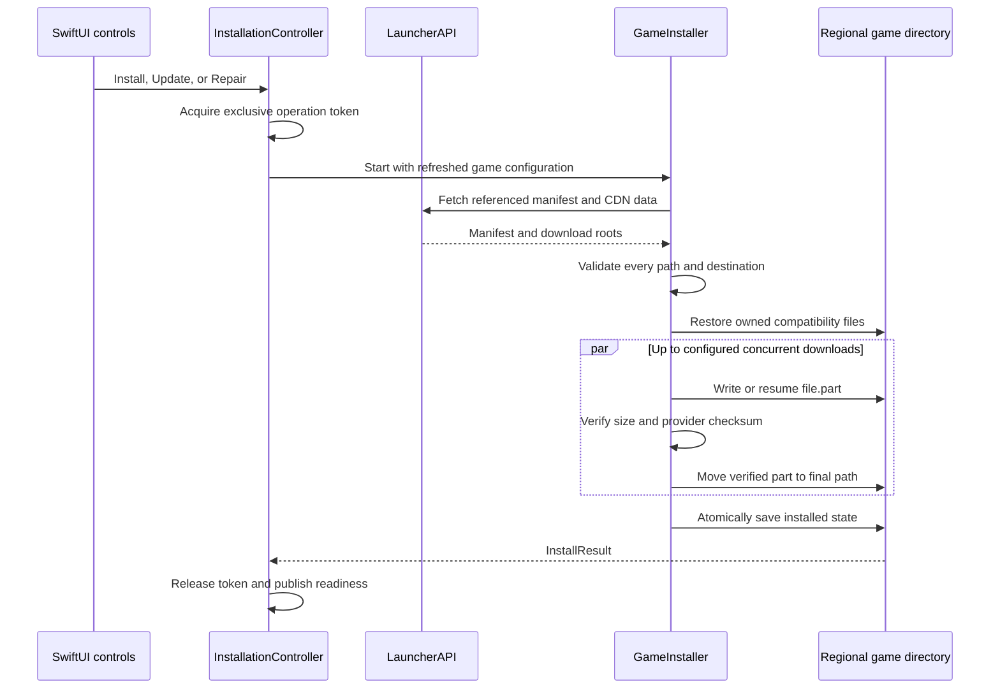
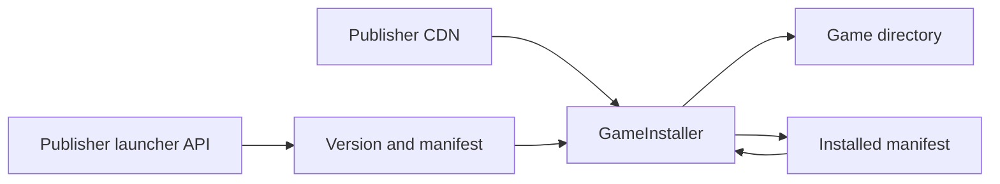
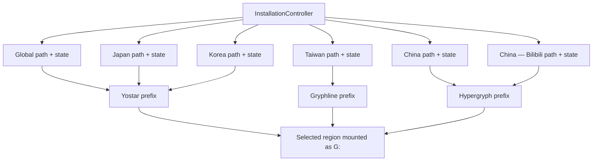

# Installation architecture

The installation feature turns one region's publisher configuration into a verified game directory.
[`InstallationController`](../../../Sources/ArknightsClient/Features/Game/Installation/InstallationController.swift)
owns the selected region, user-selected directory, readiness projection, progress, and task
lifecycle. [`GameInstaller`](../../../Sources/ArknightsClient/Features/Game/Installation/GameInstaller.swift)
performs the filesystem and transfer work. `LauncherAPI` obtains the current version, manifest, and
CDN URLs for a `GameRegion`. Global, Japan, and Korea use the same Yostar API shape and signature
algorithm with different base URLs and `game_tag` values. The Canary-gated Taiwan client uses
Gryphline's batch metadata and web-metadata endpoints with app code `uiCaUeGDB2htwXSv`, channel
and sub-channel `6`, and launcher app code `TiaytKBUIEdoEwRT`. Its `game_files` response is an
encrypted JSON-lines manifest whose entries use MD5 checksums. The Canary-gated China clients use
Hypergryph's batch metadata endpoint with their respective distribution channels.
The Gryphline adapter accepts only HTTPS responses from `launcher.gryphline.com`,
`launcher.hg-cdn.com`, `ak-tw.hg-cdn.com`, and `gl-utils-public.hg-cdn.com`; it never starts the
vendor launcher. It appends `game_files` to the verified package path, decrypts that response with
the shared Hypergryph manifest cipher, and passes the resulting files through the same installer
path-safety and resumable-download checks as every other region.

## Inputs and ownership

| Input or state                        | Owner                                                    | Role                                                                                                          |
| ------------------------------------- | -------------------------------------------------------- | ------------------------------------------------------------------------------------------------------------- |
| Selected region and install directory | `InstallationController` plus `LauncherPreferencesStore` | Selects one of the supported clients and persists one path per region                                         |
| Game configuration                    | `LauncherRefreshController` and `LauncherAPI`            | Supplies latest version, manifest location, executable name, launch parameters, and reported disk requirement |
| Manifest and CDN configuration        | `GameInstaller`                                          | Lists relative file paths, expected byte counts, provider checksums (CRC64 or MD5), and download roots        |
| Installed state                       | `GameInstaller`                                          | Records the manifest that was successfully finalized in `.arknights-client-state.json`                        |
| Exclusive operation                   | `LauncherLifecycleStore` and `ExclusiveOperationGate`    | Prevents refreshes, updates, repair, or stale tasks from mutating the same install concurrently               |
| Compatibility files                   | `GameCompatibilityManager`                               | Restores launcher-owned shims before install/update/repair                                                    |

The installer does not choose a region, update the UI directly, or infer whether a partial install
is usable. Those decisions remain with the controller and the lifecycle store.

> [!IMPORTANT]
> A normal update compares the installed and current manifests so unchanged files can be reused. **Repair** deliberately skips that shortcut: it checks every installed file and downloads missing or damaged files again. Installation is exclusive; refreshes, Settings actions, and repeated clicks cannot start a second installer.
>
> Each region has its own install directory and installed-state file, so regions install and update independently. Yostar regions share one Wine prefix; Taiwan has its own Gryphline prefix; both Hypergryph regions share another. `WinePrefixConfigurator` re-points the selected family's `G:` drive to the active region's directory on every launch.

## Operation flow

The controller starts one operation only after the lifecycle is idle and the current region's game configuration has already been loaded by the refresh path. That configuration supplies the version, manifest location, executable, and reported space requirement used for the initial capacity check. Once the controller owns the operation token, `GameInstaller` fetches the referenced manifest and CDN configuration and begins validation. The token remains the authority for progress and completion; a cancelled task that finishes late cannot clear a newer operation.

Each download streams to disk rather than buffering a whole file. A stream holds a bounded
amount of received-but-unwritten data and suspends its transfer at that ceiling until the
installer catches up, so a fast connection writing to a slow disk cannot grow in memory without
limit.

When the operation is cancelled, the current stream and task group are cancelled. Completed final
files remain valid, while in-progress files keep their `.part` suffix so a later operation can send a
range request. A successful operation saves state even when every manifest file was already present;
that repairs a missing state file without downloading the game again.

## Manifest and path safety

`GameInstaller` validates the complete manifest before it begins downloads. A manifest path may be
relative or have one leading slash, but it may not contain empty components, `.` or `..`, backslashes,
newlines, NUL bytes, or an escape from the selected install directory. Paths are compared with
case-insensitive, canonical Unicode keys so two entries cannot target the same file on macOS.

The validation also reserves the state filename and every `.part` destination. A file cannot shadow
another file's parent directory, and existing symlinks are rejected at every path component. Partial
files must be regular files with one hard link; this keeps a resumed write from following a link or
modifying an unrelated inode.

> [!CAUTION]
> Never relax manifest path checks because a current Yostar, Gryphline, or Hypergryph manifest happens to contain
> only simple names. The manifest is remote input. Path containment, symlink rejection, duplicate detection,
> and safe partial-file handling are installer invariants, not format niceties.

The destination is still checked immediately before a download and immediately before finalization.
This protects the gap between initial validation and a later filesystem change. Verified bytes are
moved from the `.part` path rather than copied, so an interrupted finalization cannot leave an
unverified file at the official destination.

## Reuse, repair, and resume

| Mode                              | Existing file decision                                                                                    | Network behavior                                          |
| --------------------------------- | --------------------------------------------------------------------------------------------------------- | --------------------------------------------------------- |
| Fresh install or incomplete state | A same-size file is checked against the manifest; absent or mismatching files are pending                 | Existing `.part` bytes are resumed when safe              |
| Normal update                     | A same-size file whose previous installed manifest entry has the expected hash is reused                  | Only changed, missing, or incomplete files are downloaded |
| Repair                            | Every existing manifest file is checked with its provider checksum, regardless of the previous state file | Missing or damaged files are downloaded again             |

Each transfer starts at the primary CDN. Failed attempts retry with the configured backoff and use
the fallback CDN on later attempts. A response must be HTTP 200 or 206; when a server answers a range
request with 200, the installer safely truncates the partial file and restarts that file from zero.
An unexpected status, oversized response, size mismatch, or provider-checksum mismatch fails that
file. A checksum failure removes the partial file instead of retrying corrupted bytes.

> [!TIP]
> If a download is paused, keep the regional directory and its `.part` files in place. Starting
> **Resume** or **Install/Update** later lets the installer reuse complete files and continue safe
> partial transfers. Deleting the directory is a full reset, not a repair.

## Final state and region boundaries

The installed-state file contains the publisher-reported game version and file basis, the manifest
source, installation timestamp, and the manifest entries used for the successful operation. The
controller considers a region installed only when both `Arknights.exe` and this state file exist and
decode successfully. It does not consider a directory with a few game files or a `.part` file to be
installed.

Each supported region persists an independent path and state. Regions share a Wine prefix only within
their publisher family:

Selecting another region is blocked during an exclusive activity. When it succeeds, the controller
clears only the selected region's in-memory readiness and resolves that region's persisted path;
it does not move, delete, or rewrite another region's files. The selected publisher family's prefix
is repointed only at launch, after the selected game directory has passed the normal readiness checks.

## Compatibility and update hand-off

Before an install, update, or repair, `GameCompatibilityManager.restoreForUpdate` restores the
official Vuplex and PlatformProcess files that older launches may have wrapped. This gives the
official updater unmodified helper executables. The compatibility manager applies active components
again before the next launch and can remove retired components through stable ownership markers.

> [!WARNING]
> Do not manually replace or delete unknown files beside the game's helpers while troubleshooting.
> The compatibility manager restores only files with its ownership markers and deliberately leaves
> unknown helpers untouched. See [Launch and process lifecycle](launch-and-process-lifecycle.md)
> for the reconciliation contract.

## Failure handling and diagnostics

Failures release the operation token before publishing the user-facing error. The diagnostic log
retains the operation context and target path, while progress callbacks are sequence-numbered so
concurrent downloads cannot move the UI backwards. Cancellation is reported as a paused operation,
not as a corrupt installation; a real transfer or validation failure keeps the existing partial
files that remain safe to resume.

For user-facing recovery steps, link to [Installation](../../installation.md), [Troubleshooting](../../help/troubleshooting.md),
and [Storage](../../help/storage.md). For regression coverage, see [Testing architecture](../testing.md)
and the fixture-backed installer tests in
[`Tests/ArknightsClientTests/Game/Installation`](../../../Tests/ArknightsClientTests/Game/Installation).
