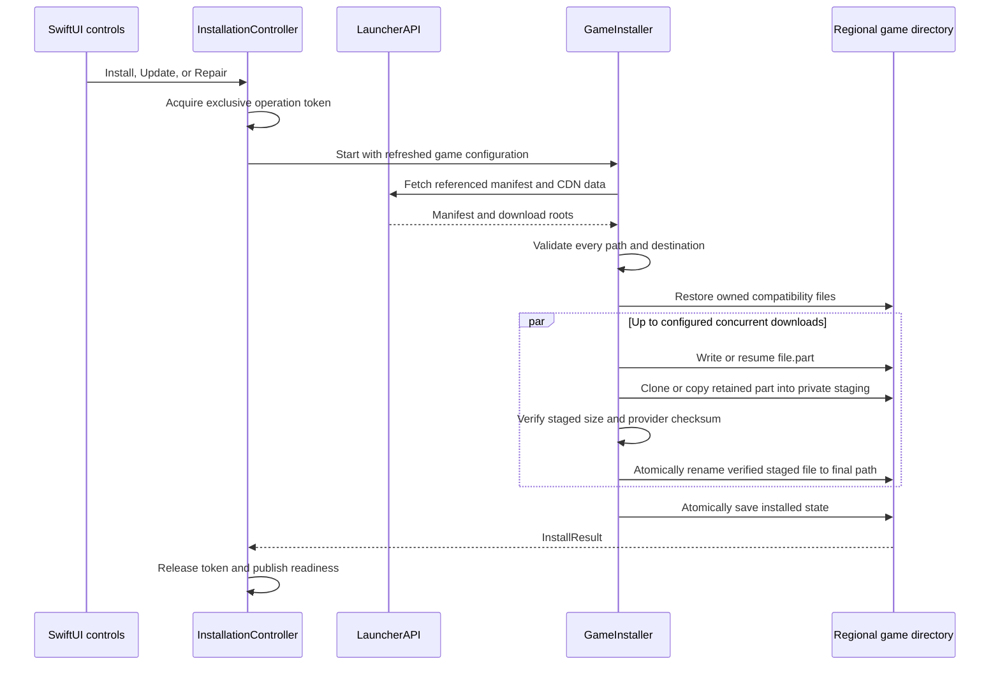
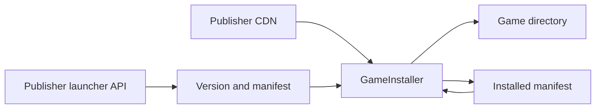

# Installation architecture

- [`InstallationController`](../../../Sources/ArknightsClient/Features/Game/Installation/InstallationController.swift)
  owns region, directory, readiness, progress, and tasks.
- [`GameInstaller`](../../../Sources/ArknightsClient/Features/Game/Installation/GameInstaller.swift)
  does the filesystem and transfer work.
- `LauncherAPI` gets the version, manifest, and CDN URLs for a `GameRegion`.

Each publisher family has its own API:

| Region                  | API                                                                                                                                                                                                                                    |
| ----------------------- | -------------------------------------------------------------------------------------------------------------------------------------------------------------------------------------------------------------------------------------- |
| Global, Japan, Korea    | Same Yostar API shape and signature algorithm. Base URLs and `game_tag` values differ.                                                                                                                                                 |
| Taiwan (Canary-gated)   | Gryphline batch metadata and web-metadata endpoints: app code `uiCaUeGDB2htwXSv`, channel and sub-channel `6`, launcher app code `TiaytKBUIEdoEwRT`. The `game_files` response is an encrypted JSON-lines manifest with MD5 checksums. |
| China, China (Bilibili) | Hypergryph batch metadata endpoint with the respective distribution channel.                                                                                                                                                           |

The Gryphline adapter accepts only HTTPS responses from `launcher.gryphline.com`, `launcher.hg-cdn.com`,
`ak-tw.hg-cdn.com`, and `gl-utils-public.hg-cdn.com`, and never starts the vendor launcher. It appends
`game_files` to the verified package path and decrypts the response with the shared Hypergryph manifest
cipher. The files then pass the same path-safety and download checks as every other region.

## Inputs and ownership

| Input or state                        | Owner                                                    | Role                                                                                               |
| ------------------------------------- | -------------------------------------------------------- | -------------------------------------------------------------------------------------------------- |
| Selected region and install directory | `InstallationController` plus `LauncherPreferencesStore` | Selects a client; persists one path per region                                                     |
| Game configuration                    | `LauncherRefreshController` and `LauncherAPI`            | Supplies version, manifest location, executable name, launch parameters, reported disk requirement |
| Manifest and CDN configuration        | `GameInstaller`                                          | Lists relative paths, byte counts, provider checksums (CRC64 or MD5), download roots               |
| Installed state                       | `GameInstaller`                                          | Records the finalized manifest in `.arknights-client-state.json`                                   |
| Exclusive operation                   | `LauncherLifecycleStore` plus an installer-root `flock`  | Coordinates in-process operations and cooperating installers for one opened install root           |
| Compatibility files                   | `GameCompatibilityManager`                               | Restores launcher-owned shims before install, update, repair                                       |

The controller and lifecycle store, not the installer, choose the region, update the UI, and judge a
partial install.

> [!IMPORTANT]
>
> - A normal update compares the installed and current manifests to reuse unchanged files. **Repair**
>   skips that shortcut: it checks every installed file and downloads missing or damaged files again.
> - Installation is exclusive. Refreshes, Settings actions, and repeated clicks cannot start a second
>   installer.

## Operation flow

The controller starts an operation only when the lifecycle is idle and the refresh path has loaded the
region's game configuration (version, manifest location, executable, reported space requirement for the
capacity check). Then `GameInstaller` fetches the manifest and CDN configuration and validates them. The
operation token stays the authority for progress and completion, so a cancelled task that finishes late
cannot clear a newer operation.

```mermaid
sequenceDiagram
	participant UI as SwiftUI controls
	participant Controller as InstallationController
	participant API as LauncherAPI
	participant Installer as GameInstaller
	participant Disk as Regional game directory

	UI->>Controller: Install, Update, or Repair
	Controller->>Controller: Acquire exclusive operation token
	Controller->>Installer: Start with refreshed game configuration
	Installer->>API: Fetch referenced manifest and CDN data
	API-->>Installer: Manifest and download roots
	Installer->>Installer: Validate every path and destination
	Installer->>Disk: Restore owned compatibility files
	par Up to configured concurrent downloads
		Installer->>Disk: Write or resume file.part
		Installer->>Disk: Clone or copy retained part into private staging
		Installer->>Installer: Verify staged size and provider checksum
		Installer->>Disk: Atomically rename verified staged file to final path
	end
	Installer->>Disk: Atomically save installed state
	Disk-->>Controller: InstallResult
	Controller->>Controller: Release token and publish readiness
```

Each download streams to disk. A stream holds a bounded amount of unwritten data and suspends at that
limit, so memory stays bounded.

On cancellation, the installer cancels the current stream and task group. Completed files stay valid.
In-progress files keep the `.part` suffix for a later range request. A successful operation saves state
even when every file already existed, which repairs a missing state file.

```mermaid
flowchart LR
	API[Publisher launcher API] --> Manifest[Version and manifest]
	CDN[Publisher CDN] --> Installer[GameInstaller]
	Manifest --> Installer
	State[Installed manifest] --> Installer
	Installer --> Files[Game directory]
	Installer --> State
```

## Manifest and path safety

`GameInstaller` validates the complete manifest before downloads begin. A path can be relative or have
one leading slash. It cannot contain empty components, `.` or `..`, backslashes, newlines, NUL bytes, or
an escape from the install directory. Further rules:

- Paths compare as case-insensitive, canonical Unicode keys, so no two entries target one file.
- The validation reserves the state filename and every `.part` destination.
- A file cannot shadow another file's parent directory.
- Existing symlinks are rejected at every path component.
- Partial files must be regular files with one hard link, so a resumed write cannot follow a link or
  modify an unrelated inode.

> [!CAUTION]
> Never relax manifest path checks because a current Yostar, Gryphline, or Hypergryph manifest has only
> simple names. The manifest is remote input. Path containment, symlink rejection, duplicate detection,
> and safe partial-file handling are installer invariants, not format preferences.

File promotion:

- The installer holds its advisory root lock from manifest fetch through state commit. It keeps directory
  parents as open descriptors. Download bytes stay on the opened `.part` inode, even if a name or parent
  pathname changes.
- Before promotion, it clones or copies that descriptor into a unique owner-only staging file, removes
  inherited ACLs, and hashes the staged descriptor. Then it atomically renames the verified inode into
  the opened destination parent.
- It writes and syncs installed-state records in private staging, then renames them atomically into the
  install root.
- Without filesystem cloning, staging uses a bounded copy that can fail for lack of free space. A failure
  leaves the previous destination intact and keeps the resumable `.part`.

Limits:

- On a volume that enforces ownership and permissions, private staging stops other UIDs from replacing
  the verified source name before promotion.
- On a volume mounted to ignore ownership, mode and ACL checks do not isolate staged names. Hashing and
  atomic rename still run, but protection from source-name replacement by another UID is not guaranteed.
- The lock coordinates cooperating installers. It does not stop uncooperative writers or hostile
  same-UID code.

## Reuse, repair, and resume

| Mode                | Existing file decision                                                                  | Network behavior                                    |
| ------------------- | --------------------------------------------------------------------------------------- | --------------------------------------------------- |
| Fresh or incomplete | Same-size file is checked against the manifest; absent or mismatching files are pending | Existing `.part` bytes are resumed when safe        |
| Normal update       | Same-size file with the expected hash in the previous installed manifest is reused      | Only changed, missing, or incomplete files download |
| Repair              | Every existing file is checked with its provider checksum, ignoring the previous state  | Missing or damaged files download again             |

Before it downloads a pending file, `GameInstaller+Reuse` tries to take it from another region's
installation. The preferences store supplies those directories, including custom locations. A donor must:

- be a different directory from the target (compared by device and inode);
- contain `Arknights.exe`;
- have a decodable installed-state file that lists the file's manifest path;
- have the file at the same size, with no sibling `.part`.

Files that already have resumable `.part` bytes are never replaced.

1. The installer clones the donor file with `fclonefileat` into a private `reuse-*.tmp` in the target's
   staging directory.
2. It passes that inode to `finishDownload` in place of a finished `.part`, with the same size check,
   provider checksum, atomic promotion, and failure handling as a download.
3. A clone failure (different volume, no APFS, permission, vanished file) or checksum mismatch discards
   the clone and logs a line. The installer tries the next donor, then the normal download. Reuse never
   fails an installation.

- Donors open read-only. The installer never locks, moves, or modifies them, so a running donor game is
  unaffected.
- Reused bytes advance progress and file count, not network total or transfer rate, so the ETA reflects
  real downloads. Each install logs the files and bytes reused.

Retry and validation:

- Each transfer starts at the primary CDN. Failed attempts retry with the configured backoff and use the
  fallback CDN on later attempts.
- A response must be HTTP 200 or 206. A resumed response must match the requested byte offset and
  manifest size. A changed entity restarts from zero.
- If a server answers a range request with 200, the installer safely truncates the partial file and
  restarts it from zero.
- An unexpected status, oversized response, size mismatch, or checksum mismatch fails the attempt. A
  checksum failure clears the unverified partial bytes before the retry.

The installer validates the source URL and every redirect before it accepts bytes. All must use HTTPS and
have no embedded credentials. Per region:

| Region               | Allowed hosts                                                                                        |
| -------------------- | ---------------------------------------------------------------------------------------------------- |
| Global, Japan, Korea | Any otherwise valid HTTPS host from the publisher configuration                                      |
| China                | Hostname ending in `.hycdn.cn`, no explicit port                                                     |
| Taiwan               | Exactly `launcher.hg-cdn.com`, `ak-tw.hg-cdn.com`, or `gl-utils-public.hg-cdn.com`, no explicit port |

`launcher.gryphline.com` serves the Taiwan metadata adapter, not game-file downloads.

> [!TIP]
> To resume a paused download, keep the regional directory and its `.part` files, then select
> **Resume** or **Install/Update**. Deleting the directory is a full reset, not a repair.

## Final state and region boundaries

The installed-state file holds the publisher-reported game version and file basis, the manifest source,
the install timestamp, and the manifest entries of the successful operation. A region counts as
installed only when `Arknights.exe` and this state file both exist and decode. A partial directory or a
`.part` file is not installed.

Each region has an independent install directory, installed-state file, and persisted path, so regions
install and update independently. Regions share a Wine prefix only within their publisher family:

```mermaid
flowchart TB
	Controller[InstallationController]
	Controller --> Global[Global path + state]
	Controller --> Japan[Japan path + state]
	Controller --> Korea[Korea path + state]
	Controller --> Taiwan[Taiwan path + state]
	Controller --> China[China path + state]
	Controller --> Bilibili[China (Bilibili) path + state]
	Global --> YostarPrefix[Yostar prefix]
	Japan --> YostarPrefix
	Korea --> YostarPrefix
	Taiwan --> GryphlinePrefix[Gryphline prefix]
	China --> HypergryphPrefix[Hypergryph prefix]
	Bilibili --> HypergryphPrefix
	YostarPrefix --> Active[Selected region mounted as G:]
	GryphlinePrefix --> Active
	HypergryphPrefix --> Active
```

The app blocks region selection during an exclusive activity. A selection clears only the selected
region's in-memory readiness and resolves its persisted path. It never moves, deletes, or rewrites
another region's files. At launch, after the selected directory passes the readiness checks,
`WinePrefixConfigurator` re-points the family's `G:` drive to that directory.

## Compatibility and update hand-off

Before an install, update, or repair, `GameCompatibilityManager.restoreForUpdate` restores the official
Vuplex and PlatformProcess files that older launches may have wrapped. The official updater then gets
unmodified helpers.

> [!WARNING]
> Never replace or delete unknown files beside the game's helpers while you troubleshoot. The manager
> restores only files with its ownership markers. See
> [Launch and process lifecycle](launch-and-process-lifecycle.md).

## Failure handling and diagnostics

- Failures release the operation token before the app publishes the error.
- The diagnostic log keeps the operation context and target path.
- Sequence-numbered progress callbacks stop concurrent downloads from moving the UI backwards.
- Cancellation shows as a paused operation. A transfer or validation failure keeps safe partial files.

For user recovery, see [Installation](../../installation.md), [Troubleshooting](../../help/troubleshooting.md),
and [Storage](../../help/storage.md). For coverage, see [Testing architecture](../testing.md) and the
fixture-backed tests in
[`Tests/ArknightsClientTests/Game/Installation`](../../../Tests/ArknightsClientTests/Game/Installation).
