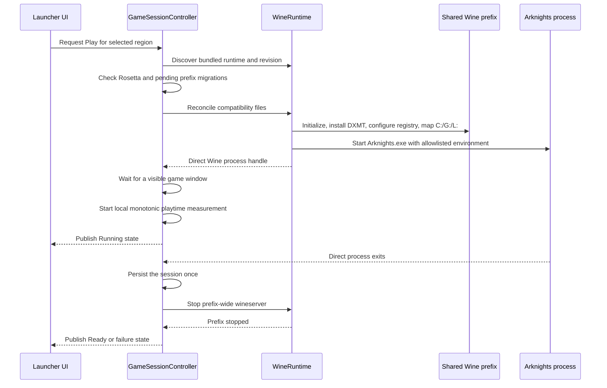
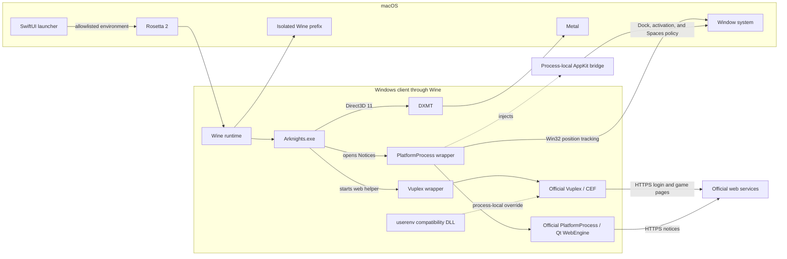
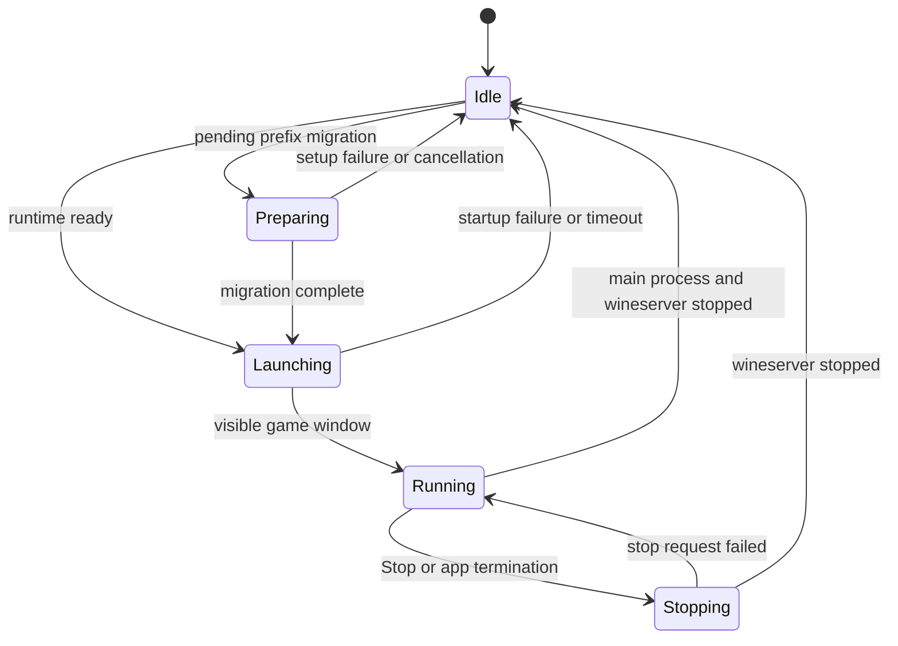
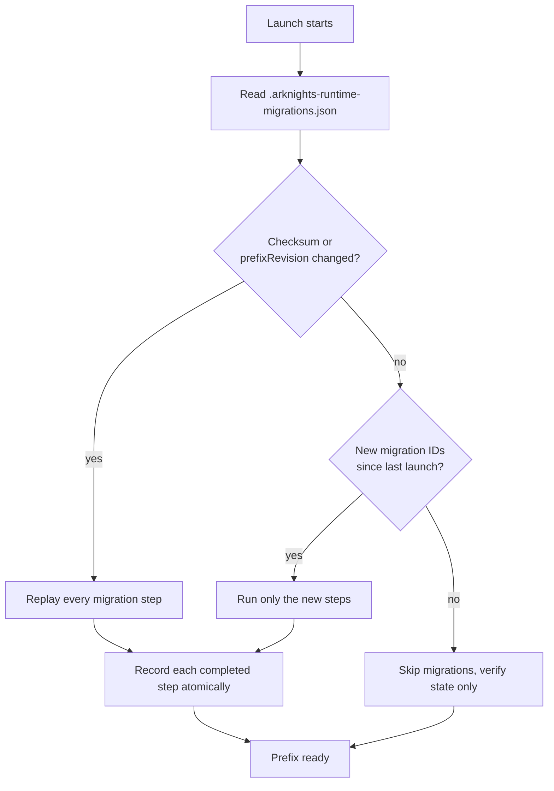

# Launch and process lifecycle

[`GameSessionController`](../../../Sources/ArknightsClient/Features/Game/Runtime/GameSessionController.swift)
owns one Wine-backed session at a time. It does not treat a successful `Process.run()` call as a
running game: launch remains in **Starting** until a visible game window is observed, and shutdown
continues until the prefix-wide `wineserver` has stopped. This distinction keeps browser helpers and
Wine child processes from being mistaken for a ready or fully stopped game.

See [Wine prefix architecture](wine-prefix.md) for the prefix topology, environment, drive mappings,
migration state, persistent data, and maintenance contract used by this lifecycle.

## Startup path migration

When a launcher update changes its standard Application Support layout, the app runs its path
migration before publishing normal readiness. Installation, maintenance, and **Play** remain blocked
until the migration has either completed or presented a blocking recovery message. It checks only the
known old default game and prefix paths, updates an exact persisted old-default game path, and leaves
custom game locations untouched.

The migration is idempotent and resumable. Each source folder is moved to its publisher-based
destination with a same-volume metadata rename; it is never copied, merged, or overwritten. A
completed move is skipped on later starts, and an interruption resumes from the remaining entries.
If both source and destination exist, or an expected path is a symbolic link or another unsafe node,
the app does not guess which data to keep: normal startup stays blocked until the conflict is resolved
or reported. This migration is separate from the per-prefix Wine/DXMT migration that runs before a
game launch.

## Launch process

> [!IMPORTANT]
> The packaged runtime is x86_64 and runs through Rosetta 2. The launcher gives Wine an isolated prefix and an allowlisted environment, mounts the game directory as `G:`, installs the pinned DXMT libraries, and starts `G:\Arknights.exe`. The main game uses DXMT for Direct3D-to-Metal translation. The exact runtime contract and compatibility components are documented in [Runtime compatibility](../../help/runtime-compatibility.md).

“Allowlisted environment” means the launcher constructs Wine's environment from scratch. It inherits only `LANG`, `LC_ALL`, `LC_CTYPE`, and `__CF_USER_TEXT_ENCODING` when present, then adds the private home/XDG paths, Wine paths, runtime search path, logging, synchronization, and selected diagnostic values it owns. It does not forward the complete launcher process environment.

Clients that expose the embedded web path start Arknights' Chromium-based Vuplex helper for account and in-game web pages. China — Bilibili uses its own client login flow; the embedded login-window guidance does not apply to that client. Before launch, the launcher moves the official helper beside a small wrapper. The wrapper preserves the game's arguments and starts the untouched helper with the system DNS resolver. A process-local `userenv.dll` supplies the one AppContainer SID function missing from the tested Wine build.

Notices use a different Qt WebEngine helper named `PlatformProcess.exe`. It runs as a separate Wine and macOS process, so this implementation deliberately keeps it as a top-level companion instead of modifying the game process. A wrapper launches the untouched helper, clears its Win32 frame and `WS_EX_NOACTIVATE` style, and follows the game in Wine's coordinate system. An AppKit bridge keeps the helper's `NSPanel` non-activating while preserving Wine's first-click input path, removes the separate Dock presence, and applies companion-window presentation while Arknights is active. The compatibility components do not inspect page data; the bridge changes only native window presentation.

A separate signed Objective-C bridge runs in the main Wine process. It waits for Wine to initialize AppKit, then normalizes Wine's original executable icon or substitutes a launcher-owned custom game icon through AppKit's public application-icon setter. Game files remain untouched, and removing the custom icon returns the next launch to the normalized original Arknights icon.

The launch hand-off is intentionally ordered:

The direct process handle and the prefix monitor have different jobs. The direct process tells the
controller whether startup failed or the main process exited; `wineserver -w` observes the complete
prefix so helper processes cannot keep the launcher in **Running** after the game is gone.

> [!IMPORTANT]
> A process ID is scoped to a launch session. Every asynchronous callback carries that session's
> UUID and is ignored after a newer session takes ownership. Do not update lifecycle state from an
> unscoped process callback: a late exit from an old Wine process could otherwise stop a new game.

Vuplex can share its accelerated off-screen surface through D3D11, but Chromium and Vuplex cannot coordinate write access to that surface through the tested DXMT path. The wrapper therefore uses Vuplex's CPU `OnPaint` transfer while leaving Chromium's internal GPU compositor enabled. CEF's asynchronous DNS path calls `SIO_ADDRESS_LIST_SORT`, which Wine does not implement; the wrapper disables that path so CEF uses Wine's normal system resolver. Social login starts a separate Chromium process and may take several seconds on first use.

The Notices helper remains a separate application process even though its Dock entry is hidden. Its wrapper tracks the game's absolute position and the bridge keeps it above the game while Arknights is active. Rapid window dragging can show a small visual delay, and clicking between the game and the helper can briefly expose the normal macOS focus transition. The launcher accepts these effects to keep coordination code out of the main game process.

> [!IMPORTANT]
> Install, update, and repair restore the official Vuplex and PlatformProcess executables before modifying game files. Their wrappers are installed again at the next launch only when each official helper still carries its expected signature. Unknown helpers, unrelated `userenv.dll` files, and unknown native bridges are left untouched.

Here, an “expected signature” is a bounded byte marker already present in the supported official helper; it is not a code-signing identity. Launcher-owned wrappers, DLLs, and bridges contain their own stable marker strings so later versions can recognize and replace or restore only files created by this project. A missing official backup produces a repair error, an unsupported official helper is skipped, and a conflicting unmarked compatibility file produces an actionable runtime-configuration error instead of being overwritten.

## Process lifecycle

The launcher remains in **Starting** until Wine exposes a visible game window. It monitors both the direct Wine process and the prefix-wide `wineserver`. Closing the game triggers prefix-scoped cleanup so browser and publisher helpers do not keep the launcher in **Running**. **Stop** and launcher termination use the same prefix-scoped shutdown.

Local playtime follows the same boundary. A failed launch or visible-window timeout records nothing. Once the window is visible, the controller keeps the wall-clock start only for the daily bucket and measures elapsed time from monotonic system uptime. Direct-process and prefix callbacks converge on the same session UUID, so whichever terminal path arrives first records the duration and the other becomes a no-op. Application termination flushes the active duration before synchronous Wine shutdown. A stale marker after an unclean launcher termination is cleared without inventing an end time.

The meaningful state transitions are:

`LauncherLifecycleStore` exposes these states through `LauncherActivity`; `LauncherPhase` is only a
display projection. Refresh, readiness, and presentation errors remain separate branches, so a
background metadata failure does not reset an active launch or installation.

| Diagram activity | Typical user-facing status                                | Meaning                                                   |
| ---------------- | --------------------------------------------------------- | --------------------------------------------------------- |
| `Idle`           | **Ready**, **Update available**, or an actionable failure | No exclusive install/runtime operation owns the lifecycle |
| `Preparing`      | **Preparing Wine**                                        | Prefix migrations or compatibility setup are running      |
| `Launching`      | **Starting**                                              | Wine has started, but no visible game window is ready yet |
| `Running`        | **Running**                                               | The visible game window has been observed                 |
| `Stopping`       | **Stopping**                                              | Prefix-wide shutdown is in progress                       |

The `Arknights` runtime alias and `WINEPRELOADERAPPNAME` give the main macOS process a readable name. Packaging applies one reviewed patch to the staged Wine macOS driver so the standard `Command-Q` shortcut is available.

Prefix changes run through an ordered migration plan: Wine initialization, DXMT installation, and registry overrides. The prefix stores completed migration IDs with the runtime archive checksum and `prefixRevision` in `.arknights-runtime-migrations.json`. Each successful step is recorded atomically, so an interrupted launch resumes at the first incomplete step. A checksum or prefix-revision change replays the complete plan; adding a migration ID runs only that new step for an otherwise current prefix. Version 0.1 markers are imported once and removed.

The migration plan is derived from the bundled runtime, not from the game version. Its effective
revision is `<runtime archive SHA-256>-prefix-<prefixRevision>`. The `initialize-wine-prefix`,
`install-dxmt`, and `configure-registry` steps are ordered because later steps assume the prefix and
DXMT destinations already exist. Registry overrides are migration-controlled, while drive mappings
are reconciled on every launch so the selected region is always the active `G:` target.

> [!CAUTION]
> Do not instruct users to delete the prefix as the default fix for a migration problem. The
> prefix contains persistent Windows-side state such as browser data and saves. Use the targeted
> migration reset first; delete the shared prefix only when troubleshooting specifically calls for
> rebuilding all Wine state.

Normal launches inspect migration, registry, drive, and private-home state without rewriting unchanged files. Runtime diagnostics record cumulative timings for filesystem setup, compatibility reconciliation, prefix preparation, display configuration, and process creation before the launcher records time to the first visible game window.

Game-directory shims implement `GameCompatibilityComponent` and are registered with `GameCompatibilityManager`. Active components are reconciled before every launch; all active and retired components are restored before install, update, or repair. Removing a shim means moving its component from the active list to the retired list for a supported upgrade cycle, allowing launcher-owned files to be cleaned up even when replacement assets are no longer bundled.

Vuplex and PlatformProcess use this reconciliation path rather than one-time migration state because the official updater can replace either helper at any time. Their wrappers, `userenv.dll`, and AppKit bridge carry the embedded ownership markers described above, so upgrades and retirement never rely only on the current bundled bytes. Unknown files remain untouched.

## Prefix boundary and process ownership

The prefix is shared between regions, but a launch has one active `G:` target. `WinePrefixConfigurator`
removes stale drive mappings, maps `G:` to the selected install directory, maps `L:` to the log
directory, and keeps `C:` inside the prefix. It also replaces Wine's default shell-folder links
with private directories for both the current macOS account and the runtime's `crossover` profile.

The process boundary is similarly deliberate:

| Process or helper                       | Started by                                              | Responsibility                                   | Shutdown owner                           |
| --------------------------------------- | ------------------------------------------------------- | ------------------------------------------------ | ---------------------------------------- |
| `Arknights.exe` through `bin/Arknights` | `WineRuntime`                                           | Main Unity game                                  | `GameSessionController` via `wineserver` |
| Vuplex / Chromium helper                | Official game helper through `VuplexShim`               | Account and in-game web pages                    | Wine prefix cleanup                      |
| `PlatformProcess.exe`                   | Official game notice flow through `PlatformProcessShim` | Separate Qt WebEngine Notices window             | Wine prefix cleanup                      |
| `wineserver`                            | Wine runtime                                            | Prefix-wide synchronization and process lifetime | `GameSessionController`                  |
| Native icon/window bridges              | Runtime environment injection                           | AppKit presentation only                         | Process termination                      |

The wrappers preserve the official helper arguments and content. They adjust only the compatibility
or presentation behavior documented in [Runtime compatibility](../../help/runtime-compatibility.md).
They do not become a general proxy for browser data or credentials.

> [!WARNING]
> The private prefix and removed `Z:` mapping limit normal Windows-path access but are not a macOS
> sandbox. Keep the runtime and game directory inside the documented ownership boundary, and do not
> claim that Wine isolation prevents a native runtime component from accessing the host account.

## Failure and shutdown behavior

Launch failures return the lifecycle to **Ready** (or **Update available**) after disabling Game
Mode. A visible-window timeout stops the prefix before reporting the error. If the direct game
process exits during startup, the controller records the exit status and the Wine log; if it exits
after **Running**, the controller still waits for prefix cleanup before publishing the final state.

User-initiated **Stop** changes the activity to **Stopping** before sending `wineserver -k`. If the
stop request fails, the session returns to **Running** so the user can retry. When the application
terminates, the same stop operation runs synchronously with bounded grace periods; a timeout is
logged and escalated to terminate/kill the wineserver process.

Cancellation is scoped to the current session. Cancelling launch does not delete game files or the
prefix, and it cannot clear state owned by a newer launch. See [Troubleshooting](../../help/troubleshooting.md)
for the user-facing recovery path and [Data and persistence](data-and-persistence.md) for what
survives each reset.

## Diagnostics

The current launch directs Wine, Unity, and Chromium diagnostics to the central macOS log directory. Wine writes `wine.log` directly; the prefix maps that directory as `L:`, Unity receives `-logFile L:\unity.log`, and the Vuplex wrapper adds `--log-file=L:\chromium.log`. Their macOS paths are listed in [Troubleshooting](../../help/troubleshooting.md#log-locations). Launch diagnostics include the session ID, region, display and synchronization options, and whether graphics diagnostics were enabled. An unexpected exit adds the process status, termination reason, recent `Arknights-*.ips` crash report when available, and a bounded tail of `wine.log`.

Keep diagnostics bounded and avoid adding credentials, page contents, or arbitrary remote response
bodies to logs. The app exposes the log directory through **Settings → Storage → Show Logs**; users
should attach the relevant files to a private support exchange or a sanitized issue report.
