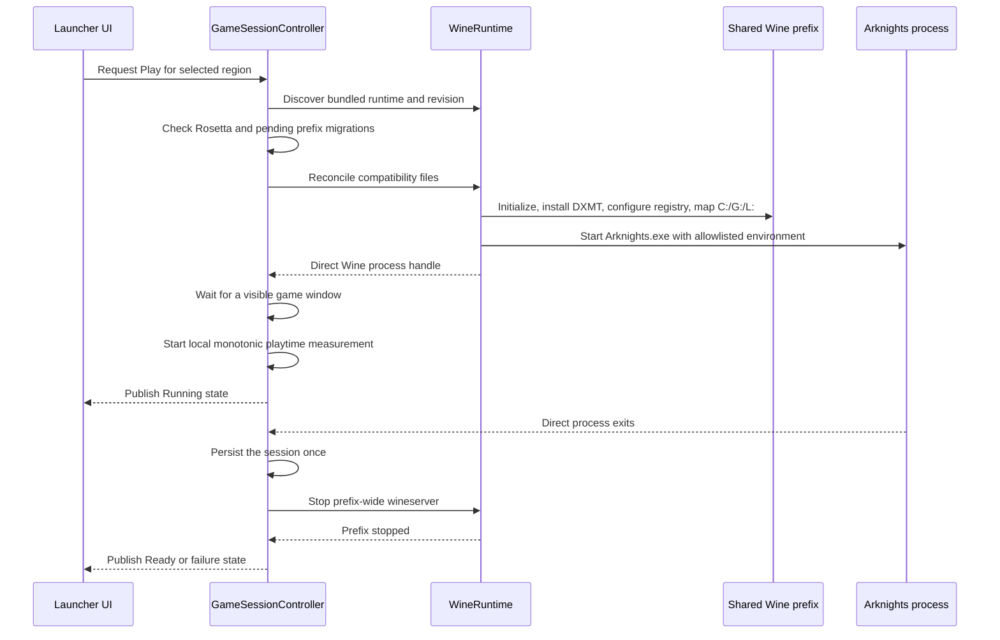
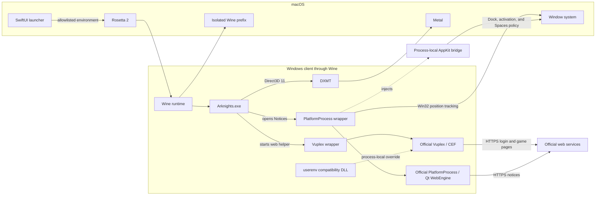
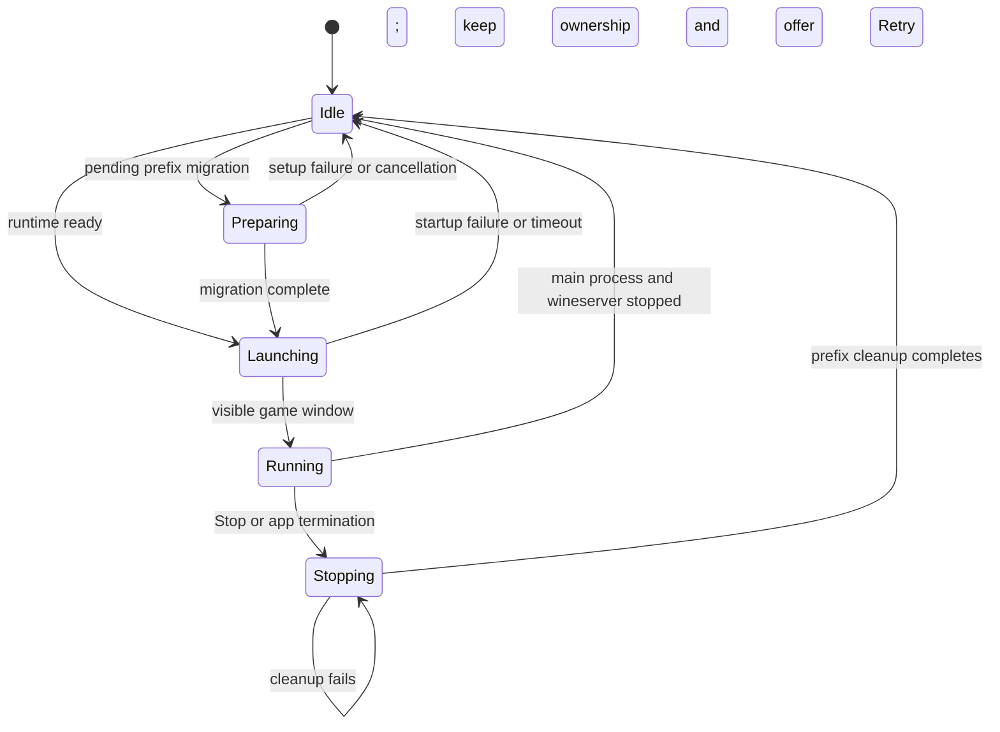
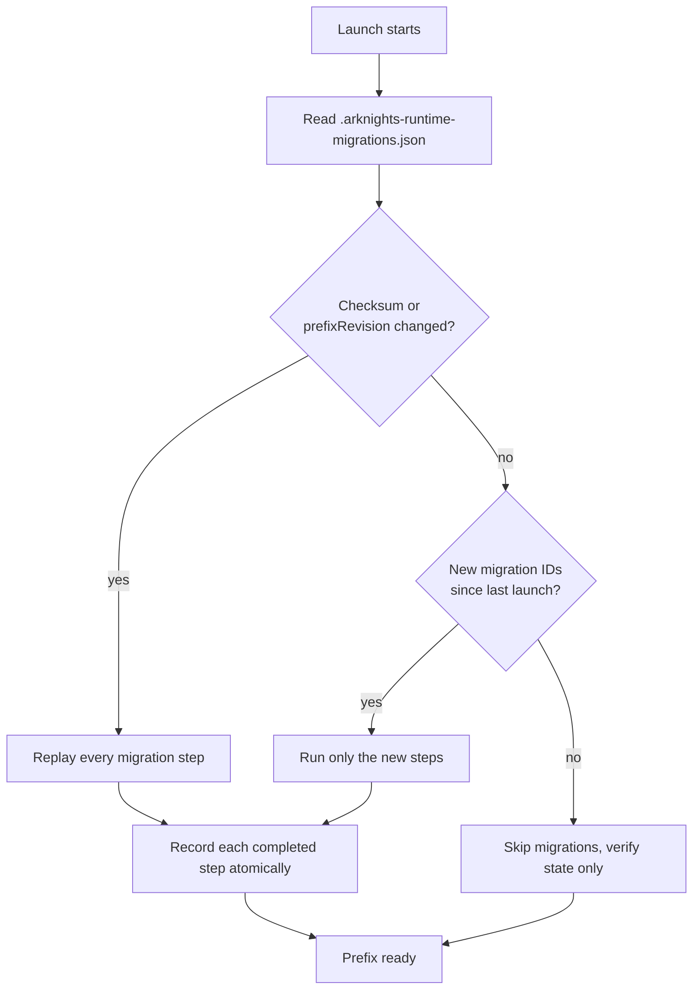

# Launch and process lifecycle

[`GameSessionController`](../../../Sources/ArknightsClient/Features/Game/Runtime/GameSessionController.swift)
owns one Wine-backed session at a time.

- A successful `Process.run()` does not mean the game runs. Launch stays in **Starting** until the
  controller sees a visible game window.
- During a user stop, the session keeps prefix ownership until cleanup completes.
- A failed or timed-out stop stays in **Stopping** with a retry action.

Browser helpers and Wine child processes therefore cannot look like a ready or stopped game. See
[Wine prefix architecture](wine-prefix.md).

## Startup path migration

After a launcher update changes the Application Support layout, a path migration runs before normal
readiness. **Play**, installation, and maintenance stay blocked until it completes or shows a blocking
recovery message. It is separate from the per-prefix Wine/DXMT migration. See
[Data and persistence](data-and-persistence.md#application-support-layout-migration).

## Launch process

> [!IMPORTANT]
> The packaged runtime is x86_64 and runs through Rosetta 2. The launcher gives Wine an isolated
> prefix and an allowlisted environment, mounts the game directory as `G:`, installs the pinned DXMT
> libraries, and starts `G:\Arknights.exe`. DXMT translates Direct3D to Metal. See
> [Runtime compatibility](../../help/runtime-compatibility.md).

[Environment isolation](wine-prefix.md#environment-isolation) lists the environment allowlist.

Sign-in differs per client:

| Client                      | Sign-in path                                                                                                                                                                                                                                                                                                      |
| --------------------------- | ----------------------------------------------------------------------------------------------------------------------------------------------------------------------------------------------------------------------------------------------------------------------------------------------------------------- |
| Global, Japan, Korea, China | Chromium-based Vuplex helper. Before launch, the launcher moves the official helper beside a wrapper. The wrapper keeps the game's arguments and starts the untouched helper with the system DNS resolver. A process-local `userenv.dll` supplies the AppContainer SID function that the tested Wine build lacks. |
| China (Bilibili)            | Bilibili's own CEF login window (`BLPlatform64/PCGamePlatform.exe` with `BLWebBrowser`). `BilibiliPlatformCompatibility` installs a launcher-owned window controller and AppKit bridge beside it. It does not replace Bilibili's platform helper.                                                                 |
| Taiwan                      | macOS default browser. No embedded helper. No sign-in path inspects credentials or bypasses provider challenges.                                                                                                                                                                                                  |

Notices use a separate Qt WebEngine helper, `PlatformProcess.exe`. It runs as a top-level companion
process. The implementation does not modify the game process.

- A wrapper launches the untouched helper, clears its Win32 frame and `WS_EX_NOACTIVATE` style, and
  follows the game in Wine's coordinate system.
- An AppKit bridge keeps the helper's `NSPanel` non-activating, keeps Wine's first-click input path,
  removes the separate Dock presence, and applies companion-window presentation while Arknights is active.
- The components do not inspect page data.

A separate signed Objective-C bridge runs in the main Wine process.

- After Wine initializes AppKit, it normalizes the original executable icon, or sets a launcher-owned
  custom game icon, through AppKit's public application-icon setter.
- Game files stay untouched. Removing the custom icon restores the original icon on the next launch.
- Wine passes the bridge to every process the game starts, such as the China (Bilibili) sign-in helper
  or a console host. The launcher also passes its own process ID, so the bridge keeps only its direct
  child, the game, in the Dock. Other windows become accessory windows, not "wine" Dock entries that
  macOS could keep among recent apps after the game exits.

The launch hand-off order is fixed:

```mermaid
sequenceDiagram
	participant UI as Launcher UI
	participant Session as GameSessionController
	participant Runtime as WineRuntime
	participant Prefix as Shared Wine prefix
	participant Game as Arknights process

	UI->>Session: Request Play for selected region
	Session->>Runtime: Discover bundled runtime and revision
	Session->>Session: Check Rosetta and pending prefix migrations
	Session->>Runtime: Reconcile compatibility files
	Runtime->>Prefix: Initialize, install DXMT, configure registry, map C:/G:/L:
	Runtime->>Game: Start Arknights.exe with allowlisted environment
	Runtime-->>Session: Direct Wine process handle
	Session->>Session: Wait for a visible game window
	Session->>Session: Start local monotonic playtime measurement
	Session-->>UI: Publish Running state
	Game-->>Session: Direct process exits
	Session->>Session: Persist the session once
	Session->>Runtime: Stop prefix-wide wineserver
	Runtime-->>Session: Prefix stopped
	Session-->>UI: Publish Ready or failure state
```

The direct process shows whether startup failed or the main process exited. `wineserver -w` waits on
the wineserver lock, which stays held while the prefix is active.

> [!IMPORTANT]
> A process ID is scoped to a launch session. Every asynchronous callback carries the session UUID. The
> controller ignores it after a newer session takes ownership. Never update lifecycle state from an
> unscoped process callback: a late exit from an old Wine process could stop a new game.

```mermaid
flowchart LR
	subgraph macOS
		Launcher[SwiftUI launcher]
		Rosetta[Rosetta 2]
		Metal[Metal]
		Prefix[Isolated Wine prefix]
		WindowSystem[Window system]
	end

	subgraph Windows client through Wine
		Wine[Wine runtime]
		Game[Arknights.exe]
		DXMT[DXMT]
		Shim[Vuplex wrapper]
		CEF[Official Vuplex / CEF]
		Userenv[userenv compatibility DLL]
		PlatformShim[PlatformProcess wrapper]
		Platform[Official PlatformProcess / Qt WebEngine]
	end
	Bridge[Process-local AppKit bridge]

	Launcher -->|allowlisted environment| Rosetta
	Rosetta --> Wine
	Wine --> Prefix
	Wine --> Game
	Game -->|Direct3D 11| DXMT
	DXMT --> Metal
	Game -->|starts web helper| Shim
	Shim --> CEF
	Userenv -. process-local override .-> CEF
	CEF -->|HTTPS login and game pages| Web[Official web services]
	Game -->|opens Notices| PlatformShim
	PlatformShim --> Platform
	PlatformShim -. injects .-> Bridge
	PlatformShim -->|Win32 position tracking| WindowSystem
	Bridge -->|Dock, activation, and Spaces policy| WindowSystem
	Platform -->|HTTPS notices| Web
```

Helper limits under Wine:

- On the tested DXMT path, Vuplex and Chromium cannot coordinate write access to the accelerated
  off-screen surface that Vuplex shares through D3D11. The wrapper uses Vuplex's CPU `OnPaint` transfer
  and keeps Chromium's internal GPU compositor enabled.
- CEF's asynchronous DNS path calls `SIO_ADDRESS_LIST_SORT`, which Wine does not implement. The wrapper
  disables that path, so CEF uses Wine's system resolver.
- Social login starts a separate Chromium process. First use can take several seconds.
- The Notices helper stays a separate process. Its wrapper tracks the game's absolute position. Fast
  window dragging can show a small delay. Clicking between the game and the helper can briefly show the
  macOS focus transition. The launcher accepts this to keep coordination code out of the game process.

> [!IMPORTANT]
> Install, update, and repair restore the official Vuplex and PlatformProcess executables before they
> change game files. The next launch installs the wrappers again, only when each official helper still
> carries its expected signature. The launcher leaves unknown helpers, unrelated `userenv.dll` files,
> and unknown native bridges untouched.

An "expected signature" is a bounded byte marker in the supported official helper, not a code-signing
identity. Launcher-owned wrappers, DLLs, and bridges carry their own stable marker strings. Later
versions replace or restore only files this project created.

- A missing official backup produces a repair error.
- The launcher skips an unsupported official helper.
- A conflicting unmarked file produces an actionable runtime-configuration error. It is not overwritten.

## Process lifecycle

The launcher monitors the direct Wine process and the prefix-wide `wineserver`. Closing the game
triggers prefix-scoped cleanup, so helpers cannot keep the launcher in **Running**.

Local playtime:

- A failed launch or visible-window timeout records nothing.
- Once the window is visible, the controller keeps the wall-clock start only for the daily bucket. It
  measures elapsed time from monotonic system uptime.
- Direct-process and prefix callbacks share one session UUID. The first terminal path records the
  duration.
- Application termination flushes the active duration before Wine shutdown.
- After an unclean launcher exit, the stale marker is cleared with no invented end time.

```mermaid
stateDiagram-v2
	[*] --> Idle
	Idle --> Preparing: pending prefix migration
	Idle --> Launching: runtime ready
	Preparing --> Launching: migration complete
	Preparing --> Idle: setup failure or cancellation
	Launching --> Running: visible game window
	Launching --> Idle: startup failure or timeout
	Running --> Stopping: Stop or app termination
	Running --> Idle: main process and wineserver stopped
	Stopping --> Stopping: cleanup fails; keep ownership and offer Retry
	Stopping --> Idle: prefix cleanup completes
```

`LauncherLifecycleStore` exposes these states as `LauncherActivity`. `LauncherPhase` is only a display
projection. Refresh, readiness, and presentation errors are separate branches, so a metadata failure
does not reset an active launch or installation.

| Diagram activity | Typical user-facing status                                | Meaning                                                   |
| ---------------- | --------------------------------------------------------- | --------------------------------------------------------- |
| `Idle`           | **Ready**, **Update available**, or an actionable failure | No exclusive install/runtime operation owns the lifecycle |
| `Preparing`      | **Preparing Wine**                                        | Prefix migrations or compatibility setup are running      |
| `Launching`      | **Starting**                                              | Wine has started, but no visible game window is ready yet |
| `Running`        | **Running**                                               | The visible game window has been observed                 |
| `Stopping`       | **Stopping**                                              | Prefix-wide shutdown is in progress                       |

### Activity leases

`LauncherLifecycleStore` controls the launcher activity. Only a lease owner changes it.

1. The owner calls `begin(_:)`. The store returns an `ActivityLease`. It returns `nil` when the
   launcher cannot start exclusive work.
2. The owner calls `update(_:to:)` to change the activity.
3. The owner calls `end(_:)` when the work finishes.

Each call checks the lease token.

- A stale lease is a no-op. It cannot change the activity or set `Idle`.
- After a game session, `Idle` comes only after prefix-wide shutdown completes. A direct game-process
  exit does not set `Idle`.

The `Arknights` runtime alias and `WINEPRELOADERAPPNAME` name the main macOS process. Packaging applies
one reviewed patch to the staged Wine macOS driver to enable `Command-Q`.

Prefix changes run through an ordered migration plan. [Wine prefix architecture](wine-prefix.md#preparation-and-migrations)
lists the steps, revision format, and replay rules. Registry overrides are migration-controlled. Drive
mappings are reconciled on every launch.

> [!CAUTION]
> Do not tell users to delete the prefix as the default fix for a migration problem. It holds
> persistent Windows-side state, such as browser data and saves. Use the targeted migration reset
> first. Delete the shared prefix only to rebuild all Wine state.

```mermaid
flowchart TD
	Launch[Launch starts] --> Read["Read .arknights-runtime-migrations.json"]
	Read --> Changed{"Checksum or<br/>prefixRevision changed?"}
	Changed -->|yes| ReplayAll[Replay every migration step]
	Changed -->|no| NewSteps{"New migration IDs<br/>since last launch?"}
	NewSteps -->|yes| ReplayNew[Run only the new steps]
	NewSteps -->|no| Skip[Skip migrations, verify state only]
	ReplayAll --> Record[Record each completed step atomically]
	ReplayNew --> Record
	Record --> Ready[Prefix ready]
	Skip --> Ready
```

Normal launches inspect migration, registry, drive, and private-home state without rewriting unchanged
files. Diagnostics record cumulative timings for filesystem setup, compatibility reconciliation, prefix
preparation, display configuration, process creation, and the first visible game window.

Game-directory shims implement `GameCompatibilityComponent` and register with `GameCompatibilityManager`.

- The manager reconciles active components before every launch.
- It restores all active and retired components before install, update, or repair.
- To remove a shim, move its component from the active list to the retired list for one supported
  upgrade cycle. The launcher then cleans up its files even without bundled assets.

Vuplex, PlatformProcess, and the Bilibili platform component use this reconciliation, not one-time
migration state, because the official updater can replace these helpers at any time. Ownership markers
mean upgrades and retirement never rely only on the current bundled bytes.

## Prefix boundary and process ownership

See [Directory and drive contract](wine-prefix.md#directory-and-drive-contract) for the `G:` target.

| Process or helper                       | Started by                                              | Responsibility                                   | Shutdown owner                           |
| --------------------------------------- | ------------------------------------------------------- | ------------------------------------------------ | ---------------------------------------- |
| `Arknights.exe` through `bin/Arknights` | `WineRuntime`                                           | Main Unity game                                  | `GameSessionController` via `wineserver` |
| Vuplex / Chromium helper                | Official game helper through `VuplexShim`               | Account and in-game web pages                    | Wine prefix cleanup                      |
| `PlatformProcess.exe`                   | Official game notice flow through `PlatformProcessShim` | Separate Qt WebEngine Notices window             | Wine prefix cleanup                      |
| Bilibili `PCGamePlatform.exe`           | Official Bilibili client with the launcher's controller | Bilibili's own CEF login window                  | Wine prefix cleanup                      |
| `wineserver`                            | Wine runtime                                            | Prefix-wide synchronization and process lifetime | `GameSessionController`                  |
| Native icon/window bridges              | Runtime environment injection                           | AppKit presentation only                         | Process termination                      |

The wrappers keep the official helper's arguments and content. They are not a proxy for browser data
or credentials.

> [!WARNING]
> The private prefix and the removed `Z:` mapping limit normal Windows-path access. They are not a
> macOS sandbox. Keep the runtime and game directory inside the documented ownership boundary. Do not
> claim that Wine isolation stops a native runtime component from accessing the host account.

## Failure and shutdown behavior

A launch failure returns to **Ready** (or **Update available**) only after the launcher disables Game
Mode and completes any required prefix cleanup.

- If cleanup fails or times out, the session stays in **Stopping** with a retryable error.
- A visible-window timeout stops the prefix before the error shows.
- If the direct process exits during startup, the controller records the exit status and the Wine log.
  If it exits after **Running**, the controller still waits for prefix cleanup before the final state.

User **Stop**:

1. The activity changes to **Stopping**. The controller closes the process-spawn gate and issues
   `wineserver -k`.
2. The launcher keeps the prefix owned until every `Process` registered with the gate exits.
3. The controller issues a final `-k` and requires a successful bounded `wineserver -w` before it
   releases ownership.
4. One 20-second deadline covers the full cleanup.

An unresolved child, a timed-out command, or a failed final wait leaves the session in **Stopping**
with a retryable error. **Retry** repeats cleanup for the same session UUID, region, and prefix. A
repeated failure keeps the same recovery state. Overlapping cleanup for one session is deduplicated.

Application termination:

1. The controller closes the process-spawn gate.
2. It synchronously requests `wineserver -k` and waits up to three seconds.
3. If the command still runs, it sends TERM and waits up to one more second.
4. If needed, it sends SIGKILL.

This path does not wait for gated `Process` owners or run a final `wineserver -w`. It cannot confirm
prefix-wide shutdown and never publishes **Idle**.

Cancellation is scoped to the current session. It deletes no game files or prefix and cannot clear
state that a newer launch owns. See [Troubleshooting](../../help/troubleshooting.md) and
[Data and persistence](data-and-persistence.md) for what survives each reset.

## Host checks and compatibility profiles

- **Intel translation probe:** The launcher does not trust `/Library/Apple/usr/share/rosetta/rosetta`
  alone. It runs `/usr/bin/arch -x86_64 /usr/bin/true`. On macOS 27, when Apple's beta-only
  `game-test-tool` exists, it reads the tool status and reports Legacy Game Test Mode separately
  (`LIMPET`). Launcher policy blocks macOS 28. Compatibility with Apple's limited Rosetta support for
  legacy games is unconfirmed.
- **Window wait:** After Wine starts the executable, the launcher waits up to 90 seconds for a visible
  game window. Then it stops the timed-out runtime and reports `NARWHAL`.
- **Compatibility profiles:** `GameRegion.clientProfile` sets the runtime flags. Taiwan and both China
  clients enable ACE Compact. China (Bilibili) also enables the CEF and CN flags for its login window.
  Taiwan and standard China keep the ACE-only profile.
- **Backups:** Game directories and prefixes set `isExcludedFromBackup`.

## Diagnostics

The launch directs Wine, Unity, and Chromium diagnostics to the central macOS log directory.

- Wine writes the selected publisher's runtime log directly: `arknights-yostar.log` (Yostar),
  `arknights-gryphline.log` (Taiwan), or `arknights-hypergryph.log` (Hypergryph).
- `L:` maps that directory. Unity receives `-logFile L:\unity.log`. The Vuplex wrapper
  adds `--log-file=L:\chromium.log`.
- [Storage](../../help/storage.md#logs) lists the macOS paths.

Launch diagnostics include the session ID, region, display and synchronization options, and whether
graphics diagnostics were enabled. An unexpected exit adds the process status, the termination reason,
the latest `Arknights-*.ips` crash report when available, and a bounded tail of the publisher log.

Keep diagnostics bounded. Never log credentials, page contents, or arbitrary remote response bodies.
**Settings → Storage → Show Logs** opens the log directory. Users attach files to a private support
exchange or sanitized issue report.
