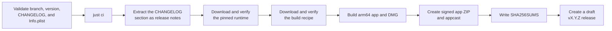

# Releases and updates

## User experience

Each release contains a complete Apple Silicon DMG with the launcher, Wine, DXMT, licenses, and an Applications shortcut. Arknights game files are never part of the DMG.

> [!IMPORTANT]
> Wine and DXMT are released as one tested runtime unit. Do not combine arbitrary latest versions: the browser and graphics fixes must match the Wine build. The current runtime is [`dappermint/Whisky` `4.5.118`](https://github.com/dappermint/Whisky/releases/tag/v4.5.118), built by the pinned [`dappermint/winecx-gptk`](https://github.com/dappermint/winecx-gptk) recipe. It contains Wine 11.15, DXMT 0.80, GStreamer, and the Chromium child-window patches required by the game. A runtime change requires a fresh-prefix and existing-prefix game launch, web login, and clean exit test before release.

The launcher performs a silent Sparkle feed check when it opens. If a newer launcher version exists, the launcher invokes its themed Sparkle update UI for the signed update archive. Installation remains manual because the app is not Developer-ID signed or notarized. The check can be disabled in Settings.

The first check that discovers a new version records it in the launcher's status capsule and Settings. Selecting the update action opens the launcher's accessible Sparkle UI, which presents embedded release notes while Sparkle owns the download, verification, and installation flow; release pages remain available through GitHub.

Game updates are checked separately against Yostar. The check can also be disabled. A check never downloads game data by itself; the user starts the update.

## Creating a release

> [!IMPORTANT]
> Merge the release branch first, update the local `main` branch, and run `just release X.Y.Z` from clean, pushed `main`. Alternatively, start **Draft release** from the GitHub Actions page on `main` and enter the version there. Both paths require the same non-empty version section in `CHANGELOG.md` and an exact `CFBundleShortVersionString` match in `Resources/Info.plist`. The workflow also rejects other branches, malformed versions, and versions whose tag or release already exists.

Before triggering the workflow, check the inputs that affect the published files:

| Input                   | Required state                                                                                                                                           |
| ----------------------- | -------------------------------------------------------------------------------------------------------------------------------------------------------- |
| `CHANGELOG.md`          | Contains a non-empty `## [X.Y.Z]` section; that section becomes the GitHub release notes and Sparkle embedded notes                                      |
| `Resources/Info.plist`  | `CFBundleShortVersionString` exactly matches `X.Y.Z`; `SUPublicEDKey` remains the tracked release public key                                             |
| `runtime.json`          | Valid schema, HTTPS downloads, lowercase SHA-256 values, safe interface paths, paired provenance repositories/commits, and the intended `prefixRevision` |
| Working tree and `main` | Clean, on `main`, with the local branch equal to its upstream; `just release` checks all three conditions before dispatching                             |

The `pages` and `package` jobs run independently from the same release commit. Pages checks out that commit, requires `main`, installs the website lockfile, runs `pnpm check`, and builds with `BASE_PATH=/Arknights-MacOS-Client`. A Pages failure does not stop the package job from creating its draft, but it keeps the workflow red until the website is repaired. Documentation changes alone never dispatch Pages.

Repository owners can inspect published DMG download counts with `just stats`. GitHub reports asset downloads rather than unique users or installations, so the derived totals and latest-version share are directional metrics only.



> [!IMPORTANT]
> [`runtime.json`](../../runtime.json) is the single source of truth for the tested runtime, its prefix revision, build recipe, component versions, source revisions, URLs, and checksums. The workflow reads it with `scripts/runtime_config.py`. Increase `prefixRevision` whenever a runtime or prefix configuration change must be applied to existing installations.

The archive checksum is also part of the effective runtime revision. Changing the pinned archive automatically replays the runtime migrations for an existing prefix, so a binary-only refresh does not require a `prefixRevision` increase or ask users to delete their prefix.

Release automation does not use repository variables for these values. A runtime update is a reviewed `runtime.json` change, so local and GitHub builds cannot silently select different binaries.

The runtime monitor reports newer mirrored dappermint builds for review and checks that pinned artifacts, source commits, recipe metadata, and checksums remain available. It never edits `runtime.json` or opens an update pull request. Candidate issues remain open or closed according to a maintainer decision; availability incidents recover automatically only after two healthy scheduled checks.

### Updating the pinned runtime

Treat a runtime refresh as a compatibility change, not as a dependency bump. Update the reviewed metadata and checksums in [`runtime.json`](../../runtime.json), run `uv run --locked --no-dev scripts/runtime_config.py --validate runtime.json`, and use `just runtime-monitor true` when the archive itself must be downloaded and hashed. Compare the candidate's Wine, DXMT, browser, and build-recipe provenance with the current pin before changing it. Then test a fresh prefix and an existing prefix through install/update, web login, game start, and clean exit. Add or update prefix migrations when the runtime state contract requires them.

Do not approve a candidate only because its version is higher. The monitor reports candidates for maintainer review; it never changes the pin or publishes a runtime.

## Local packaging

The root [`runtime.json`](../../runtime.json) file pins the prebuilt, tested runtime archive and its checksum. To download it and build the app, run:

```sh
just dev
```

`just runtime` only downloads and verifies that pinned runtime into `.build/runtime`. `just dev` uses the same downloader and then builds a complete local app bundle; `just dev dmg` continues through the installable DMG.

> [!IMPORTANT]
> `just runtime` downloads over HTTPS, verifies the SHA-256, safely extracts the archive, validates Wine and both DXMT architectures, and replaces `.build/runtime`. Repeated runs reuse the verified archive cache.

The Wine and DXMT binaries are prebuilt. Packaging compiles only the native Swift launcher and the small x86-64 compatibility components in `RuntimeSupport`, then changes Wine's staged menu shortcut from Option-Command-Q to the standard Command-Q. `just dev` produces the complete app and `just dev dmg` produces the installable disk image. Release users receive those finished artifacts and need no compiler or development tools.

Release automation always uses `runtime.json`. The attached `Runtime-Build-Recipe.tar.gz` records the runtime build process; it is not a complete corresponding-source bundle for every bundled runtime component.

The draft contains these generated assets:

| Asset                         | Purpose                                             |
| ----------------------------- | --------------------------------------------------- |
| DMG                           | Installable arm64 application and pinned runtime    |
| Versioned `.app.zip`          | Complete Sparkle update archive                     |
| `appcast.xml`                 | Signed Sparkle feed with embedded release notes     |
| `Runtime-Build-Recipe.tar.gz` | Pinned runtime build recipe and provenance metadata |
| `SHA256SUMS`                  | SHA-256 checksums for the published artifacts       |

The workflow also attaches GitHub build-provenance attestations. Do not copy generated assets from `dist/` into the repository; inspect them locally or in the draft release.

> [!WARNING]
> Keep the release as a draft until the runtime notice and corresponding-source work described in [`legal/third-party-notices.md`](../legal/third-party-notices.md) is complete. Then install its DMG on a clean Mac and test Install, Update, Repair, and Play before publishing. Published assets and version tags are never replaced. A broken release is fixed with a higher version.

The release workflow creates GitHub build-provenance attestations for the DMG, runtime recipe, and checksum file before opening the draft release. GitHub Actions dependencies remain on readable release tags. Every workflow declares bounded job runtimes and job-specific token permissions; write access is limited to release publication, scheduled contract-alert reconciliation, and the existing repository-owner-gated coding assistant.

## Versioning and changelog

Versions follow Semantic Versioning. Before 1.0, minor versions may contain deliberate compatibility changes; patch versions contain compatible fixes. User-visible work starts in `Unreleased` and moves into an `X.Y.Z` section before release. Keep entries under the existing `Added`, `Changed`, `Fixed`, and `Removed` headings so the website changelog can group them and the release-note extractor can preserve the section.

The release extractor accepts a heading in the form `## [X.Y.Z]` with an optional ` - description` suffix. It takes the content up to the next `## [` heading and fails when that section is missing or empty. Avoid placing unrelated headings or unfinished notes inside the release section.

## Signing limitation

The app is ad-hoc signed so its bundle is internally consistent, but it is not notarized. Users must confirm the first launch with right-click → **Open**. Sparkle updates are signed separately with Ed25519 and replace the complete app bundle through Sparkle's helper; this does not remove the first-launch Gatekeeper confirmation.

The appcast is published as the `appcast.xml` asset of the latest GitHub release and is read through the stable `releases/latest/download/appcast.xml` URL. Each release also contains a complete `.app.zip` update archive. The release workflow creates both from the fully packaged app, preserving bundle symlinks and executable modes, then generates and signs the appcast with Sparkle's `generate_appcast` tool.

> [!CAUTION]
> The Sparkle public key is tracked in `Resources/Info.plist` as `SUPublicEDKey` and is validated as exactly 32 decoded bytes during every package build. The private key is supplied to GitHub Actions only through the protected `release` environment as `SPARKLE_ED25519_PRIVATE_KEY`; it is passed to `generate_appcast` through standard input and never appears in command arguments. Export a current Sparkle `generate_keys -x` seed and ensure it decodes to exactly 32 bytes; legacy 96-byte key-pair exports are rejected. Release validation derives the public key from that seed and compares it with the embedded key before upload. Keep the private key in the macOS login Keychain and one separate encrypted offline recovery copy; never commit it.

The setup assistant always performs one silent Sparkle feed check before version-specific onboarding, independent of the automatic-check preference. If a newer release exists, setup remains pending and opens Sparkle's updater; it resumes only after the newer launcher is installed and reopened. A failed network check is recoverable and does not permanently block first-run setup.
