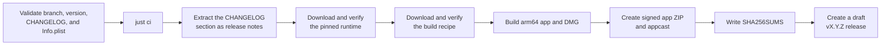

# Releases and updates

## User experience

Each release contains a complete Apple Silicon DMG with the launcher, Wine, DXMT, licenses, and an Applications shortcut. Arknights game files are never part of the DMG.

> [!IMPORTANT]
> Wine and DXMT are released as one tested runtime unit. Do not combine arbitrary latest versions: the browser and graphics fixes must match the Wine build. The current unit is published by [Arknights macOS Runtime](https://github.com/LuMiSxh/Arknights-MacOS-Runtime) and pinned with its exact components, source revisions, and checksums in [`runtime.json`](../../runtime.json). A runtime change requires a fresh-prefix and existing-prefix game launch, each supported client's login path where provided, and a clean exit test before release.

The launcher performs a silent Sparkle feed check when it opens. If a newer launcher version exists, the launcher invokes its themed Sparkle update UI for the signed update archive. The app remains ad-hoc signed and is not notarized; first-launch approval follows the [installation guide](../installation.md). The check can be disabled in Settings.

The first check that discovers a new version records it in the launcher's status capsule and Settings. Selecting the update action opens the launcher's accessible Sparkle UI, which presents embedded release notes while Sparkle owns the download, verification, and installation flow; release pages remain available through GitHub.

Game updates are checked separately against the selected publisher. The check can also be disabled. A check never downloads game data by itself; the user starts the update.

## Creating a release

> [!IMPORTANT]
> Merge the release branch first, update the local `main` branch, and run `just release X.Y.Z` from clean, pushed `main`. Alternatively, start **Draft release** from the GitHub Actions page on `main` and enter the version there. Both paths require the same non-empty version section in `CHANGELOG.md` and an exact `CFBundleShortVersionString` match in `Resources/Info.plist`. The workflow also rejects other branches, malformed versions, and versions whose tag or release already exists.

Before triggering the workflow, check the inputs that affect the published files:

| Input                   | Required state                                                                                                                                           |
| ----------------------- | -------------------------------------------------------------------------------------------------------------------------------------------------------- |
| `CHANGELOG.md`          | Contains a non-empty `## [X.Y.Z]` section; that section becomes the GitHub release notes and Sparkle embedded notes                                      |
| `Resources/Info.plist`  | `CFBundleShortVersionString` exactly matches `X.Y.Z`; `SUPublicEDKey` remains the tracked release public key                                             |
| `runtime.json`          | Valid schema, HTTPS downloads, lowercase SHA-256 values, safe interface paths, paired provenance repositories/commits, and the intended `prefixRevision` |
| Working tree and `main` | Clean, on `main`, with the local branch equal to its upstream; `just release` checks all three conditions before dispatching                             |

The `pages` and `package` jobs run independently from the same release commit. Pages checks out that commit, requires `main`, installs the website lockfile, runs `pnpm check`, and builds with `BASE_PATH=/Arknights-MacOS-Client`. A Pages failure does not stop the package job from creating its draft, but it keeps the workflow red until the website is repaired. Documentation changes alone never dispatch Pages.

Repository owners can inspect published DMG and Sparkle update-archive download counts with `just stats`. The command separates manual packages from in-app updates and reports their combined release totals and rates. GitHub reports asset downloads rather than unique users or installations, so every derived total and latest-version share remains a directional metric only.


```mermaid
flowchart LR
	Check["Validate branch, version,<br/>CHANGELOG, and Info.plist"] --> Test[just ci]
	Test --> Notes["Extract the CHANGELOG<br/>section as release notes"]
	Notes --> Runtime["Download and verify<br/>the pinned runtime"]
	Runtime --> Recipe["Download and verify<br/>the build recipe"]
	Recipe --> Build[Build arm64 app and DMG]
	Build --> Archive["Create signed app ZIP<br/>and appcast"]
	Archive --> Sums[Write SHA256SUMS]
	Sums --> Draft["Create a draft<br/>vX.Y.Z release"]
```

> [!IMPORTANT]
> [`runtime.json`](../../runtime.json) is the single source of truth for the tested runtime, its prefix revision, build recipe, component versions, source revisions, URLs, and checksums. The workflow reads it with `scripts/runtime_config.py`. Increase `prefixRevision` whenever a runtime or prefix configuration change must be applied to existing installations.

The bundled runtime's `RUNTIME.json` may include `interface.runtimeCapabilities`, an optional
single filename for a capability manifest at the runtime root. Package that sidecar when the runtime
supports the optional controls; it declares Hardware Cursor support and optional MetalFX rendering
support. Its frame latency range is still validated but no longer used.
If the entry or manifest is missing, malformed, unreadable, or unsupported, the client uses
conservative defaults and keeps saved Canary preferences without sending unsupported overrides. Do
not infer runtime support from the launcher controls alone.

The archive checksum is also part of the effective runtime revision. Changing the pinned archive automatically replays the runtime migrations for an existing prefix, so a binary-only refresh does not require a `prefixRevision` increase or ask users to delete their prefix.

Release automation does not use repository variables for these values. A runtime update is a reviewed `runtime.json` change, so local and GitHub builds cannot silently select different binaries.

The [Arknights macOS Runtime](https://github.com/LuMiSxh/Arknights-MacOS-Runtime) repository owns
upstream source monitoring, reproducible runtime builds, and runtime releases. This repository owns
the one runtime selected for the client: `runtime.json` pins the reviewed release archive and its
consumer-facing layout.

### Updating the pinned runtime

Treat a runtime refresh as a compatibility change, not as a dependency bump. Start from a published,
checksum-verified Arknights macOS Runtime release, update the reviewed metadata and checksums in
[`runtime.json`](../../runtime.json), and run
`uv run --locked --no-dev scripts/runtime_config.py --validate runtime.json`. Then run `just runtime`
to download, hash, extract, and validate the exact pinned archive. Test a fresh prefix and an existing
prefix through install/update, each supported client's web-login path where provided, game start, and clean exit. Add or update prefix migrations
when the runtime state contract requires them.

Do not approve a runtime only because its version is higher. A runtime release never changes the
client pin automatically; promotion remains a reviewed `runtime.json` change.

## Local packaging

The root [`runtime.json`](../../runtime.json) file pins the prebuilt, tested runtime archive and its checksum. To download it and build the app, run:

```sh
just dev
```

`just runtime` only downloads and verifies that pinned runtime into `.build/runtime`. `just dev` uses the same downloader and then builds a complete local app bundle; `just dev dmg` continues through the installable DMG.

> [!IMPORTANT]
> `just runtime` downloads over HTTPS, verifies the SHA-256, safely extracts the archive, validates Wine and both DXMT architectures, and replaces `.build/runtime`. Repeated runs reuse the verified archive cache.

The Wine and DXMT binaries are prebuilt. Packaging compiles only the native Swift launcher and the small x86-64 compatibility components in `RuntimeSupport`, then changes Wine's staged menu shortcut from Option-Command-Q to the standard Command-Q. `just dev` produces the complete app and `just dev dmg` produces the installable disk image. Release users receive those finished artifacts and need no compiler or development tools.

Release automation always uses `runtime.json`. The attached `Runtime-Build-Recipe.tar.gz` records the runtime build process; it is not a complete corresponding-source bundle for every bundled runtime component.

The draft contains these generated assets:

| Asset                         | Purpose                                             |
| ----------------------------- | --------------------------------------------------- |
| DMG                           | Installable arm64 application and pinned runtime    |
| `.tar.xz` update archive      | Complete Sparkle update archive (0.6.x: `.zip`)     |
| `*.delta`                     | Sparkle binary deltas from recent releases          |
| `appcast.xml`                 | Signed Sparkle feed with embedded release notes     |
| `Runtime-Build-Recipe.tar.gz` | Pinned runtime build recipe and provenance metadata |
| `SHA256SUMS`                  | SHA-256 checksums for the published artifacts       |

The workflow also attaches GitHub build-provenance attestations. Do not copy generated assets from `dist/` into the repository; inspect them locally or in the draft release.

> [!WARNING]
> Keep the release as a draft until the runtime notice and corresponding-source work described in [`legal/third-party-notices.md`](../legal/third-party-notices.md) is complete. Then install its DMG on a clean Mac and test Install, Update, Repair, and Play before publishing. Published assets and version tags are never replaced. A broken release is fixed with a higher version.

The release workflow creates GitHub build-provenance attestations for the DMG, runtime recipe, and checksum file before opening the draft release. GitHub Actions dependencies use immutable commit pins with version comments. Every workflow declares bounded job runtimes and job-specific token permissions; write access is limited to release publication, scheduled contract-alert reconciliation, and wallpaper-tag issue filing.

## Versioning and changelog

Versions follow Semantic Versioning. Before 1.0, minor versions may contain deliberate compatibility changes; patch versions contain compatible fixes. User-visible work starts in `Unreleased` and moves into an `X.Y.Z` section before release. Keep entries under the existing `Added`, `Changed`, `Fixed`, and `Removed` headings so the website changelog can group them and the release-note extractor can preserve the section.

The release extractor accepts a heading in the form `## [X.Y.Z]` with an optional ` - description` suffix. It takes the content up to the next `## [` heading and fails when that section is missing or empty. Avoid placing unrelated headings or unfinished notes inside the release section.

## Signing limitation

The 0.6.1 release remains ad-hoc signed and non-notarized. Users should obtain the official release and follow the [installation guide](../installation.md) for Apple's app-specific **Open Anyway** flow. Sparkle signs updates separately with Ed25519 and replaces the complete app bundle through its helper; this does not remove the first-launch Gatekeeper confirmation.

The appcast is published as the `appcast.xml` asset of the latest GitHub release and is read through the stable `releases/latest/download/appcast.xml` URL. Each release also contains a complete `.tar.xz` update archive (releases up to 0.6.x used `.zip`; Sparkle 2.9.6, the oldest shipped updater, extracts both with `ditto` and `tar`). The release workflow creates both from the fully packaged app, preserving bundle symlinks and executable modes, then generates and signs the appcast with Sparkle's `generate_appcast` tool. Before it creates a draft, the workflow validates the public/private key pair and cryptographically verifies the signed appcast bytes and every enclosure against the generated update archive. It checks the expected archive basename and byte length; the workflow constructs the release URL prefix. This rejects a bad signature, a tampered archive, an incorrect asset filename, or a length mismatch before publication.

> [!CAUTION]
> The current Sparkle public key, K0, is tracked in `Resources/Info.plist` as `SUPublicEDKey` and is validated as exactly 32 decoded bytes during every package build. The private key is supplied to GitHub Actions only through the protected `release` environment as `SPARKLE_ED25519_PRIVATE_KEY`; it is passed to `generate_appcast` through standard input and never appears in command arguments. Export a current Sparkle `generate_keys -x` seed and ensure it decodes to exactly 32 bytes; legacy 96-byte key-pair exports are rejected. Release validation derives the public key from that seed and compares it with K0 before upload. Keep the private key in the macOS login Keychain and one separate encrypted offline recovery copy; never commit it. Local `just ci` and release signature verification require OpenSSL 3 or newer with Ed25519 support. Homebrew's OpenSSL 3 is installed in CI because macOS system LibreSSL does not provide the required command behavior; install `openssl@3` locally and put its `bin` directory before the system tools in `PATH`.

Key rotation is deferred. Sparkle 2.9.6's `generate_appcast` does not add an enclosure signature when the signing seed does not match the public key embedded in the app, and each installed client authenticates the signed feed using its own key ([Sparkle's signing and rotation guide](https://sparkle-project.org/documentation/#rotating-signing-keys)). A single replacement `appcast.xml` therefore cannot serve both K0 and a new K1. Keep K0 until a bridge release can be signed explicitly with `sign_update`, the K0 and K1 generations have separate authenticated feed routes, and packaged A→B and B→C paths pass tests, including a lagging A client still receiving B after C is published. Since current clients are ad-hoc signed, losing K0 requires an independently authenticated recovery path; it cannot be repaired by assigning a new Apple signing identity after the fact.

### Delta updates

The Wine runtime is most of the app bundle and rarely changes, so the workflow also publishes Sparkle binary deltas. Before `generate_appcast`, `scripts/sparkle_deltas.py fetch` downloads the full update archives of the newest published, non-draft, non-prerelease releases (`SPARKLE_DELTA_SOURCE_COUNT` in `scripts/lib/project_config.py`, currently 3) into the update directory as `<stem>.<version>.zip` or `.tar.xz`, keeping each release's own format so `generate_appcast` picks the right extractor. `generate_appcast --maximum-versions 1 --maximum-deltas N` then builds one delta per source and keeps only the new version in the feed; the old archives are inputs and are never uploaded. Clients older than the oldest source, or a delta Sparkle rejects, fall back to the full archive.

Delta generation is best effort. A missing previous release, a failed release listing, or a failed archive download logs a warning and skips that source; the release still ships the complete archive. Deltas never replace the full archive, so a skipped delta only costs users bandwidth.

`generate_appcast` names deltas after the app bundle (`Arknights Client42-41.delta`), but GitHub stores the asset with dots, which would break the appcast URL. `scripts/sparkle_deltas.py finalize` copies the referenced deltas into `dist/` under GitHub-safe names, rewrites their URLs, and signs the feed again with the same K0 seed, since the feed signature covers those URLs. `validate_sparkle_keys.py --delta-directory dist` then verifies every delta's name, host, `sparkle:deltaFrom`, length, and Ed25519 signature. Deltas are part of `SHA256SUMS` and the provenance attestation, and `just stats` counts their downloads as in-app updates.

Sparkle ignores the custom `Icon\r` file that `NSWorkspace.setIcon` writes into the bundle, so the launcher's icon customization does not invalidate deltas. Any other change to the installed bundle makes Sparkle fall back to the full archive.

The setup assistant always performs one silent Sparkle feed check before version-specific onboarding, independent of the automatic-check preference. If a newer release exists, setup remains pending and opens Sparkle's updater; it resumes only after the newer launcher is installed and reopened. A failed network check is recoverable and does not permanently block first-run setup.

To make every existing user go through setup again after a release, bump `OnboardingProgressStore.currentSchemaVersion`. Schema 2 shipped with 0.7.0 for the question-based setup. Preferences are untouched; only setup progress resets.

To make that rerun mandatory, also add the new schema to `OnboardingProgressStore.requiredSchemaVersions` and give it a reason in `OnboardingStrings.requiredSetupReason(schema:)`. Returning players then see why setup is required, and Skip Setup stays hidden until they finish. First-time users can still skip. Schema 2 is required. In debug builds, the **Required** toggle next to **Onboarding preview** in the developer simulator shows this state.
