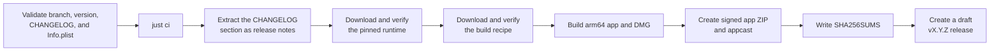

# Releases and updates

## User experience

Each release is a complete Apple Silicon DMG with the launcher, Wine, DXMT, licenses, and an Applications shortcut. It never contains Arknights game files.

> [!IMPORTANT]
> Wine and DXMT are one tested runtime unit. Do not combine arbitrary latest versions; the browser and graphics fixes must match the Wine build. [Arknights macOS Runtime](https://github.com/LuMiSxh/Arknights-MacOS-Runtime) publishes the current unit. [`runtime.json`](../../runtime.json) pins its exact components, source revisions, and checksums. Before you release a runtime change, test launch on a fresh and an existing prefix, each client's login path where provided, and clean exit.

The launcher does a silent Sparkle feed check when it opens (disable it in Settings). A newer version appears in the status capsule and Settings. The update action opens the themed Sparkle UI with embedded release notes. Sparkle owns download, verification, and installation. The app is ad-hoc signed and not notarized; see the [installation guide](../installation.md).

Game updates are checked separately against the publisher (also optional). A check never downloads game data; the user starts the update.

## Creating a release

> [!IMPORTANT]
> Merge the release branch, update local `main`, and run `just release X.Y.Z` from clean, pushed `main`. Or start **Draft release** from GitHub Actions on `main` and enter the version. Both paths need the inputs below. The workflow rejects other branches, malformed versions, and existing tags or releases.

Check these inputs first:

| Input                   | Required state                                                                                                                                       |
| ----------------------- | ---------------------------------------------------------------------------------------------------------------------------------------------------- |
| `CHANGELOG.md`          | Non-empty `## [X.Y.Z]` section; it becomes the GitHub and Sparkle release notes                                                                      |
| `Resources/Info.plist`  | `CFBundleShortVersionString` exactly matches `X.Y.Z`; `SUPublicEDKey` stays the tracked release public key                                           |
| `runtime.json`          | Valid schema, HTTPS downloads, lowercase SHA-256 values, safe interface paths, paired provenance repositories and commits, intended `prefixRevision` |
| Working tree and `main` | Clean, on `main`, equal to upstream. `just release` checks all three                                                                                 |

The `pages` and `package` jobs run independently from the same commit. Pages requires `main`, installs the website lockfile, runs `pnpm check`, and builds with `BASE_PATH=/Arknights-MacOS-Client`. A Pages failure does not stop the draft but keeps the workflow red. Documentation changes never dispatch Pages.

`just stats` shows DMG and Sparkle archive download counts, separating manual packages from in-app updates. GitHub counts downloads, not unique users, so treat derived totals and shares as directional only.

```mermaid
flowchart LR
	Check["Validate branch, version,<br/>CHANGELOG, and Info.plist"] --> Test[just ci]
	Test --> Notes["Extract the CHANGELOG<br/>section as release notes"]
	Notes --> Runtime["Download and verify<br/>the pinned runtime"]
	Runtime --> Recipe["Download and verify<br/>the build recipe"]
	Recipe --> Build[Build arm64 app and DMG]
	Build --> Archive["Create signed app ZIP<br/>and appcast"]
	Archive --> Sums[Write SHA256SUMS]
	Sums --> Draft["Create a draft<br/>vX.Y.Z release"]
```

> [!IMPORTANT]
> [`runtime.json`](../../runtime.json) is the single source of truth for the tested runtime, prefix revision, build recipe, component versions, source revisions, URLs, and checksums. The workflow reads it with `scripts/runtime_config.py`. Increase `prefixRevision` whenever a runtime or prefix configuration change must reach existing installations.

The bundled `RUNTIME.json` can include `interface.runtimeCapabilities`, an optional filename for a capability manifest at the runtime root. Package that sidecar when the runtime supports the optional controls. It declares Hardware Cursor and optional MetalFX support. The launcher validates its frame latency range but no longer uses it. If the entry or manifest is missing, malformed, unreadable, or unsupported, the client uses conservative defaults, keeps saved Canary preferences, and sends no unsupported overrides. Do not infer runtime support from the launcher controls.

The archive checksum is part of the effective runtime revision. A changed pinned archive replays the runtime migrations for an existing prefix, so a binary-only refresh needs no `prefixRevision` increase and no prefix deletion.

Release automation uses no repository variables for these values. The [Arknights macOS Runtime](https://github.com/LuMiSxh/Arknights-MacOS-Runtime) repository owns upstream source monitoring, runtime builds, and runtime releases. This repository pins the one runtime the client uses.

### Updating the pinned runtime

A runtime refresh is a compatibility change, not a dependency bump:

1. Start from a published Arknights macOS Runtime release. Run `just runtime update TAG`. The command rewrites [`runtime.json`](../../runtime.json) and every generated mention of the pin from the release assets. [Runtime updates](runtime-updates.md) describes the command and its manual steps.
2. Run `uv run --locked --no-dev scripts/runtime_config.py --validate runtime.json`, then `just runtime` to download, hash, extract, and validate the archive.
3. Test a fresh and an existing prefix through install/update, each client's web-login path where provided, game start, and clean exit.
4. Add or update prefix migrations when the runtime state contract requires them.

Do not approve a runtime because its version is higher. A runtime release never changes the client pin.

## Local packaging

Download the pinned runtime and build the app with `just dev`. `just dev dmg` continues to the installable DMG.

> [!IMPORTANT]
> `just runtime` only downloads the runtime. It downloads over HTTPS, verifies the SHA-256, safely extracts the archive, validates Wine and both DXMT architectures, and replaces `.build/runtime`. Repeated runs reuse the verified cache. `just dev` uses the same downloader.

Packaging compiles only the Swift launcher and the x86-64 components in `RuntimeSupport`, and changes Wine's staged menu shortcut from Option-Command-Q to Command-Q. The attached `Runtime-Build-Recipe.tar.gz` records the runtime build process. It is not a complete corresponding-source bundle for every bundled runtime component.

Packaging writes one compact `ThirdPartyNotices.deflate` file into the app. The website publishes the same content. Run `scripts/licenses.py --check --strict --runtime .build/runtime` before a release. See [License automation](license-automation.md) for the index, `--check`, and strict mode.

The draft contains:

| Asset                         | Purpose                                             |
| ----------------------------- | --------------------------------------------------- |
| DMG                           | Installable arm64 application and pinned runtime    |
| `.tar.xz` update archive      | Complete Sparkle update archive (0.6.x: `.zip`)     |
| `*.delta`                     | Sparkle binary deltas from recent releases          |
| `appcast.xml`                 | Signed Sparkle feed with embedded release notes     |
| `Runtime-Build-Recipe.tar.gz` | Pinned runtime build recipe and provenance metadata |
| `SHA256SUMS`                  | SHA-256 checksums for the published artifacts       |

The workflow attaches GitHub build-provenance attestations for the DMG, runtime recipe, and checksum file. Do not copy assets from `dist/` into the repository.

> [!WARNING]
> Keep the release as a draft until the runtime notice and corresponding-source work in [`legal/third-party-notices.md`](../legal/third-party-notices.md) is complete. Then test Install, Update, Repair, and Play from its DMG on a clean Mac. Published assets and version tags are never replaced. Fix a broken release with a higher version.

GitHub Actions dependencies use immutable commit pins with version comments. Every workflow declares bounded job runtimes and job-specific token permissions. Write access is limited to release publication, contract-alert reconciliation, and wallpaper-tag issue filing.

## Versioning and changelog

Versions follow Semantic Versioning. Before 1.0, minor versions can contain deliberate compatibility changes and patch versions contain compatible fixes. User-visible work starts in `Unreleased` and moves to an `X.Y.Z` section before release. Keep entries under the `Added`, `Changed`, `Fixed`, and `Removed` headings.

The extractor accepts a `## [X.Y.Z]` heading with an optional ` - description` suffix, takes content up to the next `## [` heading, and fails when the section is missing or empty. Keep unrelated headings and unfinished notes out of it.

## Signing limitation

The 0.6.1 release remains ad-hoc signed and non-notarized. Users must follow the [installation guide](../installation.md) for Apple's **Open Anyway** flow. Sparkle signs updates separately with Ed25519 and replaces the complete app bundle through its helper. This does not remove the first-launch Gatekeeper confirmation.

Clients read the appcast, the `appcast.xml` asset of the latest release, through the stable `releases/latest/download/appcast.xml` URL. Each release also has a complete `.tar.xz` update archive (up to 0.6.x: `.zip`). Sparkle 2.9.6, the oldest shipped updater, extracts both with `ditto` and `tar`.

The release workflow creates both archives from the fully packaged app, preserving bundle symlinks and executable modes. It generates and signs the appcast with Sparkle's `generate_appcast`. Before it creates the draft, it validates the public/private key pair and verifies the signed appcast bytes and every enclosure against the generated archive, including the expected archive basename and byte length. The workflow constructs the release URL prefix. This rejects a bad signature, tampered archive, wrong asset filename, or length mismatch before publication.

> [!CAUTION]
>
> - The current Sparkle public key, K0, is tracked in `Resources/Info.plist` as `SUPublicEDKey`. Every package build validates that it decodes to exactly 32 bytes.
> - The private key reaches GitHub Actions only through the protected `release` environment as `SPARKLE_ED25519_PRIVATE_KEY`. The workflow passes it to `generate_appcast` through standard input, never in arguments.
> - Export a current Sparkle `generate_keys -x` seed of exactly 32 decoded bytes. The workflow rejects legacy 96-byte key-pair exports.
> - Release validation derives the public key from the seed and compares it with K0 before upload.
> - Keep the private key in the macOS login Keychain and one separate encrypted offline recovery copy. Never commit it.
> - Local `just ci` and release signature verification need OpenSSL 3 or newer with Ed25519 support. macOS system LibreSSL lacks it, so CI installs Homebrew's OpenSSL 3. Install `openssl@3` locally and put its `bin` directory before the system tools in `PATH`.

Key rotation is deferred. Sparkle 2.9.6's `generate_appcast` adds no enclosure signature when the signing seed does not match the public key embedded in the app. Each installed client authenticates the signed feed with its own key ([Sparkle's guide](https://sparkle-project.org/documentation/#rotating-signing-keys)). One replacement `appcast.xml` cannot serve both K0 and a new K1. Keep K0 until all of these are true:

- A bridge release can be signed explicitly with `sign_update`.
- The K0 and K1 generations have separate authenticated feed routes.
- Packaged A→B and B→C paths pass tests, including a lagging A client that still receives B after C is published.

Current clients are ad-hoc signed, so losing K0 requires an independently authenticated recovery path. A new Apple signing identity cannot repair it afterward.

### Delta updates

The Wine runtime is most of the bundle and rarely changes, so the workflow also publishes Sparkle binary deltas. Before `generate_appcast`, `scripts/sparkle_deltas.py fetch` downloads the full update archives of the newest published, non-draft, non-prerelease releases (`SPARKLE_DELTA_SOURCE_COUNT` in `scripts/lib/project_config.py`, currently 3). It saves each as `<stem>.<version>.zip` or `.tar.xz` in the release's own format. `generate_appcast --maximum-versions 1 --maximum-deltas N` then builds one delta per source and keeps only the new version in the feed. The old archives are never uploaded. Clients older than the oldest source, or that reject a delta, use the full archive.

Delta generation is best effort. A missing release, failed listing, or failed download logs a warning and skips that source. The complete archive still ships.

`generate_appcast` names deltas after the app bundle (`Arknights Client42-41.delta`), but GitHub stores the asset with dots, which breaks the URL. `scripts/sparkle_deltas.py finalize` copies the referenced deltas into `dist/` under GitHub-safe names, rewrites their URLs, and signs the feed again with the same K0 seed, because the signature covers those URLs. `validate_sparkle_keys.py --delta-directory dist` then verifies every delta's name, host, `sparkle:deltaFrom`, length, and Ed25519 signature. Deltas are in `SHA256SUMS` and the attestation. `just stats` counts them as in-app updates.

Sparkle ignores the custom `Icon\r` file that `NSWorkspace.setIcon` writes into the bundle, so icon customization does not invalidate deltas. Any other bundle change makes Sparkle use the full archive.

The setup assistant always does one silent Sparkle check before version-specific onboarding, regardless of the automatic-check preference. If a newer release exists, setup stays pending and opens Sparkle's updater. It resumes after the newer launcher is installed and reopened. A failed network check is recoverable and does not block first-run setup.

To make every existing user rerun setup after a release, bump `OnboardingProgressStore.currentSchemaVersion`. Schema 2 shipped with 0.7.0 for the question-based setup. Preferences stay unchanged. Only setup progress resets.

To make the rerun mandatory, also add the new schema to `OnboardingProgressStore.requiredSchemaVersions` and give it a reason in `OnboardingStrings.requiredSetupReason(schema:)`. Returning players then see why, and Skip Setup stays hidden until they finish. First-time users can still skip. Schema 2 is required. In debug builds, the **Required** toggle next to **Onboarding preview** in the developer simulator shows this state.
