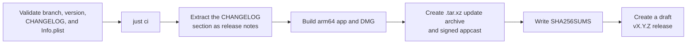

# Releases and updates

Each release is a complete Apple Silicon DMG with the launcher, its licenses, and an Applications shortcut. It does not contain a runtime or Arknights game files. On first use, the launcher asks for an architecture and downloads the pinned runtime for that architecture. [`runtime.json`](../../scripts/config/runtime.json) pins one runtime archive per lane. [Runtime updates](#runtime-updates) describes how to change a pin.

## Creating a release

> [!IMPORTANT]
> Merge the release branch, update local `main`, and run `just release X.Y.Z` from clean, pushed `main`. Or start **Draft release** from GitHub Actions on `main` and enter the version. The workflow rejects other branches, malformed versions, and existing tags or releases.

Check these inputs first:

| Input                   | Required state                                                                                                                                                                                                    |
| ----------------------- | ----------------------------------------------------------------------------------------------------------------------------------------------------------------------------------------------------------------- |
| `CHANGELOG.md`          | Non-empty `## [X.Y.Z]` section; it becomes the GitHub and Sparkle release notes                                                                                                                                   |
| `Resources/Info.plist`  | `CFBundleShortVersionString` exactly matches `X.Y.Z`; `SUPublicEDKey` stays the tracked release public key                                                                                                        |
| `runtime.json`          | Schema 4 with `lanes.x86` and `lanes.arm`; each lane has a runtime name and version, an HTTPS URL, lowercase SHA-256, byte size, pinned deltas, `minimumMacOS`, lane `prefixRevision`, interface, components, and provenance |
| Working tree and `main` | Clean, on `main`, equal to upstream. `just release` checks all three                                                                                                                                              |

A release can be critical. Set the **critical** input when you start **Draft release** from GitHub Actions; `just release` does not pass it. Use it only for an urgent fix that users must install now. The update window then has no **Later** button, and **Cancel** remains while the update downloads. Launcher builds from this release onward honor the flag; older builds ignore it.

The `pages` and `package` jobs run independently from the same commit. Pages requires `main`, runs `pnpm check`, and builds with `BASE_PATH=/Arknights-MacOS-Client`. A Pages failure does not stop the draft but keeps the workflow red.

The `package` job works in this order. It validates the branch, version, `CHANGELOG.md`, and `Info.plist`. It runs `just ci`. It extracts the changelog section as release notes. It builds the arm64 app and DMG. It creates the signed update archive and appcast, writes `SHA256SUMS`, and creates the draft `vX.Y.Z` release. It publishes no runtime binary.

This diagram shows the same order:


```mermaid
flowchart LR
	Check["Validate branch, version,<br/>CHANGELOG, and Info.plist"] --> Test[just ci]
	Test --> Notes["Extract the CHANGELOG<br/>section as release notes"]
	Notes --> Build[Build arm64 app and DMG]
	Build --> Archive["Create .tar.xz update archive<br/>and signed appcast"]
	Archive --> Sums[Write SHA256SUMS]
	Sums --> Draft["Create a draft<br/>vX.Y.Z release"]
```

`just stats` shows DMG and Sparkle archive download counts, separated into manual packages and in-app updates. GitHub counts downloads, not unique users. Treat the totals as directional.

## Local packaging

Run `just dev` to build the app. Run `just dev dmg` to continue to the installable DMG. The app bundle contains no runtime, so the build does not need a local runtime directory.

To inspect the license list with a prepared runtime, download one lane with `uv run --locked scripts/download_runtime.py --architecture x86` or `--architecture arm`. The script verifies the SHA-256 and size, extracts the archive safely, validates the lane interface, and writes `.build/runtime-x86` or `.build/runtime-arm`.


Packaging compiles the Swift launcher, the universal macOS shims in `RuntimeSupport`, and its x86-64 Windows libraries. It writes one compact `ThirdPartyNotices.deflate` file with the launcher notices into the app. Each runtime archive carries its own notices. See [License automation](license-automation.md).


The draft contains:

| Asset                    | Purpose                                         |
| ------------------------ | ----------------------------------------------- |
| DMG                      | Installable arm64 application                   |
| `.tar.xz` update archive | Complete Sparkle update archive (0.6.x: `.zip`) |
| `*.delta`                | Sparkle binary deltas from recent releases      |
| `appcast.xml`            | Signed Sparkle feed with embedded release notes |
| `SHA256SUMS`             | SHA-256 checksums for the published artifacts   |

The workflow attaches GitHub build-provenance attestations to the DMG, the `.tar.xz` update archive, the deltas, `appcast.xml`, and the checksum file. Do not copy assets from `dist/` into the repository.

To test the release path without publishing, start **Draft release** from any branch with **dry_run** enabled. The run builds, signs, and verifies everything, including the Sparkle deltas. It skips the website deploy, the attestation, and the draft release. It uploads the files as the `dry-run-vX.Y.Z` workflow artifact, which expires after three days. Inspect that artifact before a real release.

GitHub Actions dependencies use immutable commit pins with version comments. Every workflow declares bounded job runtimes and job-specific token permissions. Write access is limited to draft release creation, Pages deployment, live-contract failure issues, and the wallpaper-tag scan. The scan opens pull requests, dispatches CI for them, and files issues.

## Release review

> [!WARNING]
> Keep the release as a draft until every item below passes. Published assets and version tags are never replaced. Fix a broken release with a higher version.

1. The source tag matches `CFBundleShortVersionString` and the release notes.
2. `Contents/Resources/RUNTIME.json` in the app matches the `runtime.json` that the build used. It contains both lane pins.
3. `Contents/Resources/Runtime` is absent. The app bundle contains no runtime binary.
4. Each lane in `runtime.json` has a reachable HTTPS archive URL, a matching SHA-256, a byte size, a `minimumMacOS` value, and an interface. The archive at each URL carries `bin/wine64`, `bin/wineserver`, `winemetal.dll` where its lane requires it, the macOS driver, and the DXMT library set. The ARM64 archive also carries FEX and Mesa.
5. The component commits of each lane in `runtime.json` match the source links in [Third-party notices](../legal/third-party-notices.md). The x86 lane lists MoltenVK; the ARM64 lane lists FEX and Mesa.
6. The app bundle contains `LICENSE`, `RUNTIME.json`, and `ThirdPartyNotices.deflate`. The website publishes current [Third-party notices](../legal/third-party-notices.md) and [License texts](../legal/license-texts.md). **Settings → About → Third-Party Notices** shows the launcher list and the notices of the installed runtime.
7. `scripts/licenses.py --check` passes. On a machine with a prepared runtime, `scripts/licenses.py --check --strict --runtime .build/runtime-x86` also passes. The step fails on a stale generated block or on any unverified launcher component.
8. Each pinned runtime archive has its own reviewed source and notice package. For each runtime library, the runtime repository records the exact version or revision, notices, preferred-form source, and build scripts. The client does not publish a runtime closure inventory. The packaging checks cannot decide this step. See [Source code](../legal/source-code.md).
9. Install, first-run runtime download, Update, Repair, and Play work from the DMG on a clean Mac. Test both architectures on macOS 26.5 or later.

If an artifact lacks a notice, has another runtime checksum, or points to the wrong tag, keep the release as a draft and open a repository issue with the version and asset.

## Runtime updates

[`runtime.json`](../../scripts/config/runtime.json) is the single source of truth for the pinned runtimes. It has schema 4 and two lanes: `x86` and `arm`. Each lane carries the runtime name, version, archive URL, SHA-256, size, deltas, interface, component versions, provenance, `minimumMacOS`, and `prefixRevision`.

One launcher release serves both architectures. The launcher chooses the lane by macOS version, not by a separate app build or Sparkle channel. It picks `arm` from `AppConstants.Runtime.armLaneMinimumMacOS` (26.5) and `x86` below. **Settings** → **Runtime** → **Danger zone** → **Runtime choice** overrides the automatic choice. The launcher downloads the runtime for the chosen lane on first use, and a switch never starts a download.

### Runtime lanes

A lane is one runtime architecture. The x86 lane runs the WineCX and DXMT binaries through Rosetta 2. The arm lane runs native ARM64 Wine with FEX and Mesa.

| Lane  | Minimum macOS | Game environment             | Runtime content        |
| ----- | ------------- | ---------------------------- | ---------------------- |
| `x86` | 15.0          | `Environments/<publisher>-x86` | WineCX, DXMT, MoltenVK |
| `arm` | 26.5          | `Environments/<publisher>-arm` | Wine, FEX, Mesa, DXMT  |

The top-level `architecture` value is the default lane for `just runtime` and local tooling. The launcher resolves the lane from the macOS version and the saved override; it never reads the x86 interface for an ARM runtime. The `minimumMacOS` column is the lane's hard floor; the automatic choice can require a newer version.

Each runtime release compiles all compatibility patches into one build. The client selects patch behavior at launch with one `LMISXH_AKMOCL_<NAME>` gate per patch. It sends each gate its lane contains as `1` or `0`. See [Launch and process lifecycle](architecture/launch-and-process-lifecycle.md#host-checks-and-compatibility-profiles).

The ARM64 runtime is built in the [wine-build-new](https://github.com/riverfog7/wine-build-new) repository.

There is no runtime feed, no runtime update check, and no previous-runtime rollback. A runtime change ships with a new client version. The app update replaces a stale pinned runtime for each lane that it uses.

### Runtime deltas

Each archive is a `.tar.xz` with one top-level `Runtime/` directory. That directory is the installed runtime root. The format is in the runtime repository at `docs/runtime-format.md`.

A lane's `deltas` list names archives that update an older release to the pinned runtime. Each entry has `from`, `url`, `sha256`, and `sizeBytes`. The client uses a delta only when the installed runtime version equals `from`. It falls back to the full archive on any delta failure.

The release manifest lists only the deltas of a release. A prerelease has none. The script copies the deltas and sorts them newest source first. A release without deltas pins an empty list.

### Update the pin

1. Run `just runtime update TAG`. For example, `just runtime update v1.0.0`.
2. Read the changed files with `git diff`.
3. Run `just check scripts` and `just runtime check`.
4. Download each lane with `uv run --locked scripts/download_runtime.py --architecture LANE`.
5. Test a fresh and an existing prefix through install or update, game start, and clean exit.
6. If you pinned one lane, confirm that the other lane and its prefix are unchanged.

One release tag covers both lanes. Each lane has its own archive and manifest, named with its architecture.

`TAG` is a release tag or `latest`. `latest` is the default. It selects the newest published release and skips drafts. It skips prereleases unless you add `--include-prerelease`.

> [!WARNING]
> `latest` without `--include-prerelease` selects the newest stable release. That release can be older than the current pin. Read the tag in the output before you commit.

| Option                   | Use                                                                                                    |
| ------------------------ | ------------------------------------------------------------------------------------------------------ |
| `--tag TAG`              | A release tag or `latest`.                                                                             |
| `--architecture LANE`    | Pins one lane: `x86` or `arm`. Without this option, both lanes are pinned.                           |
| `--include-prerelease`   | Lets `latest` select a prerelease.                                                                     |
| `--moltenvk-version VER` | The MoltenVK version. Required only if its commit changed.                                             |
| `--check`                | Verifies the pin and writes nothing. It uses no network.                                               |

### What the script reads

The script reads these assets of the release over HTTPS. It does not download a runtime archive.

- `runtime-x86_64.json`: the runtime manifest of the `x86` lane. Schema 1.
- `runtime-arm64.json`: the runtime manifest of the `arm` lane. Schema 1.
- `SHA256SUMS`: the digest of each asset. The script checks the manifests, archives, and deltas against it.

The manifest names the archive, the deltas, the lane interface, the component versions, and the provenance. The script copies these fields into `runtime.json`.

The script fails and writes nothing in these cases:

- The manifest is not valid JSON, has another schema version, or lacks a field.
- The manifest names another architecture or version than the tag.
- `SHA256SUMS` does not list the manifest, the archive, or a delta, or lists another digest for it.
- The copied interface, components, or provenance are not a valid runtime configuration.
- The MoltenVK commit changed. Pass `--moltenvk-version` with the new version.

### What the script rewrites

| Target                                          | Fields                                                                                             |
| ----------------------------------------------- | -------------------------------------------------------------------------------------------------- |
| `runtime.json`                                  | `lanes.LANE` fields `runtime`, `minimumMacOS`, `interface`, `components`, and `provenance`.       |
| `docs/legal/third-party-notices.md`             | The `runtime` blocks `components` and `build`.                                                     |
| `docs/legal/source-code.md`, `license-texts.md` | The script calls `scripts/licenses.py`. That script regenerates them.                              |

A second run with the same tag changes nothing. Pinning one lane never rewrites the other lane.

### Manual steps

Change these by hand when the release changes them.

- `prefixRevision` of the lane. Increase it when a runtime or prefix configuration change must reach existing installations. The archive checksum is part of the effective runtime revision, so a binary-only refresh replays the runtime migrations without a `prefixRevision` increase.
- The `libraries` list in `docs/legal/licenses/index.json` only if the client index itself gains a component. The runtime closure is not part of the client.

### Check the pin

`just runtime check` runs `scripts/update_runtime.py --check`. The test suite also checks a fixture pin. The check fails when:

- A lane's `runtime.version` or `runtime.name` disagrees with the tag in the archive URL.
- A lane's `runtime.url` is not an archive of that tag.
- `runtime.sizeBytes` or `runtime.sha256` is invalid.
- A generated `runtime` block in a document differs from `runtime.json`.
- The file still has `armInterface`, a top-level `runtime`, a top-level `interface`, or `buildRecipe`.

### Add a marker

A marker pair surrounds a generated block. The generator replaces the lines between the two markers.

```md
<!-- runtime:begin NAME -->
<!-- runtime:end NAME -->
```

1. Write a render function in `scripts/lib/runtime_update.py`. It takes `runtime.json` data and returns Markdown that ends with a newline.
2. Add the function to the dictionary in `render_documents`. The key is the document path. The value maps `NAME` to the function result.
3. Add the marker pair to the document. Use a lowercase `NAME` with hyphens.
4. Run `uv run --locked scripts/update_runtime.py --tag TAG`. Add a test to `scripts/tests/test_update_runtime.py`.

[License automation](license-automation.md#generated-blocks) owns the marker rules. The `runtime` blocks belong to this script.

## Versioning and changelog

Versions follow Semantic Versioning. Before 1.0, minor versions can contain deliberate compatibility changes and patch versions contain compatible fixes. User-visible work starts in `Unreleased` and moves to an `X.Y.Z` section before release. Use the `Added`, `Changed`, `Fixed`, and `Removed` headings. Use exact UI labels. Describe the shipped change, not intermediate builds.

The extractor accepts a `## [X.Y.Z]` heading with an optional ` - description` suffix. It takes content up to the next `## [` heading. It fails when the section is missing or empty.

## Signing and Sparkle updates

Releases are ad-hoc signed and not notarized. Users must follow the [installation guide](../installation.md) for Apple's **Open Anyway** flow. Sparkle signs updates separately with Ed25519 and replaces the complete app bundle through its helper. This does not remove the first-launch Gatekeeper confirmation.

The launcher checks for app updates silently when it opens (the user can disable this in Settings). Sparkle owns download, verification, and installation of the app. The runtime is not part of the app update; the launcher replaces a stale pinned runtime after the app updates. Game updates are checked separately and never download without a user action.

The workflow sets `CFBundleVersion` one above the newest build in the latest appcast. A yanked release leaves that appcast, so its users would keep a higher build. Pass that build plus one as `minimum_build` (`just release X.Y.Z 28`) so Sparkle offers them the replacement.

Clients read the appcast through the stable `releases/latest/download/appcast.xml` URL. Each release has a complete `.tar.xz` update archive (up to 0.6.x: `.zip`). Sparkle 2.9.6, the oldest shipped updater, extracts both.

The workflow creates the archives from the fully packaged app, preserving bundle symlinks and executable modes. It generates and signs the appcast with Sparkle's `generate_appcast`. Before it creates the draft, it validates the key pair and runs Sparkle's `sign_update --verify` on the appcast, the archive, and every delta. This rejects a bad signature or a tampered file before publication.

The release feed marks the newest item informational for clients below build 18 (0.6.0). Those launchers cannot migrate their data, so they get an information link and no install action. Users must delete the launcher data and reinstall. Clients at 0.6.0 or newer update normally. `sparkle_deltas.py finalize` inserts the gate before signing, and `validate_sparkle_keys.py` rejects a feed without it.

The workflow also checks that the bundle contains Sparkle.framework with symlinks and nested XPC and helper code intact, an `@executable_path/../Frameworks` rpath, inside-out ad-hoc signatures, and a final outer-bundle verification. For a release candidate, install the DMG, start a newer signed update from the launcher, and confirm the themed update UI and the download and restart flow. Repeat during an active game or installation to verify that replacement is deferred.

> [!CAUTION]
>
> - The current Sparkle public key, K0, is tracked in `Resources/Info.plist` as `SUPublicEDKey`. Every package build validates that it decodes to exactly 32 bytes.
> - The private key reaches GitHub Actions only through the `release` environment as `SPARKLE_ED25519_PRIVATE_KEY`. The workflow passes it to `generate_appcast` through standard input, never in arguments.
> - Export a current Sparkle `generate_keys -x` seed of exactly 32 decoded bytes. The workflow rejects legacy 96-byte key-pair exports.
> - Release validation derives the public key from the seed and compares it with K0 before upload.
> - Keep the private key in the macOS login Keychain and one separate encrypted offline recovery copy. Never commit it.
> - The release workflow needs OpenSSL 3 or newer with Ed25519 support to derive the public key. macOS system LibreSSL lacks it. The workflow installs `openssl@3`. Unit tests do not need it.

Key rotation is deferred. Sparkle 2.9.6's `generate_appcast` adds no enclosure signature when the signing seed does not match the embedded public key. Each installed client authenticates the signed feed with its own key ([Sparkle's guide](https://sparkle-project.org/documentation/#rotating-signing-keys)). One replacement `appcast.xml` cannot serve both K0 and a new K1. Keep K0 until all of these are true:

- A bridge release can be signed explicitly with `sign_update`.
- The K0 and K1 generations have separate authenticated feed routes.
- Packaged A→B and B→C paths pass tests, including a lagging A client that still receives B after C is published.

Current clients are ad-hoc signed, so losing K0 requires an independently authenticated recovery path. A new Apple signing identity cannot repair it afterward.

### Delta updates

Sparkle deltas cover changes to the launcher, Sparkle.framework, and app resources. The runtime is not in the app bundle, so a runtime change no longer changes the app archive. Before `generate_appcast`, `scripts/sparkle_deltas.py fetch` downloads the full update archives of the newest published releases (`SPARKLE_DELTA_SOURCE_COUNT` in `scripts/lib/project_config.py`). `generate_appcast --maximum-versions 1 --maximum-deltas N` then builds one delta per source and keeps only the new version in the feed. Clients older than the oldest source, or that reject a delta, use the full archive.

Delta generation is best effort. A missing release, failed listing, or failed download logs a warning and skips that source. The complete archive still ships.

`generate_appcast` names deltas after the app bundle, but GitHub stores the asset with dots, which breaks the URL. `scripts/sparkle_deltas.py finalize` copies the referenced deltas into `dist/` under GitHub-safe names, rewrites their URLs, and signs the feed again with the K0 seed, because the signature covers those URLs. `validate_sparkle_keys.py --delta-directory dist` then verifies every delta with `sign_update --verify`. Deltas are in `SHA256SUMS` and the attestation.

Sparkle ignores the custom `Icon\r` file that `NSWorkspace.setIcon` writes into the bundle, so icon customization does not invalidate deltas. Any other bundle change makes Sparkle use the full archive.

## Onboarding after a release

The setup assistant always does one silent Sparkle check before version-specific onboarding, regardless of the automatic-check preference. If a newer release exists, setup stays pending and opens Sparkle's updater. It resumes after the newer launcher is installed and reopened. A failed network check does not block first-run setup.

On a new installation, setup also asks for the runtime architecture. See [Game runtime](../help/runtime.md#macos-support) for the macOS rule.

To make every existing user rerun setup after a release, bump `OnboardingProgressStore.currentSchemaVersion`. Schema 2 shipped with 0.7.0. Schema 3 ships with 1.0. It merges the runtime download, game location, and Rosetta 2 into the **Install** step and adds the **Look** step. Preferences stay unchanged. Only setup progress resets.

To make the rerun mandatory, also add the new schema to `OnboardingProgressStore.requiredSchemaVersions` and give it a reason in `OnboardingWelcomeView.requiredSetupReason(schema:)`. Returning players then see why, and Skip Setup stays hidden until they finish. First-time users can still skip. Schemas 2 and 3 are required. In debug builds, the **Required** toggle next to **Onboarding preview** in the developer simulator shows this state.
