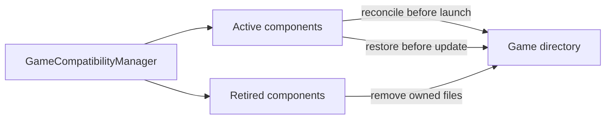

# Runtime compatibility

Arknights Client packages a fixed Windows compatibility runtime. `runtime.json` is the source of truth for the artifact URL, checksum, component versions, source revisions, and prefix revision. Runtime changes must preserve the contract below or update the launcher and its migrations in the same release.

## Runtime baseline

The current artifact is produced by the maintained [`frankea/winecx-gptk`](https://github.com/frankea/winecx-gptk) recipe and published by the maintained [`frankea/Whisky`](https://github.com/frankea/Whisky) fork. It is not sourced from the archived original Whisky project.

This build remains the baseline because it packages WineCX, DXMT, Wine Gecko, GStreamer, FFmpeg, and their relocatable dependencies together. Other free Wine distributions considered for macOS either omit DXMT, require a separately installed media stack, or do not publish a complete reproducible recipe. The launcher uses the generic Wine and DXMT component names; the host project is provenance, not part of the runtime interface.

The runtime's macOS executables are x86-64 and therefore depend on Rosetta 2. macOS 26 may show Apple's Intel-app compatibility notice on the first game launch. A future runtime should move to a native ARM64 Wine plus a suitable x86-64 Windows translation path once a free, reproducible build provides equivalent DXMT, media, Chromium, and child-window compatibility.

## Required Wine interface

| Interface                         | Use                                                                        |
| --------------------------------- | -------------------------------------------------------------------------- |
| x86-64 macOS binaries             | Run Wine through Rosetta 2 on Apple Silicon.                               |
| `bin/wine64`                      | Initialize the prefix, edit its registry, and start `Arknights.exe`.       |
| `bin/wineserver`                  | Wait for prefix processes and stop the isolated runtime.                   |
| `wineboot.exe -u`                 | Create or update a prefix during the corresponding migration.              |
| `reg.exe`                         | Apply DLL overrides and disable Wine crash dialogs.                        |
| Wine macOS driver                 | Present game and browser windows and support the reviewed Command-Q patch. |
| Wine Gecko, GStreamer, and FFmpeg | Support web and media paths used by the client.                            |

Wine receives a private Unix home, XDG directories, temporary directory, and prefix. Only `C:` and the selected game directory as `G:` remain mapped. The runtime must honor `WINEPREFIX`, `WINEDLLOVERRIDES`, `WINEPRELOADERAPPNAME`, and the current synchronization variables.

## Required DXMT interface

DXMT translates the game's Direct3D 11 calls to Metal. The runtime archive must contain x64 and x32 copies of:

- `d3d10core.dll`
- `d3d11.dll`
- `dxgi.dll`
- `winemetal.dll`

The prefix migration installs these files into `system32` and `syswow64`, then selects them with Wine DLL overrides. DXMT's shader cache is enabled explicitly and stored under the prefix's private `home/.cache/dxmt` directory. It persists between game launches and is removed with the Wine prefix.

MoltenVK is included by the upstream runtime for Wine's Vulkan support. It is not part of the current Arknights Direct3D 11 rendering path. Apple D3DMetal is neither required nor redistributed.

## Compatibility components

Game-file workarounds conform to `GameCompatibilityComponent` and are registered by `GameCompatibilityManager`:

An active component must identify only files it owns, install idempotently, and restore the official files before game updates. To remove a workaround, move it to the retired list for at least one supported upgrade cycle. Retired components no longer install but can still clean up stable ownership markers without bundling their old payload.

The current Vuplex component supplies two process-local workarounds:

- A wrapper preserves the official helper and adds CEF flags for software painting and Wine's working DNS path.
- `userenv.dll` implements the AppContainer SID function missing from the tested Wine build for the Vuplex process only.

The wrapper does not render pages, inspect credentials, or replace Vuplex. It launches the untouched official helper and waits for its exit code. Both launcher-owned files carry stable markers so they can be upgraded or removed safely.

## Updating the runtime

1. Verify the runtime and build-recipe checksums and record exact upstream revisions in `runtime.json`.
2. Confirm `wine64`, `wineserver`, DXMT payloads, Gecko, and media libraries are present in the extracted artifact.
3. Run the launcher tests and build an app with `just ci` and `just dev`.
4. Test a fresh prefix, an existing prefix, game launch, every login provider, media pages, game exit, and launcher termination.
5. Increase `prefixRevision` only when existing prefixes must replay configuration. A binary-only refresh uses the new archive checksum to invalidate all runtime migrations automatically.
6. Update third-party notices and corresponding-source material before publishing a DMG.

Launcher diagnostics record the time from **Play** to the Wine process and visible game window. Use these phases to distinguish prefix or runtime startup from game, Metal, and browser startup before changing the recipe.
