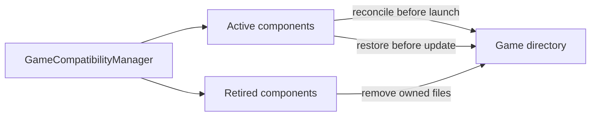

# Runtime compatibility

Arknights Client packages a fixed Windows compatibility runtime. `runtime.json` is the source of truth for the artifact URL, checksum, component versions, source revisions, and prefix revision. Runtime changes must preserve the contract below or update the launcher and its migrations in the same release.

## Runtime baseline

The current artifact is produced by the maintained [`frankea/winecx-gptk`](https://github.com/frankea/winecx-gptk) recipe and published by the maintained [`frankea/Whisky`](https://github.com/frankea/Whisky) fork. It is not sourced from the archived original Whisky project.

This build remains the baseline because it packages WineCX, DXMT, Wine Gecko, GStreamer, FFmpeg, and their relocatable dependencies together. Other free Wine distributions considered for macOS either omit DXMT, require a separately installed media stack, or do not publish a complete reproducible recipe. The launcher uses the generic Wine and DXMT component names; the host project is provenance, not part of the runtime interface.

The runtime's macOS executables are x86-64 and therefore depend on Rosetta 2. macOS 26 may show Apple's Intel-app compatibility notice on the first game launch. A future runtime should move to a native ARM64 Wine plus a suitable x86-64 Windows translation path once a free, reproducible build provides equivalent DXMT, media, Chromium, and child-window compatibility.

## Required Wine interface

| Interface                         | Use                                                                        |
| --------------------------------- | -------------------------------------------------------------------------- |
| x86-64 macOS binaries             | Run Wine through Rosetta 2 on Apple Silicon.                               |
| `bin/wine64`                      | Initialize the prefix, edit its registry, and start `Arknights.exe`.       |
| `bin/wineserver`                  | Wait for prefix processes and stop the isolated runtime.                   |
| `wineboot.exe -u`                 | Create or update a prefix during the corresponding migration.              |
| `reg.exe`                         | Apply DLL overrides and disable Wine crash dialogs.                        |
| Wine macOS driver                 | Present game and browser windows and support the reviewed Command-Q patch. |
| Wine Gecko, GStreamer, and FFmpeg | Support web and media paths used by the client.                            |

Wine receives a private Unix home, XDG directories, temporary directory, and prefix. Only `C:` and the selected game directory as `G:` remain mapped. The runtime must honor `WINEPREFIX`, `WINEDLLOVERRIDES`, `WINEPRELOADERAPPNAME`, and the current synchronization variables.

## Required DXMT interface

DXMT translates the game's Direct3D 11 calls to Metal. The runtime archive must contain x64 and x32 copies of:

- `d3d10core.dll`
- `d3d11.dll`
- `dxgi.dll`
- `winemetal.dll`

The prefix migration installs these files into `system32` and `syswow64`, then selects them with Wine DLL overrides. DXMT's shader cache is enabled explicitly and stored under the prefix's private `home/.cache/dxmt` directory. It persists between game launches and is removed with the Wine prefix.

MoltenVK is included by the upstream runtime for Wine's Vulkan support. It is not part of the current Arknights Direct3D 11 rendering path. Apple D3DMetal is neither required nor redistributed.

## Compatibility components

Game-file workarounds conform to `GameCompatibilityComponent` and are registered by `GameCompatibilityManager`:

An active component must identify only files it owns, install idempotently, and restore the official files before game updates. To remove a workaround, move it to the retired list for at least one supported upgrade cycle. Retired components no longer install but can still clean up stable ownership markers without bundling their old payload.

The Vuplex component supplies two process-local workarounds:

- A wrapper preserves the official helper, selects Vuplex's CPU `OnPaint` transfer, disables WebGL, GPU rasterization, and accelerated 2D canvas, disables the CEF flags for Wine's working DNS path and clipboard sync, and adds high-resolution arguments when requested. Chromium's own GPU compositor stays enabled for rendering speed; only Vuplex's inter-process accelerated-paint texture sharing is disabled. These restrictions apply only to the browser helper; the game process keeps its independent DXMT renderer.
- `userenv.dll` stubs the full set of Windows AppContainer APIs (SID derivation, profile create/delete, registry location, folder path) that Chromium's sandbox resolves via `GetProcAddress` and asserts on if missing. The tested Wine build implements none of them; stubbing only the SID-derivation function left the sandbox's `CHECK(fn)` assertion failing on the others.

The wrapper does not render pages, inspect credentials, or replace Vuplex. It launches the untouched official helper and waits for its exit code. Both launcher-owned files carry stable markers so they can be upgraded or removed safely.

### Payment compatibility

Credit card and PayPal payments have been observed to complete in the game's embedded browser. Disabling WebGL, GPU rasterization, and accelerated 2D canvas is the config observed to let PayPal's browser challenge complete in the tested Vuplex/CEF environment under Wine; the launcher does not bypass or weaken the payment provider's challenge (#14).

The embedded browser previously crashed on Chromium sandbox initialization. Chromium's sandbox (`sandbox/win/src/app_container_base.cc`) dynamically loads several Windows AppContainer APIs and asserts `CHECK(fn)` if any are missing; Wine's `userenv.dll` implements none of them. The compatibility DLL originally stubbed only the one function needed for OAuth popups (`DeriveAppContainerSidFromAppContainerName`), which left the sandbox's other required functions unresolved. Stubbing the full set the sandbox expects avoids the assertion (#16). Still, verify every purchase or charge directly with the payment provider and Yostar, since this runs through an unofficial, community-patched Wine environment.

The PlatformProcess component handles the separate Qt WebEngine window used by Notices:

- A wrapper launches the untouched official `PlatformProcess.exe`, removes border and non-activating styles from its large visible window, follows the game's absolute Win32 position, and waits for the official process.
- An x86-64 AppKit bridge is injected into the helper process tree through WineCX's `__CX_UNIX_` environment passthrough. It clears Wine's AppKit activation restrictions, enables mouse input, hides the helper's separate Dock presence, and applies the companion window's Spaces, level, transparency, and clipping policy.

The compatibility component does not inspect input, Qt page data, network requests, or rendered content; the bridge changes only native window presentation. Chromium starts with the helper after Notices is selected. Collapsing Qt WebEngine into one process or disabling its sandbox is intentionally avoided.

The helper and game remain separate top-level processes under the current compatibility boundary. Fast game-window drags can show a small tracking delay, and changing focus between the two processes can briefly expose the normal macOS focus transition. The current bridge accepts that presentation limitation instead of injecting coordination code into the main game process.

When high-resolution mode is enabled, the launcher enables Wine's prefix-wide Retina mode when Play is pressed from a window on a HiDPI display. Windows `LogPixels` remains at 96 because a global 192 DPI setting makes Unity restore window dimensions inconsistently. Instead, the game process passes a 2x scale factor to the Vuplex wrapper, which adds Chromium-only HiDPI arguments. This gives the game and browser high-density output without changing Unity's coordinate system. On a 1x display or when the setting is disabled, the launcher disables Retina mode and uses a 1x browser scale. The current registry values are read directly from the prefix, and `reg.exe` runs only when a value must change.

On a scaled macOS desktop, maximizing a normal Retina window can create a backing surface larger than 4K. Borderless or fullscreen rendering at a deliberate 2560×1440 or 3840×2160 resolution avoids that extra pixel cost; DXMT-specific upscaling and frame-limit overrides remain disabled because the game already controls those tradeoffs.

Use `--no-retina` or `defaults write com.lumisxh.arknights-client forceDisableRetina -bool YES` as a troubleshooting fallback. `--graphics-diagnostics` temporarily enables Wine Mac-driver and DXMT info logging so the physical backing and swapchain dimensions can be verified in the Wine log.

## Updating the runtime

1. Verify the runtime and build-recipe checksums and record exact upstream revisions in `runtime.json`.
2. Confirm `wine64`, `wineserver`, DXMT payloads, Gecko, and media libraries are present in the extracted artifact.
3. Run the launcher tests and build an app with `just ci` and `just dev`.
4. Test a fresh prefix, an existing prefix, game launch, every login provider, media pages, game exit, and launcher termination.
5. Increase `prefixRevision` only when existing prefixes must replay configuration. A binary-only refresh uses the new archive checksum to invalidate all runtime migrations automatically.
6. Update third-party notices and corresponding-source material before publishing a DMG.

Launcher diagnostics record the time from **Play** to the Wine process and visible game window. The Wine log additionally records filesystem, compatibility, prefix, display, and process stages. Use these phases to distinguish launcher work from game, Metal, and browser startup before changing the recipe.
